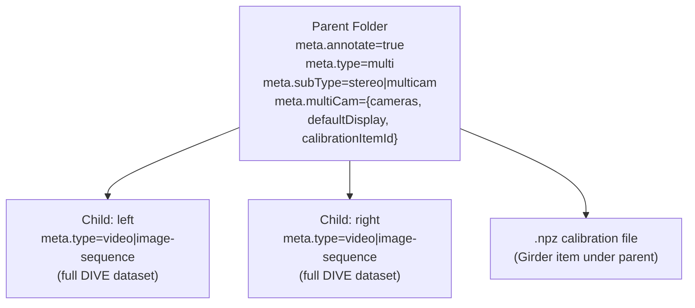
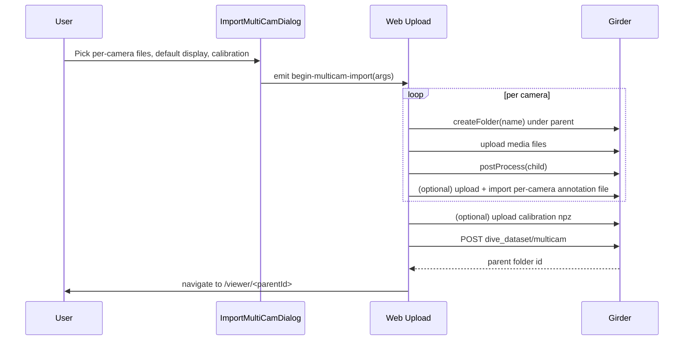
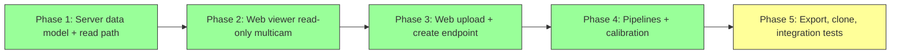

# Web Multicam / Stereo Implementation Plan

Bring stereo/multicam parity to the Girder/web platform by modeling multicam as a Girder parent folder of type `multi` containing one DIVE child folder per camera, adding server endpoints + metadata to expose `multiCamMedia`, reproducing the desktop `ImportMultiCamDialog` upload flow on the web, and removing the existing "not supported on web" guards.

## Phase status

| Phase | Scope | Status |
|-------|--------|--------|
| **1** | Server data model + read path | **Done** (merged) |
| **2** | Web viewer read-only multicam | **Done** (merged) |
| **3** | Web upload + `POST /dive_dataset/multicam` | **Done** (merged) |
| **4** | Pipelines + calibration | **Done** — merge `multicam-web-features-phase-4` → `multicam-web-feature` |
| **5** | Export, clone, integration tests | **In progress** (server + web export/clone landed; integration test pending) |

## Implementation Checklist

### Phases 1–4 (complete)

- [x] **Server: constants & models** — `MultiType`, multiCam/subType/calibration markers, pydantic models (`server/dive_utils/constants.py`, `server/dive_utils/types.py`)
- [x] **Server: verify_dataset** — Accept `type=multi`; validate `multiCam` cameras + `fps` on parent
- [x] **Server: get_dataset / multiCamMedia** — `get_multi_cam_media` embedded in `get_dataset` responses
- [x] **Server: create multicam** — `POST /dive_dataset/multicam` + `crud_dataset.create_multicam` (move children, parent meta, calibration)
- [x] **Server: pipelines** — `crud_rpc` dispatches stereo/multicam jobs; `dive_tasks/multicam_pipeline.py` + `tasks.run_pipeline` fan out per-camera media, detections, and calibration for measurement pipelines; `pipeline_discovery.py` includes measurement / 2-cam / 3-cam and excludes web-inapplicable pipes (e.g. seagis)
- [x] **Web API** — `createMulticamDataset`, calibration upload, `multicamResolve` for `${parentId}/${camera}` (`client/platform/web-girder/api/`)
- [x] **Web store** — `useDataset.ts` loads `multi` + `multiCamMedia`; browse path resolves multicam root
- [x] **Web upload** — `multiCamImport` / `multiCamImportCheck` in `Upload.vue`; stereoscopic + multicam import from upload dialog
- [x] **Web calibration shims** — `getLastCalibration` / `saveCalibration` for `ImportMultiCamDialog` on web
- [x] **Web ViewerLoader / Home** — `subTypeList` + `cameraNumbers` on `RunPipelineMenu`; pipeline menu filters by stereo vs multicam and camera count (`pipelineMenuFilters.ts`)
- [x] **dive-common Viewer** — MultiCam toolbar / camera dropdown on web (no `diveDesktop` gate); data browser stereo/multicam icons (`multicamDisplay.ts`)
- [x] **Tests (unit)** — `server/tests/test_create_multicam.py`, `test_multicam_dataset.py`, `test_multicam_pipeline.py`, `test_pipeline_discovery.py`; frontend success paths in `webGirderStoreComposables.spec.ts`
- [x] **Docs (user-facing)** — `docs/Multicamera-data.md` (web vs desktop matrix), `docs/Web-Version.md` (stereo/multicam upload)

### Phase 5 (remaining)

- [x] **Server: clone & export** — `createSoftClone` recurses child cameras and rewrites `multiCam.cameras[*].folderId`; copies calibration; `export_datasets_zipstream` exports `multiCam.json`, calibration, and per-camera subfolders
- [x] **Web export & clone** — Removed `MultiType` throw in `Export.vue`; clone uses multicam-aware `createSoftClone`
- [ ] **Tests (integration)** — Multicam create + full export path in `server/tests/integration/test_download_extract.py`

---

## 1. Goals & Non-Goals

**Goals**

- Allow a Girder user to upload N cameras (stereo = exactly 2, multicam = 2 or 3) in a single import flow and produce a viewable, annotatable multicam dataset that uses the existing `dive-common` multicam viewer code path.
- Persist a stereo calibration file (`.npz`) per parent dataset and surface it to pipelines.
- Let multicam datasets run through multicam/stereo pipelines from the web UI. **Done (Phase 4).**
- Let multicam datasets be cloned and exported from the web UI. **Phase 5.**
- Reach feature parity with the desktop multicam behavior described in [docs/Multicamera-data.md](docs/Multicamera-data.md) except where noted below.

**Non-Goals / deferred**

- Glob/keyword pattern import (desktop's `MultiCamImportKeywordArgs`) — web shows an explicit error in `Upload.vue`; still desktop-only.
- Per-camera revision divergence (revisions remain per child folder; no cross-camera revision linking).
- Mixing camera media types (all cameras must be either `image-sequence` or all `video`, matching desktop).

## 2. Data Model

A multicam dataset is a tree of Girder folders. The parent folder is the "dataset id" the user navigates to; each child folder is a fully-functional DIVE dataset (already supports media, annotations, revisions, sets, attributes).

Key meta on the parent:

- `type = "multi"`
- `subType = "stereo" | "multicam"`
- `multiCam = { defaultDisplay, cameras: { [name]: { folderId, type } }, cameraOrder?, calibrationItemId? }`
- `fps`: copied from `defaultDisplay` camera (compatibility with `verify_dataset`)
- `annotate = true`

Child folders are standard DIVE datasets, named after the camera (`left`, `right`, `camera1`, ...). Annotations are stored against the child folder ID.

ID composition: the frontend uses `${baseId}/${camera}` ([client/dive-common/components/Viewer.vue](client/dive-common/components/Viewer.vue)). Web resolves this via [client/platform/web-girder/api/multicamResolve.ts](client/platform/web-girder/api/multicamResolve.ts) in `getDataset` / `getDatasetMedia`.

## 3. Server Changes (Girder / Python)

### 3.1 Constants & Models — done

- [server/dive_utils/constants.py](server/dive_utils/constants.py): `MultiType`, `MultiCamMarker`, `SubTypeMarker`, calibration markers, `StereoPipelineMarker` (`measurement`), `MultiCamPipelineMarkers` (`2-cam`, `3-cam`), `stereoCalibrationRegex`.
- [server/dive_utils/types.py](server/dive_utils/types.py): multicam job / media types used by RPC and Celery tasks.

### 3.2 CRUD: relaxations — done

- [server/dive_server/crud.py](server/dive_server/crud.py) `verify_dataset`: accepts `MultiType` and validates `multiCam` structure.

### 3.3 Create multicam endpoint — done

`POST /dive_dataset/multicam` in [server/dive_server/views_dataset.py](server/dive_server/views_dataset.py) → `crud_dataset.create_multicam(...)`.

### 3.4 Media: multiCamMedia — done

- `get_dataset` embeds `multiCamMedia` via `get_multi_cam_media` when `type == multi`.

### 3.5 Pipelines, postprocess, export, clone

| Area | Status | Notes |
|------|--------|--------|
| **Pipelines** | **Done** | `crud_rpc` builds multicam job args; `dive_tasks/tasks.py` downloads per-camera media + optional detections; `multicam_pipeline.py` builds KWIVER `-s` settings; stereo measurement jobs attach calibration via `resolve_stereo_calibration_item_id` |
| **Pipeline discovery** | **Done** | `pipeline_discovery.py` allowlist matches desktop; seagis and other web-inapplicable pipes filtered |
| **Postprocess** | **Done** | Child folders postprocess independently (unchanged) |
| **Export** | **Phase 5** | `export_datasets_zipstream` does not recurse multicam children yet |
| **Clone** | **Phase 5** | `createSoftClone` does not clone child cameras or rewrite `multiCam.cameras`; UI clone may produce broken multicam datasets until fixed |

## 4. Frontend Changes (web-girder)

### 4.1 API + Store — done

- `createMulticamDataset`, calibration helpers, `${parentId}/${camera}` resolution in [client/platform/web-girder/api/dataset.service.ts](client/platform/web-girder/api/dataset.service.ts).
- [client/platform/web-girder/store/useDataset.ts](client/platform/web-girder/store/useDataset.ts) loads `multi` + `multiCamMedia`.

### 4.2 Upload UX — done

Stereoscopic / MultiCam paths in [client/platform/web-girder/views/Upload.vue](client/platform/web-girder/views/Upload.vue) orchestrate per-camera upload then `POST /dive_dataset/multicam`.

### 4.3 Viewer + pipelines UI — done

- [client/platform/web-girder/views/ViewerLoader.vue](client/platform/web-girder/views/ViewerLoader.vue) and [Home.vue](client/platform/web-girder/views/Home.vue): `subTypeList`, `cameraNumbers` → `RunPipelineMenu`.
- [client/dive-common/components/Viewer.vue](client/dive-common/components/Viewer.vue): MultiCam toolbar on web when `multiCamList.length > 1`.
- [client/dive-common/pipelineMenuFilters.ts](client/dive-common/pipelineMenuFilters.ts): measurement for all-stereo selection; 2-cam / 3-cam for matching multicam count; `webExcludedPipelineTerms` includes `seagis`.

### 4.4 Export + Clone — Phase 5

- [client/platform/web-girder/views/Export.vue](client/platform/web-girder/views/Export.vue) L211: still throws `Cannot export multicamera dataset` (documented limitation in user docs).
- [client/platform/web-girder/views/Clone.vue](client/platform/web-girder/views/Clone.vue): no multicam-specific guard; server clone is not multicam-aware yet — treat as unsupported until Phase 5.

### 4.5 ID resolution — done

Implemented in [client/platform/web-girder/api/multicamResolve.ts](client/platform/web-girder/api/multicamResolve.ts) (option 1 from original plan).

## 5. dive-common Touch Points — done

- `useApi()` web shims for calibration + multicam import.
- Viewer multicam path unchanged for desktop; web uses resolved folder IDs.

## 6. Stereo Calibration — done

- Calibration item under parent folder; `meta.multiCam.calibrationItemId` (and item `calibrationFile` marker).
- Pipeline jobs: `calibration_item_id` on measurement pipelines; worker downloads `.npz` and sets KWIVER `measurer:calibration_file` / `calibration_reader:file`.

## 7. Permissions, Revisions, Sets

- WRITE validated on child folders during `create_multicam`.
- Revisions and sets remain per-camera (viewer loads detections per `${parentId}/${camera}`).

## 8. Migration / Backward Compatibility

- No migration; existing single-camera datasets unchanged.
- **Tests**
  - [x] Server unit: create multicam, multicam media, pipeline helpers, pipeline discovery
  - [x] Frontend: `webGirderStoreComposables.spec.ts` success paths for `multi` / stereo / 3-cam
  - [ ] Integration: multicam create + export in `server/tests/integration/test_download_extract.py`

## 9. Documentation — done (user); Phase 5 may add export/clone

- [docs/Multicamera-data.md](docs/Multicamera-data.md) — web vs desktop capability table, web import steps
- [docs/Web-Version.md](docs/Web-Version.md) — stereo/multicam upload section

## 10. Phased Rollout

Each phase is independently mergeable.

## 11. Open Risks

- Synchronized frame counts across cameras are enforced at create time (matches desktop `ImportMultiCamDialog` validation).
- `webkitdirectory` behavior varies by browser; upload orchestrator uses the same file-list fallbacks as single-camera upload.
- **Clone before Phase 5:** cloning a multicam parent may reference original child folder IDs — do not rely on clone for multicam until server work lands.
- **Export:** explicitly blocked in web UI until Phase 5; per-camera annotation export may still be available from the viewer for the active camera.

## 12. Current State (as of Phase 4 complete)

### Shipped on web

| Capability | Status |
|------------|--------|
| Import stereo (2 cameras + `.npz` calibration) | ✔️ |
| Import multicam (2 or 3 cameras) | ✔️ |
| View / annotate / MultiCamera Tools | ✔️ |
| Run measurement pipelines (stereo) | ✔️ |
| Run 2-cam / 3-cam pipelines (multicam) | ✔️ |
| Run standard single-camera pipelines on one view | ✔️ |
| Data browser stereo / multicam indicators | ✔️ |
| Seagis pipelines hidden on web | ✔️ |

### Still outstanding (Phase 5)

| Capability | Status |
|------------|--------|
| Export full multicam dataset as one `.zip` | ✔️ |
| Multicam-aware clone (child folders + meta rewrite) | ✔️ |
| Glob / keyword multicam import | ❌ (by design; desktop-only) |

### Key implementation files (reference)

| Area | Files |
|------|--------|
| Server create / media | `server/dive_server/crud_dataset.py`, `views_dataset.py` |
| Server pipelines / jobs | `server/dive_server/crud_rpc.py`, `server/dive_tasks/tasks.py`, `server/dive_tasks/multicam_pipeline.py`, `server/dive_tasks/pipeline_discovery.py` |
| Web upload | `client/platform/web-girder/views/Upload.vue`, `multicamFileRegistry.ts` |
| Web viewer / pipelines UI | `ViewerLoader.vue`, `pipelineMenuFilters.ts`, `multicamDisplay.ts` |
| Shared viewer | `client/dive-common/components/Viewer.vue`, `MultiCamToolbar.vue` |

Desktop reference implementation:

- Import: [client/platform/desktop/backend/native/multiCamImport.ts](client/platform/desktop/backend/native/multiCamImport.ts)
- Pipeline args: [client/platform/desktop/backend/native/multiCamUtils.ts](client/platform/desktop/backend/native/multiCamUtils.ts)
- User docs: [docs/Multicamera-data.md](docs/Multicamera-data.md)
