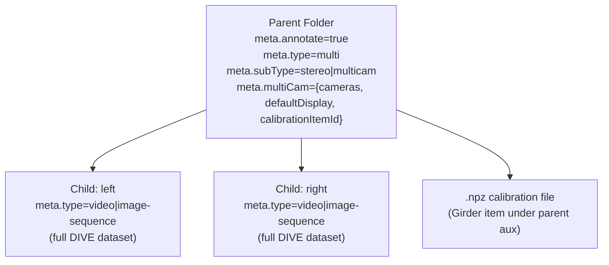
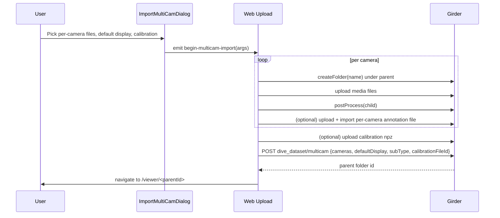
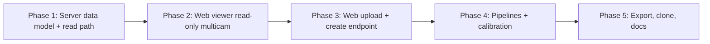

# Web Multicam / Stereo Implementation Plan

Bring stereo/multicam parity to the Girder/web platform by modeling multicam as a Girder parent folder of type `multi` containing one DIVE child folder per camera, adding server endpoints + metadata to expose `multiCamMedia`, reproducing the desktop `ImportMultiCamDialog` upload flow on the web, and removing the existing "not supported on web" guards.

## Implementation Checklist

- [ ] **Server: constants & models** — Add `MultiType` + multiCam/subType/calibration markers and pydantic models (`server/dive_utils/constants.py`, `server/dive_utils/models.py`)
- [ ] **Server: verify_dataset** — Relax `verify_dataset` to accept `type=multi`; keep fps mirrored from default-display camera
- [ ] **Server: get_dataset / multiCamMedia** — Extend `crud_dataset.get_dataset` to embed `multiCamMedia` by fanning out to child `get_media` calls
- [ ] **Server: create multicam** — Implement `POST /dive_dataset/multicam` and `crud_dataset.create_multicam` to move child folders + write parent meta + attach calibration
- [ ] **Server: clone & export** — Extend `createSoftClone` and `export_datasets_zipstream` to recurse into child cameras; include calibration
- [ ] **Server: pipelines** — Add multicam/stereo pipeline dispatch in `crud_rpc` that fans inputs/outputs per camera and passes calibration for stereo
- [ ] **Web API** — Add `createMulticamDataset`, `uploadCalibration` helpers in `client/platform/web-girder/api/dataset.service.ts`
- [ ] **Web store** — Remove the `multi is not supported` guard in `useDataset.ts` and attach `multiCamMedia`
- [ ] **Web API: ID rewrite** — Rewrite `${parentId}/${camera}` to child folder id inside `getDataset` / `getDatasetMedia`
- [ ] **Web upload** — Replace `multiCamImportCheck` / `multiCamImport` stubs; orchestrate per-camera uploads + call create_multicam endpoint
- [ ] **Web calibration shims** — Provide `getLastCalibration` / `saveCalibration` shims so `ImportMultiCamDialog` works without desktop
- [ ] **Web ViewerLoader** — Wire `subTypeList` + `camNumbers` into `RunPipelineMenu`
- [ ] **Web export & clone** — Drop multi-guard in `Export.vue` and verify `Clone.vue` handles parent folders
- [ ] **dive-common Viewer** — Drop `'diveDesktop' in window` gate so MultiCamToolbar/camera dropdown work on web
- [ ] **Tests & docs** — Server multicam integration test, success-path frontend test, update `docs/Multicamera-data.md` / `docs/Web-Version.md`

---

## 1. Goals & Non-Goals

**Goals**

- Allow a Girder user to upload N cameras (stereo = exactly 2, multicam = 2 or 3) in a single import flow and produce a viewable, annotatable multicam dataset that uses the existing `dive-common` multicam viewer code path.
- Persist a stereo calibration file (`.npz`) per parent dataset and surface it to pipelines.
- Let multicam datasets be cloned, exported, and run through multicam/stereo pipelines from the web UI.
- Reach feature parity with the desktop multicam behavior described in [docs/Multicamera-data.md](docs/Multicamera-data.md).

**Non-Goals (Phase 1)**

- Glob/keyword pattern import (desktop's `MultiCamImportKeywordArgs`). Phase 2.
- Per-camera revision divergence (we will rev each camera folder independently, no cross-camera revision linking).
- Mixing camera media types (all cameras must be either `image-sequence` or all `video`, matching desktop).

## 2. Data Model

A multicam dataset is a tree of Girder folders. The parent folder is the "dataset id" the user navigates to; each child folder is a fully-functional DIVE dataset (already supports media, annotations, revisions, sets, attributes).



Key meta on the parent (new):

- `type = "multi"`
- `subType = "stereo" | "multicam"`
- `multiCam = { defaultDisplay: str, cameras: { [name]: { folderId: str, type: "video"|"image-sequence" } }, calibrationItemId?: str }`
- `fps`: copied from `defaultDisplay` camera (kept for compatibility with `verify_dataset`)
- `annotate = true`

Child folders are unchanged from today: standard DIVE datasets, named after the camera (`left`, `right`, `camera1`, ...). They are uniquely identified by their own ObjectId. Annotations are stored against the child folder ID.

ID composition: the frontend already uses `${baseId}/${camera}` (see [client/dive-common/components/Viewer.vue](client/dive-common/components/Viewer.vue) lines 766-789). We will keep this composite ID convention but make the web `loadMetadata` / `loadDetections` resolve `${parentId}/${cameraName}` to the actual child folder ObjectId on the way to Girder.

## 3. Server Changes (Girder / Python)

### 3.1 Constants & Models

- [server/dive_utils/constants.py](server/dive_utils/constants.py): add `MultiType = "multi"`, `MultiCamMarker = "multiCam"`, `SubTypeMarker = "subType"`, `CalibrationMarker = "calibrationItemId"`, plus a `npzRegex`.
- [server/dive_utils/models.py](server/dive_utils/models.py):
  - Add `MultiCamCamera`, `MultiCamMediaCamera`, and `MultiCamMeta` pydantic models matching the frontend `MultiCamMedia` shape in [client/dive-common/apispec.ts](client/dive-common/apispec.ts) lines 150-157.
  - Extend `GirderMetadataStatic` with `subType: Optional[Literal['stereo','multicam']]` and `multiCamMedia: Optional[MultiCamMediaResponse]`.
  - Extend `DatasetSourceMedia` (or add a sibling response model) so `get_media` can return per-camera arrays when type is `multi`.

### 3.2 CRUD: relaxations

- [server/dive_server/crud.py](server/dive_server/crud.py) `verify_dataset` (lines 99-110): allow `MultiType` (no `fps` requirement at parent — fps lives on the children, but mirror it on the parent on creation for backwards-compatibility with callers that read it).
- `getCloneRoot` already follows `ForeignMediaIdMarker`; we will set `ForeignMediaIdMarker` on a cloned parent and clone each child folder individually, preserving the parent/child shape.

### 3.3 New endpoint: create multicam

Add to [server/dive_server/views_dataset.py](server/dive_server/views_dataset.py):

```
POST /dive_dataset/multicam
  body: {
    parentFolderId: str,
    name: str,
    fps: number,
    type: "video" | "image-sequence",
    subType: "stereo" | "multicam",
    defaultDisplay: str,
    cameras: { [name]: { folderId: str } },     # each child folder must already exist & contain media
    calibrationFileId?: str,                    # optional, for stereo
  }
```

Implemented in `crud_dataset.create_multicam(...)`:

1. Create parent folder under `parentFolderId`.
2. Write parent meta (DatasetMarker, type=multi, subType, multiCam, fps copied from default camera).
3. For each `cameras[name].folderId`, `Folder().move(child, parentFolder)`, rename to `name`, validate that it is a valid DIVE dataset with the same `type`, same frame count (or video duration), and same fps.
4. If `calibrationFileId` is given (only for `stereo`), validate `.npz`, move the item into the parent's auxiliary folder, store its id under `meta.multiCam.calibrationItemId`.

This flow assumes the cameras have already been uploaded as ordinary single-camera DIVE datasets via the existing upload (`UploadGirder.vue`), which matches the chosen "full upload flow" UX (Section 4.2): upload N child datasets via the existing path inside the dialog, then call this endpoint to link them.

### 3.4 Media: expose multiCamMedia

In [server/dive_server/crud_dataset.py](server/dive_server/crud_dataset.py):

- `get_dataset` (lines 96-107): when `type == multi`, include `multiCamMedia` built by iterating `meta.multiCam.cameras` and calling the existing `get_media` for each child folder, then mapping into the `MultiCamMedia` shape the frontend expects.
- `get_media` (lines 110-176): for `multi`, return an empty `imageData` (the per-camera media is keyed in `multiCamMedia`); or alternatively raise and require the client to call `/media` on each child id. Recommendation: have `get_meta` embed `multiCamMedia` (cleanest, single round trip).

### 3.5 Pipelines, postprocess, export, clone

- **Pipelines** ([server/dive_server/crud_rpc.py](server/dive_server/crud_rpc.py)): a multicam pipeline run is dispatched on the parent folder; the job needs to fan out per-camera inputs (mirrors desktop's `writeMultiCamStereoPipelineArgs` in [client/platform/desktop/backend/native/multiCamUtils.ts](client/platform/desktop/backend/native/multiCamUtils.ts) lines 78-139). New helper `crud_rpc.run_multicam_pipeline(parent, pipeline)` that walks `meta.multiCam.cameras`, materializes per-camera input lists, includes the calibration file when `subType == stereo`, and writes outputs back to each child folder.
- **Postprocess**: child folders already postprocess themselves. Adding a multicam parent only needs to set `ConfidenceFiltersMarker` and skip the existing image/video-specific branches.
- **Export** ([server/dive_server/crud_dataset.py](server/dive_server/crud_dataset.py) `export_datasets_zipstream`): when a parent of type `multi` is exported, recurse into each child folder and place its export under `<parent>/<cameraName>/`. Include `multiCam.json` at the parent level. Include the calibration file when present.
- **Clone** (`createSoftClone`, lines 25-53): when source is `multi`, also clone each child folder (recursively, preserving names) and rewrite `meta.multiCam.cameras[name].folderId` on the cloned parent to point at the cloned children. Calibration item is referenced by id; we either copy it or share by reference (recommend copy).

## 4. Frontend Changes (web-girder)

### 4.1 API + Store

- [client/platform/web-girder/api/dataset.service.ts](client/platform/web-girder/api/dataset.service.ts):
  - Add `createMulticamDataset(args)` POSTing to the new endpoint.
  - Add `uploadCalibration(parentFolderId, file)`.
  - `getDatasetMedia` already returns child media; add `getDatasetMultiCamMedia(parentFolderId)` thin wrapper that returns the per-camera media map from `getDataset` meta.
- [client/platform/web-girder/store/useDataset.ts](client/platform/web-girder/store/useDataset.ts) lines 31-33: remove the throw; when `dsMeta.type === MultiType`, attach `multiCamMedia` from the static metadata response and skip the single-camera `videoUrl`/`imageData` assignment.

### 4.2 Upload UX — full flow

Replace the `multiCamImportCheck` and `multiCamImport` TODOs in [client/platform/web-girder/views/Upload.vue](client/platform/web-girder/views/Upload.vue) lines 247-259.



UI work:

- Reuse [client/dive-common/components/ImportMultiCamDialog.vue](client/dive-common/components/ImportMultiCamDialog.vue) by giving it a web-flavored `importMedia` and a web `openFromDisk` — the dialog only depends on `useApi().openFromDisk`, `getLastCalibration`, `saveCalibration`. Provide web shims for the last two (no-ops or local-storage backed).
- The dialog currently calls `openFromDisk('image-sequence', directory: true)`; on web that already opens a directory picker via [client/platform/web-girder/utils.ts](client/platform/web-girder/utils.ts). Need to confirm directory-mode actually returns `webkitdirectory` `File[]`.
- After the dialog emits `begin-multicam-import`, drive an orchestrator in Upload.vue that uploads each camera using the existing `UploadGirder.vue` mixin code (loop, not concurrent at first), then calls the new endpoint.

### 4.3 Viewer + sidebar/toolbar

- [client/platform/web-girder/views/ViewerLoader.vue](client/platform/web-girder/views/ViewerLoader.vue):
  - Wire `subTypeList` and `camNumbers` props on `RunPipelineMenu` (mirrors desktop [client/platform/desktop/frontend/components/ViewerLoader.vue](client/platform/desktop/frontend/components/ViewerLoader.vue) lines 46-47).
  - Read `datasetMeta.subType` and `Object.keys(datasetMeta.multiCamMedia?.cameras ?? {}).length`.
- [client/dive-common/components/Viewer.vue](client/dive-common/components/Viewer.vue) line 1028-1033: `showMultiCamToolbar` is currently gated on `'diveDesktop' in window`. Remove that condition so the toolbar/camera dropdown work on web too.

### 4.4 Export + Clone + Pipelines

- [client/platform/web-girder/views/Export.vue](client/platform/web-girder/views/Export.vue) line 211: replace the throw with a multicam export URL that points to the new server zip behavior; the existing UI can stay the same since the server zip handles per-camera.
- [client/platform/web-girder/views/Clone.vue](client/platform/web-girder/views/Clone.vue): the server clone already recurses; verify the UI's "include annotations" path still works against a parent.
- `RunPipelineMenu` will already filter stereo/multicam pipelines correctly once `subTypeList` and `cameraNumbers` are passed (see [client/dive-common/components/RunPipelineMenu.vue](client/dive-common/components/RunPipelineMenu.vue) lines 148-203).

### 4.5 ID resolution for `${baseId}/${camera}`

The frontend in [client/dive-common/components/Viewer.vue](client/dive-common/components/Viewer.vue) line 770 calls `loadMetadata(\`${baseMulticamDatasetId}/${camera}\`)`. The desktop intercepts that string; the web Girder REST client cannot, because the URL would 404.

Two clean options, pick one in implementation:

- **(Preferred) Rewrite at the API service**: in [client/platform/web-girder/api/dataset.service.ts](client/platform/web-girder/api/dataset.service.ts), make `getDataset` and `getDatasetMedia` detect a `/` in the id, look up the parent meta from a tiny client cache (or fetch parent), resolve `cameraName -> folderId`, and call the real endpoint with the resolved id. This keeps `Viewer.vue` unchanged.
- Add an explicit `cameraFolderId` map prop to `Viewer.vue`. More invasive; affects desktop too.

The plan uses option 1.

## 5. dive-common Touch Points

- [client/dive-common/apispec.ts](client/dive-common/apispec.ts): no API surface changes needed; `MultiCamImportArgs` already exists. Just make sure `useApi()` for web provides shim `getLastCalibration`/`saveCalibration` (currently desktop-only, see lines 233-234).
- [client/dive-common/components/Viewer.vue](client/dive-common/components/Viewer.vue) line 1028: drop `'diveDesktop' in window` gate (also covers MultiCamToolbar).

## 6. Stereo Calibration

- Stored as a Girder Item in the parent folder's auxiliary folder (`crud.get_or_create_auxiliary_folder`).
- Referenced by `meta.multiCam.calibrationItemId`.
- Download URL surfaced as `multiCamMedia.calibrationUrl` so pipeline jobs and the desktop importer can fetch it.
- Upload in the web dialog reuses the existing single-file upload pattern from `Upload.vue`'s annotation upload code.

## 7. Permissions, Revisions, Sets

- Parent folder permissions propagate to children via standard Girder semantics. Validate during `create_multicam` that the user has WRITE on each child being moved.
- Annotation revisions remain per-camera; the UI already supports this via per-camera `loadDetections` calls in [client/dive-common/components/Viewer.vue](client/dive-common/components/Viewer.vue) lines 783-789.
- Annotation sets work per-camera; we will surface the parent's "current set" route param but loadDetections is called against each camera independently.

## 8. Migration / Backward Compatibility

- No data migration needed; existing single-camera datasets are unaffected (the `multi` type is new).
- Tests:
  - Server: extend [server/tests/integration/test_download_extract.py](server/tests/integration/test_download_extract.py) with a multicam create+download path.
  - Frontend: extend [client/platform/web-girder/store/webGirderStoreComposables.spec.ts](client/platform/web-girder/store/webGirderStoreComposables.spec.ts) (which already mocks a `multi` failure case at line 270) to a success case.

## 9. Documentation

- Update [docs/Multicamera-data.md](docs/Multicamera-data.md) to add a "Web Version" section and a flowchart for the upload/import process. Cross-link from [docs/Web-Version.md](docs/Web-Version.md).

## 10. Phased Rollout

Each phase is independently mergeable.



## 11. Open Risks

- The aggregate media controller in `dive-common` assumes synchronized frame counts across cameras; the create endpoint must reject mismatched lengths up front (matches desktop validation in [client/dive-common/components/ImportMultiCamDialog.vue](client/dive-common/components/ImportMultiCamDialog.vue) lines 152-175).
- `webkitdirectory` directory uploads behave differently across browsers; the upload orchestrator must handle the file-list-based fallback the same way the existing `Upload.vue` does today.
- Removing the `diveDesktop` gate in `Viewer.vue` could change behavior for desktop users; we will keep the multicam-toolbar behind `multiCamList.length > 1` only, which it already checks.

## 12. Current State (Reference)

The following guards and stubs exist today and are targeted by this plan:

| Location | Issue |
|----------|--------|
| [client/platform/web-girder/store/useDataset.ts](client/platform/web-girder/store/useDataset.ts) L31-33 | `throw new Error('multi is not supported on web yet')` |
| [client/platform/web-girder/views/Upload.vue](client/platform/web-girder/views/Upload.vue) L247-259 | `multiCamImportCheck` / `multiCamImport` are TODO stubs |
| [client/platform/web-girder/views/Export.vue](client/platform/web-girder/views/Export.vue) L211 | `Cannot export multicamera dataset` |
| [client/dive-common/components/Viewer.vue](client/dive-common/components/Viewer.vue) L1028-1033 | MultiCam toolbar gated on `'diveDesktop' in window` |
| [server/dive_server/crud.py](server/dive_server/crud.py) L99-110 | `verify_dataset` rejects non image-sequence/video/large-image types |
| Server generally | No `multi` type, no `multiCam` metadata, no multicam create endpoint |

Desktop reference implementation:

- Import: [client/platform/desktop/backend/native/multiCamImport.ts](client/platform/desktop/backend/native/multiCamImport.ts)
- Media URLs: [client/platform/desktop/backend/native/multiCamUtils.ts](client/platform/desktop/backend/native/multiCamUtils.ts)
- User docs: [docs/Multicamera-data.md](docs/Multicamera-data.md)
