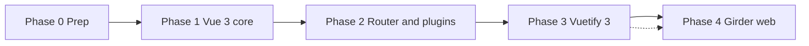

# Vue 3 Upgrade Guide

This document outlines a phased plan for migrating DIVE from **Vue 2.7** to **Vue 3**, while keeping the existing **`defineComponent` + `setup()`** component style.

---

## Current state

| Area | Today |
|------|-------|
| Vue | 2.7 (`defineComponent`, Composition API) |
| Build | Vite + `@vitejs/plugin-vue2` |
| Router | vue-router 3 (`new Router()`) |
| UI | Vuetify 2 |
| Girder UI | `@girder/components` (Vue 2 branch: `girder-5-websocket-upgrade`) |
| Components | ~120+ files already use `defineComponent` |

Most application components do **not** need to be rewritten. The main work is upgrading the ecosystem around them.

---

## Phase 0 — Prep (Vue 2.7, no version bump)

**Goal:** Remove Vue-2-only patterns so the Vue 3 swap is smaller and safer.

### Done
- [x] Convert `Vue.extend` and plain `export default {}` components to `defineComponent`
- [x] Replace `new Vue()` event buses with `dive-common/utils/eventBus.ts`
- [x] Harden `clientSettings.rowsPerPage` against bad localStorage data

### Keep on Vue 2.7 for now
- **Do not use `v-model:prop`** — Vue 2’s compiler treats it as default `v-model` on `value`, not as a named prop. Keep **`:prop.sync`** until Vue 3.
- **`prompt-service`**, **`UILayer` widget mounting**, and **`main.ts` `new Vue()`** — defer to later phases.

### Remaining (optional before Phase 1)
- [ ] Convert any leftover Options API-only components to `defineComponent` (for consistency)
- [ ] Audit `Vue.prototype`, `$on` / `$off` on component instances, and `beforeDestroy` → `onBeforeUnmount`

---

## Phase 1 — Core Vue 3 swap

**Goal:** Run on Vue 3 with the app still largely working.

### Dependencies
| Package | From | To |
|---------|------|-----|
| `vue` | 2.7 | 3.x |
| `@vitejs/plugin-vue2` | — | `@vitejs/plugin-vue` |
| `vue-template-compiler` | 2.7 | remove |

### Code changes
- Replace `new Vue({ ... }).$mount('#app')` with `createApp()` in:
  - `platform/web-girder/main.ts`
  - `platform/desktop/main.ts`
- Remove imports from `vue/types/vue`
- Replace `.sync` with `v-model:prop` (valid in Vue 3)
- Fix breaking API removals: `$listeners` → merged into `$attrs`, `$scopedSlots` → `$slots`, etc.

### Requirements
- App boots on Vue 3 (web and/or desktop pilot)
- Unit tests updated for Vue 3 test utils (can start in Phase 4)

---

## Phase 2 — Router and plugins

**Goal:** Replace Vue 2 plugin and global patterns.

### Router (vue-router 4)
- `new Router({ routes })` → `createRouter({ history: createWebHistory(), routes })`
- Navigation guards and `useRouter` / `useRoute` composables (some already in use)

### Plugins to rewrite
| Current (Vue 2) | Vue 3 approach |
|-----------------|----------------|
| `Vue.use(promptService)` + `$promptAttach` | `app.provide(PromptSymbol, service)` + `inject` |
| `Vue.use(vMousetrap)` with `inserted` / `unbind` | Directive with `mounted` / `unmounted` |
| `Vue.prototype.$foo` | `app.config.globalProperties` or provide/inject |
| Sentry `@sentry/integrations` Vue plugin | `@sentry/vue` |
| `vue-gtag@1` | `vue-gtag@2` |

### UILayer / GeoJS widgets
- Replace `new Vue({ render: h => h(...) })` in `src/layers/UILayers/UILayer.ts` with `createApp()` or `<Teleport>` where possible.

---

## Phase 3 — Vuetify 3

**Goal:** Migrate UI components to Vuetify 3.

**This is the largest UI effort** (~100+ files use Vuetify components).

### Dependencies
- `vuetify@2` → `vuetify@3`
- `new Vuetify()` / `Vue.use(Vuetify)` → `createVuetify()` + `app.use(vuetify)`

### Template changes (examples)
- Tabs, lists, data tables, dialogs, and form fields have renames and prop changes
- Theme/config shape changes
- Coordinate Vuetify config with `@girder/components` via the plugin’s `vuetifyConfig` option (see [Girder Web Components](#girder-web-components-vue-3) below)

### Suggested approach
- Migrate **desktop app first** (fewer Girder-specific views)
- Then web-girder views file-by-file
- **Phases 3 and 4 should be done together for web** — Girder Web Components Vue 3 requires Vuetify 3

---

## Phase 4 — Web platform and Girder

**Goal:** Full web app on Vue 3 with Girder 5 support.

### Girder Web Components (Vue 3)

A **Vue 3 + Girder 5** branch of Girder Web Components (GWC) is available and is the planned replacement for the current Vue 2 dependency.

| | Current (Vue 2) | Target (Vue 3) |
|---|-----------------|----------------|
| Branch | [`girder-5-websocket-upgrade`](https://github.com/girder/girder_web_components/tree/girder-5-websocket-upgrade) | [`girder-5-websocket-configurable`](https://github.com/girder/girder_web_components/tree/girder-5-websocket-configurable) |
| Vue | 2.7 | 3.x only ([v3.3.0](https://github.com/girder/girder_web_components) is the last Vue 2 release) |
| Vuetify | 2 | 3 |
| Girder server | Girder 5 (websocket work in progress) | Girder 5 |

**Branch URL:** [github.com/girder/girder_web_components — `girder-5-websocket-configurable`](https://github.com/girder/girder_web_components/tree/girder-5-websocket-configurable)

#### `package.json` dependency (target)

```json
"@girder/components": "github:girder/girder_web_components#girder-5-websocket-configurable"
```

#### Initialization changes

GWC Vue 3 uses `createApp` and a single plugin instead of `Vue.use(Girder)` + manual `RestClient` setup:

```javascript
import { createApp } from 'vue';
import GirderPlugin from '@girder/components';

const app = createApp(App);

app.use(GirderPlugin, {
  girder: { apiRoot: import.meta.env.VITE_API_ROOT },
  notifications: { useWebSocket: true }, // Girder 5 WebSocket notifications
  vuetifyConfig: { /* merge with DIVE theme */ },
  components: false, // prefer a-la-carte imports
});

app.mount('#app');
```

#### Notifications (Girder 5)

| Girder version | Transport | Plugin option |
|----------------|-----------|---------------|
| Girder 3 | Server-Sent Events | `notifications: { useEventSource: true }` |
| Girder 5 | WebSocket (`/notifications/me?token=…`) | `notifications: { useWebSocket: true }` |

DIVE targets Girder 5, so use **`useWebSocket: true`**. Ensure the reverse proxy forwards the `Upgrade` header for WebSockets.

This replaces much of the custom notification wiring in `platform/web-girder/main.ts` and `src/notificatonBus.ts` — align with GWC’s `NotificationBus` during Phase 4.

#### Import and API changes

- Prefer stable imports: `import { GirderUpload } from '@girder/components/'`
- Avoid deep paths like `@girder/components/src/components/...` (may move between releases)
- Inject Girder state via **`inject('girder')`** (`rest`, `user`, etc.) instead of a custom `girderRest` provide where GWC covers the same surface
- Vue 2 **mixins** used today (`mixins.fileUploader`, etc.) will need to be replaced with GWC Vue 3 component APIs or composables — audit:
  - `UploadGirder.vue`, `DataDetails.vue`, `DataShared.vue`
  - Views using `GirderJobList`, `GirderAuthentication`, `GirderDataBrowser`, etc.

#### DIVE files most affected

- `platform/web-girder/main.ts` — `createApp`, `GirderPlugin`, notification config
- `platform/web-girder/plugins/girder.ts` — likely replaced or simplified by the plugin
- `platform/web-girder/plugins/vuetify.ts` — merge theme via `vuetifyConfig` on `GirderPlugin`
- `platform/web-girder/views/DiveGirderBrowser.vue`, `DataBrowser.vue`, `Home.vue`
- `src/notificatonBus.ts` — consolidate with GWC notification bus

### Also in this phase
- `@vue/test-utils@1` → `@vue/test-utils@2`
- ESLint: enable `vue/no-v-model-argument` rules appropriate for Vue 3
- End-to-end smoke tests for viewer, data browser, upload, jobs
- Verify WebSocket notifications against a Girder 5 deployment

---

## Recommended order



**Desktop-first** is still lower risk for the annotator and shared UI (`dive-common/`, `src/`).

**Web platform:** Phases 3 and 4 are coupled — switch to [`girder-5-websocket-configurable`](https://github.com/girder/girder_web_components/tree/girder-5-websocket-configurable) at the same time as Vuetify 3, since GWC Vue 3 requires both.

---

## Component style (unchanged)

Keep using `defineComponent` — no need to switch to `<script setup>` unless you want to later.

```typescript
export default defineComponent({
  name: 'MyComponent',
  props: { /* ... */ },
  setup(props, { emit }) {
    return { /* ... */ };
  },
});
```

---

## Quick reference: Vue 2 vs Vue 3 in this repo

| Pattern | Vue 2.7 (now) | Vue 3 (target) |
|---------|---------------|----------------|
| App entry | `new Vue({ router, vuetify, render }).$mount('#app')` | `createApp(App).use(router).use(vuetify).mount('#app')` |
| Two-way prop | `:foo.sync="bar"` | `v-model:foo="bar"` |
| Event bus | ~~`new Vue()`~~ → `createEventBus()` | `mitt` or composables |
| Layer events | `layer.bus.$emit(...)` | same API via `EventBus` class (already migrated) |
| Lifecycle | `onBeforeUnmount` | same |
| Vuetify | `v-tabs` + `v-tabs-items` | new tabs API |
| Girder plugin | `Vue.use(Girder)` + `provide: { girderRest }` | `app.use(GirderPlugin, { girder, notifications, vuetifyConfig })` |
| Girder inject | `inject: ['girderRest']` | `inject('girder')` → `{ rest, user }` |
| Notifications | custom `notificatonBus.ts` | GWC `NotificationBus` + `useWebSocket: true` (Girder 5) |

---

## Known gotchas

1. **`v-model:prop` on Vue 2.7** — Broken; compiles as default `v-model` on `value`. Caused `value` / `itemsPerPage` type warnings and could corrupt `localStorage` settings. Use `.sync` until Phase 1.
2. **Corrupted settings** — If pagination acts strangely after experiments, run `localStorage.removeItem('Settings')` once or rely on `normalizeRowsPerPage()` in `dive-common/store/settings.ts`.
3. **Girder + Vuetify on web** — Upgrade Vuetify 3 and [`@girder/components` `girder-5-websocket-configurable`](https://github.com/girder/girder_web_components/tree/girder-5-websocket-configurable) together; GWC Vue 3 does not support Vuetify 2.
4. **GWC Vue 2 pin** — Stay on `@girder/components` v3.3.0 (or the current `girder-5-websocket-upgrade` git branch) until Phase 3/4; do not bump to GWC Vue 3 on Vue 2.7.

---

## Files to touch first in Phase 1

- `package.json` — vue, vite plugin, remove `vue-template-compiler`
- `vite.config.ts` — `@vitejs/plugin-vue`
- `platform/web-girder/main.ts`, `platform/desktop/main.ts`
- `platform/web-girder/router.ts`, `platform/desktop/router.ts`
- `platform/web-girder/plugins/vuetify.ts`, `platform/desktop/plugins/vuetify.js`

---

## Success criteria (full upgrade)

- [ ] Web and desktop build and run on Vue 3 + Vuetify 3
- [ ] Annotator (`src/`), layers, and `dive-common/` work unchanged in style (`defineComponent`)
- [ ] Web app uses `@girder/components` from `girder-5-websocket-configurable` with Girder 5 WebSocket notifications
- [ ] Girder data browser, upload, jobs, and viewer load without console prop warnings
- [ ] Tests pass on `@vue/test-utils` v2
