# Annotation Quickstart

[Single Frame Detections](#single-frame-detections) - creating multiple detections on a single image frame quickly

[Track Annotations](#track-annotations) - How to quickly create track annotations for a video or image sequence

* [Interpolation Mode](#interpolation-mode) - fastest and easiest way to generate track annotations
* [Advance Frame Mode](#advance-frame) - This mode keeps you editing the same track while automatically advancing the frame each time a detection is drawn.  In most cases the interpolation mode will be preferred.

[Polygon Annotations](#polygon-annotations)

[Head/Tail Annotations](#head-tail-annotations)

[Important Keyboard Shortcuts](#important-keyboard-and-mouse-shortcuts)

## Single Frame Detections

1. Click the Settings wheel next to the '+Track' Icon
    1. 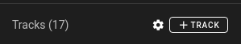
1. From the dropdown choose “Detection” mode.
    1. 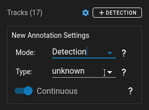
1. Choose a type from the dropdown or type a name that you want all detections to inherit.  If the type doesn't exist just type the name to create a new one.  You should see the "+Detection" button change color to match the type.  Now if you hover over the button it will display the default type.
    1. 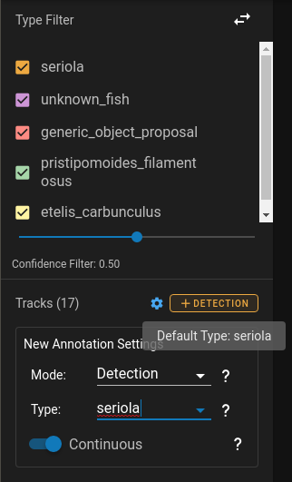
1. Turn on continuous mode if you would like to keep dragging the mouse to create detections.
1. Create your first detection by clicking and dragging to generate a rectangle.
1. If you are in continuous mode just click and drag again to create the next detection
1. Otherwise edit the detection and then hit the “N” key on the keyboard or click on detection to create another detection.

### Single Detection Mode Demo

The Demo below shows how to use Detection mode to quickly create numerous detections of the same type.

## Track Annotations

### Interpolation Mode

1. Next to the "+Track" button click the Settings Icon to open the Creation Settings
1. From the dropdown make sure that “Track” mode is selected.
1. Also ensure that interpolation is turned on.
    1. 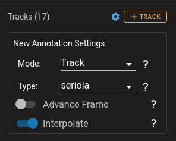
1. Either click “+Track” or hit “N” on the keyboard to create the initial track.
1. You can now advance through frames and an outline of the previous annotation will remain.  You can advance either by using Left Arrow/Right Arrow or clicking on the timeline to a specific position.
1. To set another frame you only need to move or resize the transparent annotation.
1. There are controls on for the currently selected track to add/remove keyframes.  The “Star” icon will allow you to add and remove keyframes.  The "interpolate icon" (two overlapped dashed rectangles) will turn on/off interpolation for the current region you are in.
    1. 
1. During editing there is a view within the event viewer which allows you to see where interpolation occurs and where the keyframes are located.  If a line is not connecting two keyframes in a track then interpolation is disabled for that section.
    1. 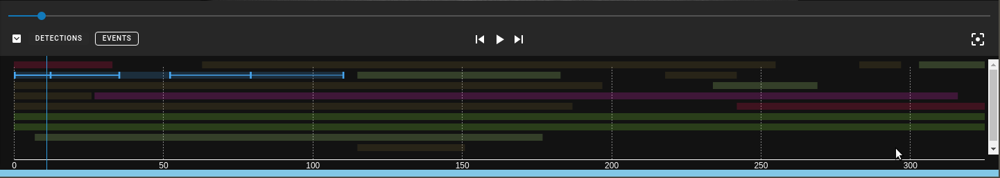

### Interpolation Mode Demo

The Demo below shows how to use Interpolation mode to quickly crate tracks for objects through a video/image-sequence.

### Advance Frame

1. Next to the "+Track" button click the Settings Icon to open the Creation Settings
1. From the dropdown make sure that “Track” mode is selected.

   1. 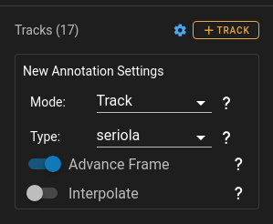

1. Turn off interpolation and turn on "AdvanceFrame"
1. Now each time an individual detection is drawn the frame will automatically advance to the next frame.

### Advance Frame Mode Demo

The Demo below shows how to use AdvanceFrame mode to travel through the video while creating annotations.

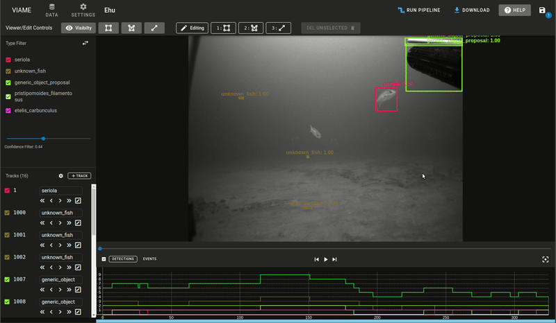

## Head Tail Annotations

**Head/Tail creation on an existing Track:**

1. Either create a new detection/track or select an existing one with “Left Click”
1. When a track is selected Head/Tail annotations can be added by either going to the edit menu and selecting the line tool at the top of screen or by:

* H Key - Create Head annotation
* T Key - Create Tail annotation

1. After entering head/tail annotation mode the cursor becomes a crosshair and the the head or tail can be placed.
1. Once the first marker is placed it automatically transitions to the second marker.  (If you start with head, the second one will be the tail and vice versa if you start with tail)

**Creating New Track from Head/Tail Annotation:**
You can create a track by starting with a head/tail annotation or just a single point.

1. After clicking "+Track" you can switch the editing mode into the line tool.
    1. 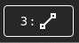
1. This will allow you place a single point initially by clicking
1. You can then either hit escape and a bounding box will appear around that point
1. Or you can place the second point and a new bounding box will be created which can be edited.

Notes:

* The head point is denoted by a filled circle, while the tail point is denoted by a hollow circle.

    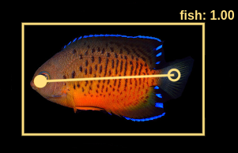

* You can also start with the tail: tap `t`
    *  - Indicates you are in tail mode and are going to place the tail point.
* You don't have to place both markers.  Press `Escape` on your keyboard at anytime to exit out of the line creation mode..  Your cursor will change back to a pointer.
* You can modify an existing head/tail marker by placing the annotation into 'Edit Mode' and then selecting the line tool from the editing options.
* **To Delete a head/tail pair**, select a detection with existing markers and have it in line edit mode.  This will allow you click the Delete button at the top to delete both points.

## Fish Head Tail Demo

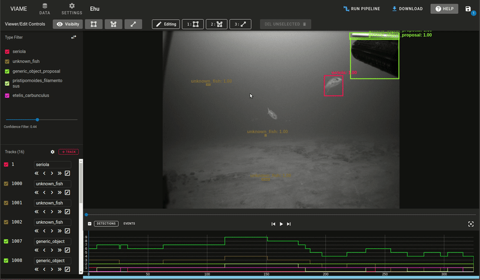

## Polygon Annotations

While every track is required to have a bounding box a polygon can be added as well for more detailed annotations of objects.  When a polygon is created or edited it will adjust the bounding box to fit the size of the polygon.

### Polygon Creation

1. Click on "+Track" or hit the 'N' key then select the polygon tool - 
1. Start by placing the first point and then start placing additional points for the polygon
    1. **NOTE:** You can hold down the mouse to draw points quickly
1. You can either close the polygon manually or "Right-Click" to automatically close the polygon

### Polygon Editing

1. In edit mode for a polygon you can select any large circle to move it.  This will move the point to a new position and recalculate the bounding box.
1. The smaller circles allow you you to create new points which can be used to adjust the polygon and make it appear smoother.
1. A single click on a point will select a point which can then be deleted by using the delete button
    1. 

## Polygon Demo

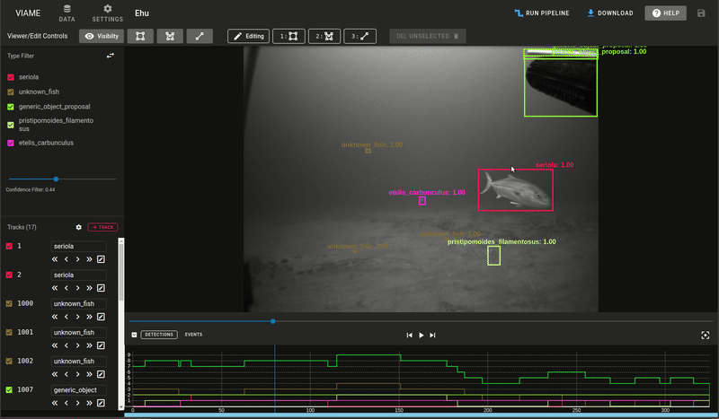
