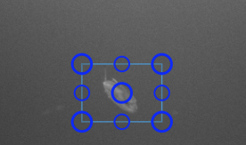

# Annotation Quickstart

Before following the quickstart, it could be helpful to skim the [User Interface Guide](Annotation-User-Interface-Overview.md)

## Single Frame Detections

How to quickly create multiple detections on a single image frame.

1. Click ==:material-cog:== (creation settings menu) in the [Track List](UI-Track-List.md) area.
    1. From the **Mode** dropdown, choose **Detection**.
    1. From the **Type** dropdown, choose or enter a default name that all new detections will have.  If the type doesn't exist yet, enter a name to create a new one.
    1. Turn on the **Continuous Mode** switch if you would like to automatically re-enter the creation state so you can click-and-drag repeatedly to quickly create many detections.
1. Enter the annotation creation state by clicking ==:material-plus: Detection== or pressing the ++n++ key.
1. Create your first detection by clicking and dragging to draw a rectangle.
1. If you are in continuous mode, click and drag again to create the next detection.
    1. Press ++escape++ to exit continuous creation mode.

### Single Detection Mode Demo

The demo below shows how to use Detection mode to quickly create numerous detections of the same type.

## Track Annotations

How to quickly create track annotations for a video or image sequence.

### Interpolation Mode

Linear interpolation is a kind of spatio-temporal annotation that allows the inference of bounding boxes between keyframes.  Interpolation mode is the fastest and easiest way to generate track annotations.

Interpolation editing for existing tracks will only be enabled on tracks that span more than one frame. It is enabled on new tracks by default.

1. Click ==:material-cog:== (creation settings menu) in the [Track List](UI-Track-List.md) area.
    1. From the **Mode** dropdown, choose **Track**.
    1. Also ensure that the **Interpolate** switch is turned **on**.
1. Enter the annotation creation state by clicking ==:material-plus: Track== or pressing the ++n++ key.
1. Create your first detection by clicking and dragging to draw a rectangle around the object you want to track.
1. You can now go forward one or more frames by pressing ++f++ or ++arrow-right++ or by using the [Timeline controls](UI-Timeline.md) and an outline of the previous annotation will remain.
    1. 
1. To set another keyframe, either move or resize the transparent annotation or press ++k++. There are also controls on for the currently selected track to add/remove keyframes. 
    1. ==:material-star:== and ==:material-star-outline:== will allow you to add and remove the current keyframe.
    1. ==:material-vector-selection:== and ==:material-selection-off:== will turn on or off interpolation for the current keyframe interval region you are in.
    1. 

### Visualizing interpolated tracks

Click ==Events== in the [Timeline controls](UI-Timeline.md) to see where interpolation occurs and where the keyframes are located.

* **Keyframes** are indicated by solid rectangular blue tick marks in the highlighted track.
* **Interpolated regions** are indicated by a thin yellow line between keyframes.
* **Gap regions** are indicated by areas with neither interpolated frames nor keyframes.  Typically means that a track is off-camera or occluded.

### Interpolation Mode Demo

### Advance Frame Mode

This mode keeps you editing the same track while automatically advancing the frame each time a detection is drawn.  In most cases **interpolation mode will be easier**.

1. Click ==:material-cog:== (creation settings menu) in the [Track List](UI-Track-List.md) area.
    1. From the **Mode** dropdown, choose **Track**.
    1. Also ensure that the **Interpolate** switch is turned **off**.
1. Enter the annotation creation state by clicking ==:material-plus: Track== or pressing the ++n++ key.
1. Create your first detection by clicking and dragging to draw a rectangle around the object you want to track.
1. Now each time an individual detection is drawn the frame will automatically advance to the next frame.  Press ++escape++ to end creation of the track.

### Advance Frame Mode Demo

The demo below shows how to use AdvanceFrame mode to travel through the video while creating annotations.

## Head Tail Annotations

### Adding Head/Tail points to existing annotations

1. **Right-click** an existing detection to enter edit mode.
1. Enter head/tail creation mode
    1. In the [Edit bar](UI-Navigation-Editing-Bar.md), click ==:material-vector-line:==
    1. Or Press ++h++ to create a head point.
    1. Or press ++t++ to create a tail point.
1. The mouse cursor will become a crosshair.  Click in the annotator to place each point.
1. Once the first marker is placed it automatically transitions to the second marker. If you start with head, the second one will be the tail and vice versa.

### Creating new annotations using Head/Tail points

You can create a track by starting with a head/tail annotation or just a single point.

1. Enter the annotation creation state by clicking ==:material-plus: Track== or pressing the ++n++ key.
1. In the [Edit bar](UI-Navigation-Editing-Bar.md), click ==:material-vector-line:== to switch to head/tail creation mode or press ++h++, ++t++, or ++3++.
1. The mouse cursor will become a crosshair.  Click in the annotator to place each point.
1. Press ++escape++ to finish creation after one or both points have been placed.

### Other notes on Head/Tail

* The head point is denoted by a filled circle, while the tail point is denoted by a hollow circle.

    

* You don't have to place both markers.  Press ++escape++ on your keyboard at anytime to exit out of the line creation mode.
* You can **modify** an existing head/tail marker by placing the annotation into 'Edit Mode' and then selecting the line tool from the editing options.
* You can **delete** a head/tail pair by selecting a detection with existing markers, entering edit mode, and clicking ==Delete Linestring :material-delete:=={ .error }

### Fish Head Tail Demo

## Polygon Annotations

Every track is required to have a bounding box, but a polygon region may be added.  When a polygon is created or edited it will generate or adjust the bounding box to fit the size of the polygon.

### Polygon Creation

1. Enter the annotation creation state by clicking ==:material-plus: Track== or pressing the ++n++ key.
1. In the [Edit bar](UI-Navigation-Editing-Bar.md), click ==:material-vector-polygon:== or press ++2++ to enter polygon creation mode.
1. Place each point on the polygon by clicking.
1. **Right-Click** to automatically close the polygon or press ++escape++ to cancel creation.

### Polygon Editing

1. **Right click** an annotation to enter edit mode.
1. In the [Edit bar](UI-Navigation-Editing-Bar.md), click ==:material-vector-polygon:== or press ++2++ to enter polygon edit mode.
1. Click and drag any large circle handle to move it.  This will move the point to a new position and recalculate the bounding box.
1. Click and drag any small circle handle to create new points. This can be used to adjust the polygon and make it appear smoother.
1. To **delete the whole polygon**, in the [Edit bar](UI-Navigation-Editing-Bar.md), click ==Del polygon :material-delete:=={ .error }
1. To **delete a single keypoint**, click its handle then click ==Del Point N :material-delete:=={ .error }

### Polygon Demo

