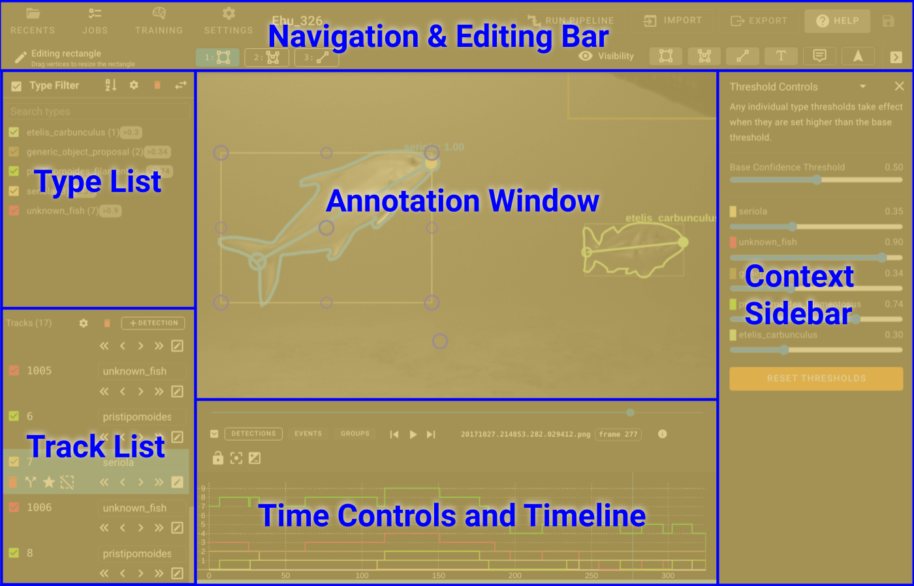

# Annotation User Interface Overview

The User Interface for the Annotation Editor is broken into a few main areas:

* **[Navigation Bar](UI-Navigation-Bar.md)** - Controls to return back to browser as well as perform higher level functions such as running pipelines.  Also the ability to save annotations to the server.
* **[Edit Bar](UI-Edit-Bar.md)** - Controls the viewing of annotations on screen and allows for the editing/creation of annotations.
* **[Annotation View](UI-Annotation-View.md)** - where the image/video is displayed as well as all annotations
* **[Type List](UI-Type-List.md)** - A list of all the types of tracks/detections on the page that can be used to filter the current view.
* **[Track List](UI-Track-List.md)** - List of all the tracks as well as providing a way to perform editing functions on those tracks.
* **[Timeline](UI-Timeline.md)** - timeline view of tracks and detections, as well as an interface to control the current frame along the video/image-sequence
* **[Attributes](Attributes.md)** - Attributes panel used to assign attributes to individual tracks or detections.

## Concepts and Definitions

**Detection** - A single slice of a track at a point in time.  Unusually the point of time is a frame of a video or a sequence of images.

**Features** - Bounding Rectangle, Head/Tail or other visible elements of a detection.

**Track** - A collection of detections spanned over multiple frames in a video or image sequence.  Tracks include a start and end time and can have periods in which no detections exist.

**Types** - a set of tracks that share specific display properties including color, line thickness, opacity.
Frame - a single image or point in time for a video or image sequence

**KeyFrame** - While using interpolation for tracks these are indicated as a locked position.  Interpolation is calculated linearly between keyframes to draw the bounding rects.

**Interpolation** - linearly moving the bounding rect of a detection over time between two keyframes.
