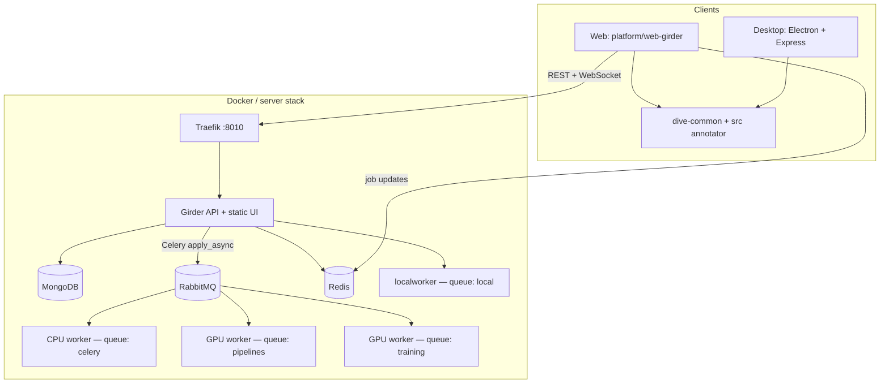
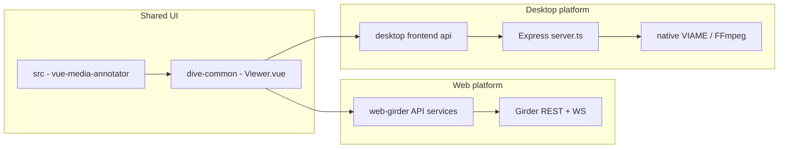

# DIVE architecture overview

This page describes how the DIVE codebase is organized: repository layout, Girder plugins, Docker services, server and Celery tasks, and how the web and desktop clients share code.

**DIVE** is a web and desktop application for video/image annotation and integration with [VIAME](https://github.com/VIAME/VIAME) computer-vision pipelines. At runtime it follows the standard **Girder + Girder Worker + Docker** pattern.

## Overview

**Users** upload videos or image sequences, annotate them (boxes, polygons, tracks across frames), run VIAME detection/training pipelines, and export annotations.

| Layer | Stack |
|-------|--------|
| Data & API | [Girder](https://girder.readthedocs.io/) 5 |
| Async jobs | Celery via [Girder Worker](https://girder-worker.readthedocs.io/) |
| Persistence | MongoDB |
| Message broker | RabbitMQ |
| Job notifications | Redis → WebSockets to the browser |
| Frontend | Vue 2 + Vuetify + GeoJS |
| CV / media | VIAME, FFmpeg (inside worker images) |

**Two ways to run the UI:**

1. **Web** — Browser talks to Girder (for example `http://localhost:8010` when using Docker Compose locally, or a deployed host).
2. **Desktop** — Electron app with a local Express server that mirrors Girder-style APIs and runs VIAME/FFmpeg on the filesystem.

Both UIs share the same annotator and DIVE shell code; only the **platform layer** (how data and jobs are reached) differs.



## Top-level repository layout

DIVE is **not** an npm/yarn workspaces monorepo. There is one Python project under `server/` and one npm package under `client/`. Production Docker images **build the client** and **bundle static assets** into the Girder image.

| Path | Purpose |
|------|---------|
| **`client/`** | Vue 2 frontend: web app, Electron desktop |
| **`server/`** | Python: Girder plugins, Celery tasks, shared utils, CLI, tests |
| **`docker/`** | Dockerfiles, entrypoints, `server_setup.py`, Traefik snippets |
| **`docker-compose.yml`** | Primary stack (plus `docker-compose.override.yml` for dev, `docker-compose.prod.yml` for prod) |
| **`docs/`** | MkDocs documentation (this site) |
| **`mkdocs.yml`** | Documentation site navigation |
| **`devops/`** | Deployment automation (for example Ansible) |
| **`samples/`** | Sample data and Girder import helpers |
| **`testutils/`** | Shared JSON fixtures for client/server tests |
| **`.github/workflows/`** | CI (docs, release, etc.) |
| **`.env.default`** | Environment template for Compose |

**Related reading in the repository:**

- Root overview: [README.md](https://github.com/Kitware/dive/blob/main/README.md)
- Server development: [server/README.md](https://github.com/Kitware/dive/blob/main/server/README.md)
- Client development: [client/README.md](https://github.com/Kitware/dive/blob/main/client/README.md)
- Deployment: [Deployment Options Overview](Deployment-Overview.md)

## Girder structure

Girder is the **data management and REST API** layer. DIVE does not use legacy `plugin.yml` files; plugins are **Python packages** registered in [`server/pyproject.toml`](https://github.com/Kitware/dive/blob/main/server/pyproject.toml) via entry points.

### Girder server plugins

```toml
[project.entry-points."girder.plugin"]
dive_server = "dive_server:GirderPlugin"
bucket_notifications = "bucket_notifications:GirderPlugin"
rabbit_user_queues = "rabbitmq_user_queues:GirderPlugin"
```

| Plugin | Package | Role |
|--------|---------|------|
| **`dive_server`** | `server/dive_server/` | Core DIVE API, models, static client, route extensions |
| **`bucket_notifications`** | `server/bucket_notifications/` | GCS bucket notifications → assetstore import |
| **`rabbit_user_queues`** | `server/rabbitmq_user_queues/` | Per-user private Celery/RabbitMQ queues (requires a public RabbitMQ server and not currently used) |

### Girder Worker plugin

```toml
[project.entry-points."girder_worker_plugins"]
dive_tasks = "dive_tasks:DIVEPlugin"
```

| Plugin | Package | Role |
|--------|---------|------|
| **`dive_tasks`** | `server/dive_tasks/` | Registers Celery tasks on workers |

### Shared Python utilities

| Package | Role |
|---------|------|
| **`dive_utils`** | Constants, Pydantic models, serializers (VIAME CSV, DIVE JSON, KPF, KWCOCO, etc.) — used by **both** server and worker |

### What `dive_server` does on load

In `dive_server/__init__.py`, the plugin typically:

- Registers custom Girder models (`trackItem`, `groupItem`, `revisionLogItem`)
- Mounts REST resources: datasets, annotations, configuration, RPC (job launch)
- Extends Girder routes (jobs, shared folders, private-queue flags)
- Serves the built Vue app at `/` and Girder’s UI at `/girder`

### REST layout (mental model)

| Pattern | Examples | Responsibility |
|---------|----------|----------------|
| `views_*.py` | `views_dataset.py`, `views_rpc.py` | HTTP endpoints (`Resource` subclasses) |
| `crud_*.py` | `crud_dataset.py`, `crud_annotation.py` | Business logic |
| `crud_rpc.py` | — | Creates Girder `Job` records and dispatches Celery tasks |
| `event.py` | — | Upload postprocess, welcome email, etc. |

### Data model (high level)

- A **dataset** is a **Girder folder** with metadata (`annotate`, `type`, `fps`, etc.).
- **Annotations** (tracks, groups) live in custom models with **revision logs** for history (web).
- Media files live in Girder’s assetstore; large images may use **girder-large-image** (Memcached-backed tiles).

How tracks relate to per-frame detections and attributes is summarized in **[Tracks, detections, and attributes](#tracks-detections-and-attributes)** below.

See [server/README.md](https://github.com/Kitware/dive/blob/main/server/README.md) for metadata property details.

## Tracks, detections, and attributes

In DIVE, a **track** is a persistent object (for example one animal or one vehicle) observed over time. A track is represented as a **sequence of detections**: each **detection** is a **feature** at a specific **frame** (bounding box, polygon, line, confidence, or optional geometry). Frames where the object is not visible have **no detection** for that track—the sequence can contain **gaps**. The UI interpolates or holds the last keyframe depending on interpolation settings.

**Track-level attributes** are key–value metadata stored on the whole track (for example species, behavior ID, or custom fields). **Detection-level attributes** attach to individual features (for example confidence notes or rotation). Both are arbitrary structured data within the schema, with a few reserved keys documented in the format spec.

Authoritative JSON shapes (including `TrackData`, `Feature`, `GroupData`, and import/export formats) are described in **[Data Formats](DataFormats.md)**. Server-side equivalents and serializers live in `server/dive_utils/`.

## Containers and Docker Compose

### Compose files

| File | Use |
|------|-----|
| `docker-compose.yml` | Full stack definition |
| `docker-compose.override.yml` | Dev: bind-mount `./server`, hot reload |
| `docker-compose.prod.yml` | TLS, watchtower, backups |

### Services (runtime)

| Service | Image / build | Purpose |
|---------|---------------|---------|
| **`traefik`** | `traefik:v3.7.4` | Reverse proxy; app on host port **8010** |
| **`girder`** | `docker/girder.Dockerfile` → `kitware/viame-web` | API + static DIVE + Girder web clients |
| **`mongo`** | `mongo:5.0` | Girder database |
| **`rabbit`** | `rabbitmq:4.2-management` | Celery broker (management UI on **15672**) |
| **`redis`** | `redis:latest` | Job notifications (`GIRDER_NOTIFICATION_REDIS_URL`) |
| **`memcached`** | `memcached` | Tile cache for `girder-large-image` |
| **`localworker`** | Same image as girder | Celery on queue **`local`** (lightweight jobs in-container) |
| **`girder_worker_default`** | `docker/girder_worker.Dockerfile` → `kitware/viame-worker:cpu` | Queue **`celery`** — transcoding, zip, image conversion |
| **`girder_worker_pipelines`** | `docker/girder_worker_gpu.Dockerfile` | Queue **`pipelines`** — VIAME detection pipelines (GPU) |
| **`girder_worker_training`** | GPU Dockerfile | Queue **`training`** — VIAME training (GPU) |
| **`autoheal`** | `willfarrell/autoheal` | Restarts unhealthy GPU workers |

### Docker Compose profiles

Compose **profiles** decide which worker services start. Core services (Traefik, Girder, MongoDB, RabbitMQ, Redis, Memcached) are not profile-gated.

- **GPU profile (`gpu`):** `girder_worker_default`, `localworker`, and the two **GPU** workers (`girder_worker_pipelines`, `girder_worker_training`) for VIAME pipelines and training.
- **CPU profile (`cpu`):** `girder_worker_default` and `localworker` only—**no** pipeline or training workers.

The template [`.env.default`](https://github.com/Kitware/dive/blob/main/.env.default) sets `COMPOSE_PROFILES=gpu` so a normal `docker compose up -d` after `cp .env.default .env` brings up the full GPU stack. Set `COMPOSE_PROFILES=cpu` in `.env` to run without GPU workers, or use the CLI form from the deployment guide:

```bash
docker compose -f docker-compose.yml --profile cpu up -d
```

When **no** worker is consuming the `pipelines` or `training` queues, the web UI and API **disable** pipeline and training actions.

### Environment file (`.env`)

Configuration for Compose and containers is driven by a **`.env`** file in the repository root (not committed; create from the template):

```bash
cp .env.default .env
# edit .env — see inline comments in .env.default
```

Common variables (see [Running with Docker Compose](Deployment-Docker-Compose.md) for the full list):

| Variable | Role |
|----------|------|
| `COMPOSE_PROFILES` | `gpu` (default template) vs `cpu` for worker stack shape |
| `TAG` | Image tag for `kitware/viame-web` / workers (`latest` by default) |
| `GIRDER_ADMIN_USER` / `GIRDER_ADMIN_PASS` | Initial Girder admin credentials |
| `PIPELINE_GPU_UUID` / `TRAINING_GPU_UUID` | Pin each GPU worker container to a specific NVIDIA device (below) |
| `PIPELINE_WORKER_CONCURRENCY` / `TRAINING_WORKER_CONCURRENCY` / `DEFAULT_WORKER_CONCURRENCY` | Celery concurrency per worker type |

### NVIDIA GPU, CUDA, and pipelines / training

**VIAME pipelines and training** run inside the **`girder_worker_pipelines`** and **`girder_worker_training`** images. They require:

- A host with an **NVIDIA GPU** and a driver version **compatible with VIAME** (see the [VIAME installation notes](https://github.com/VIAME/VIAME#installations)).
- **[NVIDIA Container Toolkit](https://docs.nvidia.com/datacenter/cloud-native/container-toolkit/install-guide.html#docker)** so Docker can expose GPUs to containers (`nvidia` runtime / CDI, as used in `docker-compose.yml`).
- The default **GPU** Compose profile so those services are created.

The CPU worker (`girder_worker_default`) handles **transcoding**, zip extraction, and similar jobs **without** requiring CUDA for DIVE’s own code path; only the **pipeline** and **training** queues need a working GPU stack inside the worker image.

GPU worker containers use a **healthcheck** based on `nvidia-smi` so failures are visible to Compose and **autoheal** can restart unhealthy GPU workers.

### Assigning GPUs to pipeline vs training workers

By default, each GPU worker container receives **`WORKER_GPU_UUID`** from the environment. In Compose, that value is wired from **`.env`**:

- **`PIPELINE_GPU_UUID`** → `girder_worker_pipelines` (`WORKER_GPU_UUID`)
- **`TRAINING_GPU_UUID`** → `girder_worker_training` (`WORKER_GPU_UUID`)

If these are **unset**, the worker code does not force `CUDA_VISIBLE_DEVICES` and the process can see whatever GPUs Docker exposes (often the first visible device per container policy).

If set, the worker maps the UUID to a device index. In `server/dive_tasks/tasks.py`, `get_gpu_environment()` reads **`WORKER_GPU_UUID`**, matches it against installed GPUs (via GPUtil), and when it matches sets **`CUDA_VISIBLE_DEVICES`** so VIAME/Kwiver uses that device.

List GPU UUIDs on the host (for example):

```bash
nvidia-smi -L
```

Set different UUIDs in `.env` to dedicate **one physical GPU to pipelines** and **another to training**, or leave one blank to use default visibility. For advanced host-level pinning, Compose also declares NVIDIA device reservations in `docker-compose.yml`; align those settings with your `.env` if you customize device lists.

### Dockerfiles (`docker/`)

| File | Output |
|------|--------|
| `girder.Dockerfile` | Multi-stage: build Vue client + Girder web UI + `uv sync` server → `kitware/viame-web` |
| `girder_worker.Dockerfile` | CPU worker (Python 3.11, FFmpeg transcoding, `dive_tasks`) |
| `girder_worker_gpu.Dockerfile` | Based on `kitware/viame:gpu-algorithms-web` + DIVE Python deps |
| `entrypoint_server.sh` | Dev client sync, `server_setup.py`, `girder serve` |
| `entrypoint_worker.sh` | `python -m dive_tasks` with `-Q $WORKER_WATCHING_QUEUES` |
| `server_setup.py` | Admin user, assetstore, CORS, DB setup |

**Production static paths inside the Girder image:**

- DIVE client: `/opt/dive/clients/dive`
- Girder client: `/opt/dive/clients/girder`
- Server source: `/opt/dive/src`

### Development vs production

| Mode | Client | Server |
|------|--------|--------|
| **Development** | `cd client && npm run serve` (Vite proxies API to `:8010`) | Girder hot-reloads via override; **workers must be restarted** for Celery changes |
| **Production** | `npm run build:web` baked into image | Single container serves API + static files |

Quick start: `cp .env.default .env` → edit `.env` if needed → `docker compose up -d` → http://localhost:8010

More detail: [Running with Docker Compose](Deployment-Docker-Compose.md).

## Server code and tasks

### Python project layout (`server/`)

```
server/
├── dive_server/       # Girder plugin — REST, events, RPC dispatch
├── dive_tasks/        # Celery / Girder Worker plugin
├── dive_utils/        # Shared models, constants, serializers
├── bucket_notifications/
├── rabbitmq_user_queues/
├── scripts/           # CLI: dive, diveutils
├── pyproject.toml     # deps + entry points
└── tox.ini            # lint, mypy, pytest, docs
```

Dependency management: **[uv](https://astral.sh/uv/)** (`uv sync` locally; Docker uses the same lockfile).

### Job flow (web)

1. Browser calls **`dive_rpc`** REST endpoints (`views_rpc.py`).
2. Server creates a Girder **`Job`** document and enqueues Celery with a `girder_client_token` (`crud_rpc.py`).
3. Worker runs the task and updates job progress.
4. Browser receives updates via **Redis + WebSockets**.
5. `worker_capabilities.py` checks RabbitMQ so the UI knows if GPU pipeline/training workers are available.

### Celery queues and workers

| Queue | Worker service | Typical work |
|-------|----------------|--------------|
| **`celery`** | `girder_worker_default` | Media prep: video transcode, image conversion, zip extract, large-image conversion |
| **`pipelines`** | `girder_worker_pipelines` | Run VIAME detection/tracking/analysis pipelines on a dataset |
| **`training`** | `girder_worker_training` | VIAME training jobs |
| **`local`** | `localworker` (in girder container) | Batch postprocess, async assetstore import |
| **`{login}@private`** | User’s own worker (optional) | Same tasks, routed per-user when private queue is enabled |

Worker entry: `python -m dive_tasks` (see `dive_tasks/__main__.py`, `dive_tasks/celeryconfig.py`).

### Main Celery tasks (`dive_tasks/tasks.py`)

| Task | Category | Purpose |
|------|----------|---------|
| `convert_video` | Transcoding | FFmpeg → web-friendly playback |
| `convert_images` | Transcoding | Normalize image sequences |
| `convert_large_images` | Transcoding | girder-large-image conversion |
| `extract_zip` | Import | Unpack uploaded archives |
| `run_pipeline` | Pipelines | Execute VIAME pipeline on a dataset |
| `export_trained_pipeline` | Pipelines | Export trained model (for example ONNX) |
| `train_pipeline` | Training | VIAME training |
| `upgrade_pipelines` | Pipelines | Refresh pipeline definitions from disk/addons |

Supporting modules: `pipeline_discovery.py`, `dive_batch_postprocess.py`, `local_tasks.py`, `worker_girder_events.py`.

**VIAME on GPU workers:** bundled under `/opt/noaa/viame/`; optional addons at `/tmp/addons` (writable on the pipeline worker).

### Where to start in code

| Feature | Start here |
|---------|------------|
| Launch pipeline | `views_rpc.py` → `crud_rpc.py` → `dive_tasks/tasks.py` (`run_pipeline`) |
| Upload → transcode | `event.py` → `convert_video` / `convert_images` on `celery` |
| Save annotation | `views_annotation.py` → `crud_annotation.py` |
| Dataset metadata | `views_dataset.py` → `crud_dataset.py` |

## Client: web, desktop, and shared code

Single npm package: [`client/package.json`](https://github.com/Kitware/dive/blob/main/client/package.json). Published library name: **`vue-media-annotator`**.

### Four layers

```
client/
├── src/                    # Vue Media Annotator — core GeoJS annotator (format-agnostic)
├── dive-common/            # DIVE shell: Viewer.vue, tracks UI, import/export, pipelines UI
├── platform/
│   ├── web-girder/         # Web: Girder API, routing, admin, data browser
│   └── desktop/            # Electron: Express backend, native VIAME/FFmpeg, filesystem
├── index.html              # Web entry → platform/web-girder/main.ts
├── desktop.html            # Desktop renderer → platform/desktop/main.ts
├── vite.config.ts          # Web dev/build (proxies /api, /notifications)
└── electron.vite.config.ts # Electron main / preload / renderer
```

Vite aliases:

- `vue-media-annotator` → `client/src`
- `dive-common` → `client/dive-common`
- `platform` → `client/platform`

### Shared vs platform-specific

| Shared (both web and desktop) | Platform-specific |
|-------------------------------|-------------------|
| **`src/`** — annotator, GeoJS layers, track editing | **Web:** `@girder/components`, Girder REST, WebSocket job notifications |
| **`dive-common/`** — `Viewer.vue`, mode manager, pipeline/training UI, import/export UX | **Desktop:** Express `backend/server.ts`, Electron IPC (`preload.ts`), local job runners in `backend/native/` |
| Annotation timeline, attributes, recipes | **Web:** revision history API |
| | **Desktop:** multicam, local paths, OS-specific binaries |

### Unified API concept

Both platforms expose the **same capabilities** (load/save annotations, run pipelines/training, import/export) through different transports:

- **Web:** `platform/web-girder/api/*.service.ts` → Girder REST
- **Desktop:** `platform/desktop/frontend/api.ts` + `platform/desktop/backend/server.ts` → local Express

This lets **`dive-common`** and **`src`** stay identical; only `ViewerLoader.vue` and API adapters change.

### Client API specification (`apispec.ts`)

[`client/dive-common/apispec.ts`](https://github.com/Kitware/dive/blob/main/client/dive-common/apispec.ts) is the **TypeScript contract** between shared UI code and each platform’s backend. It defines:

- The **`Api` interface** — async methods for pipelines, training, loading/saving **detections** (tracks and groups), dataset **metadata**, **attributes**, attribute track filters, optional large-image tiles, and file/disk helpers (`openFromDisk`, `importAnnotationFile`, etc.).
- Shared **types** exported for callers: `AnnotationSchema`, `DatasetMeta`, `SaveDetectionsArgs`, `Pipe`, `Pipelines`, and related structures used across `dive-common` and `vue-media-annotator`.
- **`provideApi(api)`** / **`useApi()`** — Vue `provide` / `inject` wiring so any composable or component in **`dive-common`** can call `useApi()` without knowing whether it is running in the browser against Girder or inside Electron against Express.

**Web** — [`platform/web-girder/App.vue`](https://github.com/Kitware/dive/blob/main/client/platform/web-girder/App.vue) calls `provideApi({ ... })` with an object whose methods delegate to **`platform/web-girder/api/*.service.ts`** (REST, Girder tokens, WebSockets for jobs, Girder large-image tile URLs).

**Desktop** — [`platform/desktop/App.vue`](https://github.com/Kitware/dive/blob/main/client/platform/desktop/App.vue) calls `provideApi(statefulApi())`, where **`statefulApi()`** wraps the desktop frontend API and local Express backend (`backend/server.ts`, native runners).

Optional methods on **`Api`** (for example `getTiles`, `getTileURL`, `getLastCalibration`, `saveCalibration`) exist for large-image or desktop-only flows; the web app implements the subset it needs, and the desktop app can supply the rest.

### Key entry points

| Component | Path | Role |
|-----------|------|------|
| **ViewerLoader** | `platform/web-girder/views/ViewerLoader.vue` or `platform/desktop/frontend/components/ViewerLoader.vue` | Loads dataset by `id`, sets revision / read-only, mounts viewer |
| **Viewer** | `dive-common/components/Viewer.vue` | Root annotator; `loadData`, `useSave`, `provideAnnotator`, etc. |

### Web (`platform/web-girder/`)

- **Entry:** `main.ts`, `App.vue`
- **API:** `api/*.service.ts` (dataset, annotation, rpc, configuration, largeImage)
- **Views:** data browser, jobs, admin, training menus
- **Store:** composables for user, dataset, jobs, config
- **Dev:** `npm run serve` — Vite dev server with API proxy to Girder

### Desktop (`platform/desktop/`)

- **Main process:** `background.ts` — window, IPC, starts Express
- **Preload:** `preload.ts` — `window.diveDesktop` bridge
- **Renderer:** `main.ts`, `frontend/` — same viewer stack as web
- **Backend:** `backend/server.ts` — Express routes mirroring Girder
- **Native jobs:** `backend/native/` — VIAME pipelines, training, media jobs
- **Serializers:** `backend/serializers/` — format conversion (viame, coco, kpf, dive, …)
- **Build:** `npm run build:electron` → `dist_electron/`

More detail: [client/platform/desktop/README.md](https://github.com/Kitware/dive/blob/main/client/platform/desktop/README.md).



## Ancillary plugins and operations

| Area | Location |
|------|----------|
| GCS import rules | `server/bucket_notifications/` |
| Private user queues | `server/rabbitmq_user_queues/` |
| User documentation | `docs/` + `mkdocs.yml` |
| Deployment playbooks | `devops/` |
| CLI utilities | `server/scripts/` (`dive`, `diveutils`) |


## Glossary

| Term | Meaning |
|------|---------|
| **VIAME** | Kitware video analytics toolkit; pipelines and training run inside GPU workers |
| **Girder** | Data platform: users, folders, files, permissions, REST API |
| **Girder Worker** | Celery integration for Girder jobs |
| **Dataset** | Annotatable folder (video or image sequence) with metadata |
| **Track** | One labeled object over time; a sequence of per-frame detections (features), possibly with gaps |
| **Detection / feature** | Single-frame geometry and metadata belonging to a track |
| **Pipeline** | VIAME algorithm config run on a dataset (detection, tracking, etc.) |
| **Revision** | Web-only snapshot of annotation history |
| **vue-media-annotator** | Reusable annotator component/library in `client/src` |
| **`Api` / `apispec.ts`** | Shared TypeScript interface and `provideApi` / `useApi` for web vs desktop backends |

---

This overview matches the repository layout for **Girder 5** and **Docker Compose v2**. For deployment and upgrades, see [Deployment Options Overview](Deployment-Overview.md) and the rest of the Administrator Guide.
