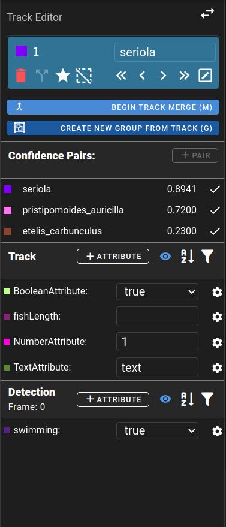
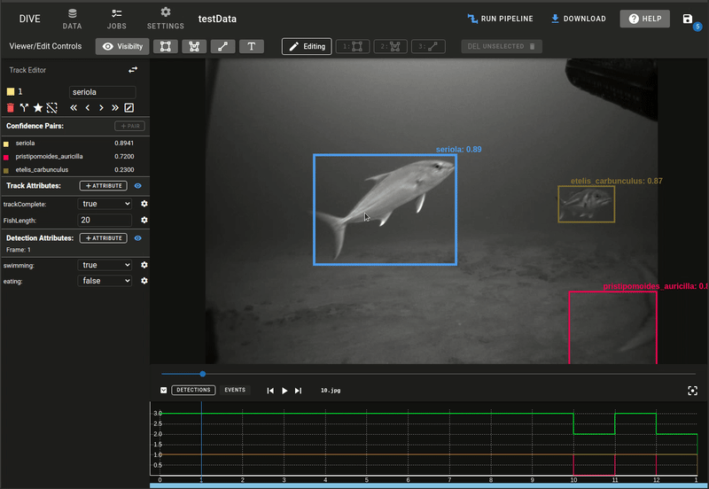

# Attributes

Attributes are properties that can be assigned to an entire track or a single detection within a track. Attributes are created within a dataset using the TrackDetails panel.

!!! info
    Attributes were previously global settings but have been moved to being dataset specific.

## Background/Definitions

It’s important to note that there are dataset level attributes and then track/detection attributes.  Dataset attributes are all the possible attributes that can be assigned and visualized in the dataset.  Then there are track/detection level attributes.  These are a subset of the dataset attributes that are applied to tracks/detections.  Track attributes are information for the entire track and detection attributes are information for the specific frame or instance of time.

**Dataset Attribute** - base attribute which defines the name and **type** for either a Track or Detection Attribute
**Track Attribute** - attribute with a **value** associated with the entire track
**Detection Attribute** - attribute with a **value** specified for a detection during a single frame

Example:
- Dataset Attributes
    - Track
        - CompleteTrack: Boolean
        - FishLength: number (cm)
    - Detection
        - Swimming: Boolean
        - Eating: Boolean

Usage of the Dataset Attributes for a track:
- Fish Track 1
    - Track Attributes
        - FishLength: 20
    - Detection Attributes
        - Frame 1
            - Eating: true
        - Frame 2
            - Swimming: false
            - Eating: false

**Note:** All dataset attributes do not need to be assigned to values

## Navigating to Attributes

Attributes and editing them are located under the TrackDetails Panel.  This panel is used to perform detailed editing of a track types and attributes.

1. While your data is open you can select a track/detection to apply attributes.
1. Open the track-details page by clicking on the  {screenshot of symbol} icon or by using the ‘A’ key as a shortcut.
    1. 
    1. 
1. Here you will see the track/detection type, confidence pairs associated with it and then a list of track and detection attributes.
    1. 
1. For attributes there are two sections
    1. *Track Attributes* - All track level attributes
    1. *Detection Attributes* - attributes associated with the track on a per frame basis

!!! info
    During import of a VIAME CSV file Attributes that are structured using the VIAME CSV specification will automatically show up in the list.  The system does a best guess at determining the type of the attribute based on the values used throughout the dataset.

## Adding Dataset Attributes

By default the view on the page shows all attributes associated with the dataset in editing mode.  If you click on the Eye Icon this will only display the attributes that are set on the selected track and the current frame for that track.

After clicking the eye icon, all attributes that aren't set will be removed from view.  This is useful for reviewing or viewing attributes of a track when there is a large set of Dataset Attributes.

1. To add attributes click on the corresponding "+Attribute" icon for either a Track or Detection Attribute
    1. 

1. This will bring up a New Attribute dialog where you can enter a unique name for the attribute
    1. 
1. Next choose a datatype: 
    1. Number
    1. Boolean - (True/False)
    2. Text
        1. Custom text that the user provides
        1. A predefined list of text that can be chosen from
1. After choosing a Track/Detection and a Datatype click Save to add the new attribute

## Editing Dataset Attributes
1. Click on the setting icon next to an existing attribute to edit it's details
    1. 
1. **Note:**  Currently editing or deleting a dataset attribute doesn’t affect the currently set Track/Detection attributes for the data.  It removes the display of them and prevents sem from being set on future tracks/detections.  A future update will enable this capability.

## Setting Track/Detection Attribute Values
1.  Click on the attribute value when in viewing mode to edit and set the attribute
1.  Or directly edit the value field when in the attribute editing mode
1.  Setting an attribute to the null/empty value or deleting it will remove the value from the track/detection

## Setting Attributes on Tracks/Detections

1. Select a track or detection that attributes should be applied on
1. Click in the upper right of the track/type panel to go to the Attributes Interface
    1. 
1.  You are provided with some information about the currently selected track and it's attributes
    1. 
1.  Near the top is the Track ID, confidence pairs and then a list of Track Attributes that can be edited
1.  Further down is the current Frame number and the Detection attributes which are connected to that specific frame
1.  Attributes can be edited by clicking on the dropdowns and setting them
    1. Boolean attributes allows you select **blank** or **true** or **false**
       1. 
    2. Number attributes allow a numerical input
    3. Text attributes can either be custom text or selection from a predefined list of types
2. 
3.  **NOTE:**  Don't forget to save the data after changing track attributes.
    1. 

## Applying Attributes Demo

