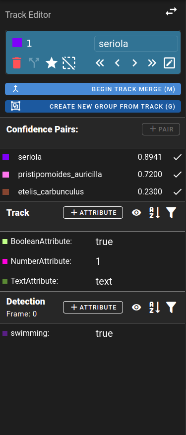
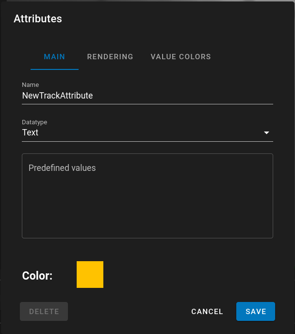

# Attributes

Attributes are properties that can be assigned to an entire track or a single detection within a track. Attributes are created within a dataset using the Track Details panel.

!!! info

    Attributes were previously globally defined.  They are now defined on each individual dataset.

## Background/Terms

It’s important to note that there are attribute definitations and then track/detection attributes.  Attributes definitions are all the possible attributes that can be assigned to tracks or detection.  Think of them as a template for the attributes that can be set on tracks/detections.  Track attributes are information for the entire track and detection attributes are information for the specific frame or instance of time.

- **Attribute Definition** - base attribute which defines the name and **type** for either a track or detection attribute
- **Track Attribute** - attribute with a **value** associated with the entire track
- **Detection Attribute** - attribute with a **value** specified for a detection during a single frame

Example:

    - Attribute Definitions
        - Track
            - CompleteTrack: Boolean
            - FishLength: number (cm)
        - Detection
            - Swimming: Boolean
            - Eating: Boolean

Usage of the above Attribute Definitions for a track and its detections:

    - Fish Track 1
        - Track Attributes
            - FishLength: 20
        - Detection Attributes
            - Frame 1
                - Eating: true
            - Frame 2
                - Swimming: false
                - Eating: false
**Note:** All Attribute definitions do not need to be assigned to values.  CompleteTrack (Track Attribute) and Swimming for Frame 1 (Detection Attribute) weren't assigned in this example.

## Navigating to Attributes

Controls for defining and editing attributes are found on the Track Details Panel. 

1. While your data is open you can select a track/detection to apply attributes.
1. Open the Track Details page by clicking on the eye icon or by using the ‘A’ key as a shortcut.
    1. 
    1. 
1. Here you will see the track/detection type, confidence pairs associated with it and then a list of track and detection attributes.
    1. 
1. For attributes there are two sections
    1. *Track Attributes* - All track level attributes
    1. *Detection Attributes* - attributes associated with the track on a per frame basis

!!! info

    During import of a VIAME CSV file, attributes that are structured using the [VIAME CSV specification](https://viame.readthedocs.io/en/latest/section_links/detection_file_conversions.html) will automatically show up in the list.  The type of the attribute is guessed by examining values and may need to be manually corrected.

## Adding Attribute Definitions

By default the view on the page shows all attributes associated with the dataset in editing mode.  If you click on the Eye Icon this will only display the attributes that are set on the selected track and the current frame for that track.

    

After clicking the eye icon, all attributes that are unset will be removed from view.  This is useful for reviewing or viewing attributes of a track when there is a large number of attribute definitions.

1. To add attributes click on the corresponding "+Attribute" icon for either a track or detection attribute
    1. 

1. This will bring up a New Attribute dialog where you can enter a unique name for the attribute
    1. 
1. Next choose a datatype: 
    1. Number
    1. Boolean - (True/False)
    2. Text
        1. Custom text that the user provides
        1. A predefined list of text that can be chosen from
1. After choosing a Track/Detection and a Datatype click Save to add the new attribute

## Editing Dataset Attributes
1. Click on the setting icon next to an existing attribute to edit it's definition details
    1. 
1. **Note:**  Editing or deleting an attribute definition doesn’t change the existing track/detection attributes for the data
    1. Deleting an attribute definition will cause it to disappear from the list.  A future update will cause the attribute to also be removed from all tracks/detections.
    1. Editing an attribute definition will change the way the controls behave, but will not change any existing set values.

## Setting Track/Detection Attribute Values
1.  Click on the attribute value when in viewing mode to edit and set the attribute
1.  Or directly edit the value field when in the attribute editing mode
1.  Setting an attribute to the null/empty value will remove the value from the track/detection

## Applying Attributes Demo

