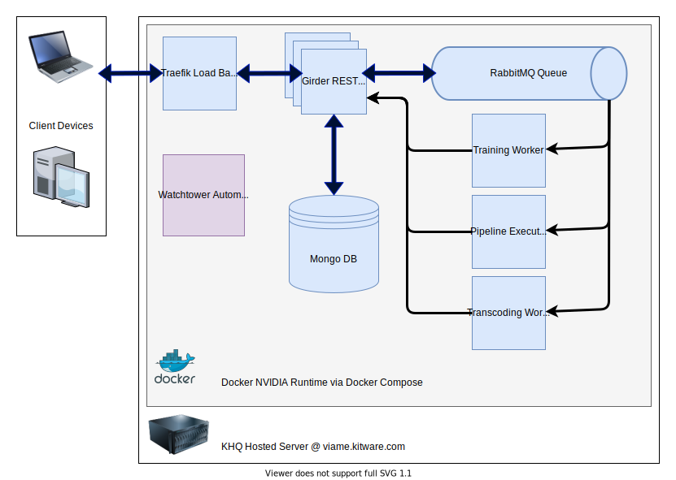

# Deployment Overview

The goal of this page is to provide an overview of the ways to run part or all of VIAME Web in various types of compute environments.

## Contents

* [Using our deployment of VIAME Web](#using-our-public-server)
* [Running your own instance of VIAME Web](#running-your-own-instance)
* [Using the VIAME command line and project folders in a cloud environment](#viame-cli-with-project-folders)
* [Hybrid options for using local or cloud compute resources with an existing deployment](#hybrid-options-for-compute)
* [Hybrid options for integrating data from cloud storage such as GCP Buckets or S3 into an existing deployment](#hybrid-options-for-storage)

## Comparing options

| Using our server | Running your own |
|----------|-----------|
Free to use; no maintenance costs | You pay hosting and maintenance costs |
Always up to date | Possible to configure automated updates |
One shared enviornment for everyone | Your organization has full control over access |
Our team monitors this service for errors and can respond to issues proactively | Support by email requires logs, screenshots, and other error information if applicable
Our team can provide guidance on annotaiton and training because we have direct access to your data | Support by email usually requires example data and annotations
Having user data in our environment helps us understand user needs and improve the product | Feedback by email is always appreciated.
Limited shared compute resources (2 GPUs) available to process jobs. Can be mitigated by hybrid compute options | As much compute as you pay for

## Architecture Overview

## Using our public server

The easiest option to get started using VIAME is to [try our public server](Web-Version.md).

## Running your own instance

You may wish to run your own deployment of VIAME Web in your own lab or in a cloud environment.  Deploying VIAME Web is relatively straighforward with `docker-compose`.

**Local server**

If you already have SSH access to an existing server and `sudo` permissions, skip to the docker guide.

[Docker Operator Guide ➥](https://github.com/Kitware/dive/tree/main/docker){ .md-button .md-button--primary }

**Google Cloud**

You'll need a GCP Virtual Machine (VM) with the following features

| Feature | Recommended value |
|---------|-------------------|
| Operating system | Ubuntu 20.04 |
| Instance Type | `n1-standard-4` or larger |
| GPU Type | `nvidia-tesla-t4`, `nvidia-tesla-p4`, or similar |
| Disk Type | SSD, 128GB or more depending on your needs |

You can achieve this in a couple of ways:

* **Option 1**: Provision a virtual machine on your own through the Google Cloud web console and then proceed to follow the [docker documentation](https://github.com/Kitware/dive/tree/main/docker) as if it were a regular server with SSH access.
* **Option 2**: Use our Terraform and Ansible guide to automatically provision an VM and configure a server.

**AWS**

You'll need to provision an EC2 instance using the command line or AWS console.  You can either run the whole stack on a single node or rely on AWS infrastructure like Amazon MQ, MongoDB Atlas, and ELBs.  We do not provide detailed instructions for AWS.

There is likely no one-size-fits-all cloud deployment strategy, so feel free to contact us to discuss your needs.

## VIAME CLI with project folders

You may not want to use the web annotator and job orchestration at all, and instead run VIAME using the command line in a cloud environment with GPU.

**Local server**

This is a standard VIAME install.  See the [VIAME documentation install instructions](https://github.com/VIAME/VIAME).

**Google Cloud**

Basically the same approach and options as above.

* **Option 1**: Provision a VM on your own, then proceed with the [VIAME documentation install instructions](https://github.com/VIAME/VIAME).
* **Option 2**: Use our Terraform and Ansible, and follow the "VIAME CLI" optional instructions.

**AWS**

Provision an EC2 instance using the command line or AWS console and then proceed with the [VIAME documentation install instructions](https://github.com/VIAME/VIAME). You could also use our Ansible playbook to provision the AWS host.

## Hybrid options for compute

Instead of running the whole web stack, it's possible to deploy a worker on its own to process compute-intensive jobs.

**Example scenarios**

* Upload and annotate at viame.kitware.com, but run your own **private** worker on a lab workstation
* Deploy your own web server to a local lab workstation, but process your jobs in an ephemeral Google Cloud VM.

**How it works**

* You must [toggle your private queue](https://viame.kitware.com/#jobs)
* When you launch jobs (like transcoding, pipelines, or training), they go into a special queue just for your user account.
* You are responsible for running a worker.  Your worker is a Celery process that will connect to our public RabbitMQ server.
* Jobs submitted through the interface at viame.kitware.com will run on your compute resources.  This involves automatically downloading the video or images and annotation files, running a kwiver pipeline, and uploading the results.

## Hybrid options for storage

Any instance of VIAME Web, including our public server, can connect to S3-compatible storage.  This means your lab or group could make your existing data avaible at [viame.kitware.com](https://viame.kitware.com), either privately or publicly.

| Storage Product | Support level |
|-----------------|---------------|
Google Cloud Buckets | Use as backing storage, import existing data, monitor for changes and automatically discover new uploads
AWS S3 | Use as backing storage, import existing data
MinIO | Use as backing storage, import existing data
Azure Blob Storage | Limited import support using [MinIO Azure Gateway](https://docs.min.io/docs/minio-gateway-for-azure.html)

## Get Help

[Contact us](https://kitware.github.io/dive/#get-help) for support with any of these topics.
