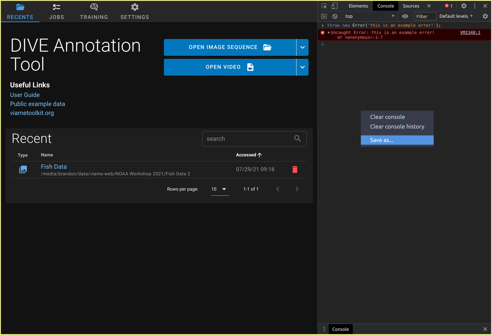

# DIVE Desktop

DIVE is available as an electron based desktop application with [VIAME](https://github.com/viame/viame) integration. It has most of the same UI and features web.  You may want to use desktop if...

* You want to make use of GPUs on your own workstation
* You need to use DIVE without network access
* You have large quantities of data on disk impractical for uploading to a server.

DIVE Desktop is fully supported on Windows and Linux. MacOS users can use it as an annotator, but without NVIDIA Driver support, the machine learning features from VIAME are unavailable.


## Installation

[:material-download: Download the latest DIVE Desktop from GitHub](https://github.com/Kitware/dive/releases/latest){ .md-button }

Choose an **asset** from the list matching your operating system:

| OS       | Extension | Description |
| -------- | --------- | ----------- |
| Windows  | .exe      | Portable executable (recommended) |
| Windows  | .msi      | Installer file |
| MacOS    | .dmg      | MacOS DiskImage (Intel only, M1 not supported) |
| Linux    | .AppImage | Portable executable for all Linux platforms (recommended) |
| Linux    | .snap     | Ubuntu SnapCraft package |

### Full VIAME Desktop Installation

This is the installation guide for DIVE.  If you want the full VIAME toolkit, you can get it from [github.com/viame/viame](https://github.com/viame/viame#installations).  The full toolkit installation includes DIVE.

## Supported Dataset Types

DIVE Desktop supports single- and multi-camera datasets.

* **Single Camera Datasets** is the most common option.  Single camera datasets are supported by the majority of VIAME pipeline and training configurations.
* **Stereo Datasets** are for datasets collected from a camera rig with a left and right camera.  These datasets can be used with certain specialty VIAME pipelines.
* **Multi-Cam Datasets** are for more generic multi-camera rig setups.  They may have overlapping fields of view, and their physical relationship may be described by a camera transform `.npz` file (numpy transformation matrix).

### Importing Datasets

Click either ==Open Image Sequence :material-folder-open:== or ==Open Video :material-file-video:== to begin a single camera default import.  Click the ==:material-chevron-down:== dropdown button to show additional import options.

* ==:material-file-video: From File== is the default option for videos. It will open a file picker and allow you to choose a single video file.
* ==:material-folder: Directory== is the default option for image sequences. It will prompt you to choose an **entire folder** of images to import as a dataset.
    * You can use globbing patterns to filter the contents of an image directory during import. Click ==:material-chevron-down: Show advanced options== to reveal the glob input.
* ==:material-view-list-outline: Image List== will prompt you to choose a `.txt` file that contains an image name or full path on each line.
* ==:material-binoculars: Stereo== will prompt you to choose 2 videos or 2 image sequences.
* ==:material-camera-burst: Multi-Cam== will prompt you to describe the multi-cam configuration by naming several cameras and picking the source media for each.

The import routine will look for `.csv` and `.json` files in the same directory as the source media, and you will be prompted to manually select an annotation file and a configuration file.  Neither is required.

### Video Transcoding

DIVE Desktop is an [Electron](https://www.electronjs.org/) application built on web technologies.  Certain video codecs require automatic transcoding to be usable.  Video will be transcoded unless _all_ the following conditions are met.

* `codec` = `h264`
* `sample_aspect_ratio (SAR)` = `1:1`

## Running Training

1. Click on ==:material-brain: Training== to open the training tab.
1. Add one or more datasets to the staging area by clicking ==:material-plus:==.
1. Choose an appropriate training config file and any training parameters.  These are documented on the [training configuration page](Pipeline-Documentation.md).
1. Click ==Train on (N) Datasets==.  Note that depending on what configuration and datasets you chose, training could take hours or days.

## Desktop Settings

DIVE Desktop requires a local installation of the VIAME toolkit to run pipelines, train, and do transcoding.

* **VIAME Install Path** is set automatically if you use the `launch_dive_interface.[bat|sh]` script from a VIAME install.  Otherwise, you may need to change this yourself.
    * Use ==Choose :material-folder:== to choose the base installation path, then click ==:material-content-save: Save==.
* **Project Data Storage Path** defaults to a subfolder in your user workspace and should generally not be changed.
* **Read only mode** disables the ability to save when using the annotator.
* **Synchronize Recents** - The ==:material-sync: Synchronize Recents with Project Data== button is useful if data in the Project Data Storage Path gets out of sync with what appears in the ==:material-folder-open: Recents== list.

### Data Storage Path

The data storage path is not at all related to "project folders" in VIAME.  It's just a place for DIVE Desktop to keep and structure all the data it needs to run.

A typical data storage directory has 3 subfolders:

* `DIVE_Jobs` - Each job run has a working directory, kept here.
* `DIVE_Projects` - Each dataset you import into desktop has metadata and annotation data (with revision history) kept here.
* `DIVE_Pipelines` - Training runs produce models that get copied into here.

Here's an example of structure you might find in the storage path.

``` text
VIAME_DATA
├── DIVE_Jobs
│  ├── Scallop_1_scallop and flatfish_06-01-2021_11-02-11.585
│  │  ├── detector_output.csv
│  │  ├── dive_job_manifest.json
│  │  ├── image-manifest.txt
│  │  └── runlog.txt
│  └── Scallop_2_scallop netharn_06-01-2021_11-02-19.432
│     ├── detector_output.csv
│     ├── dive_job_manifest.json
│     ├── image-manifest.txt
│     └── runlog.txt
├── DIVE_Pipelines
│  ├── My Fish SVM Demo
│  │  ├── detector.pipe
│  │  └── fish.svm
│  └── Quadcam_Fish_Detector_SVM
│     ├── detector.pipe
│     └── fish.svm
└── DIVE_Projects
   ├── fish_training_data_c_jp7hq88vfv
   │  ├── auxiliary
   │  │  └── result_06-01-2021_10-55-38.627.json
   │  ├── meta.json
   │  └── result_06-01-2021_04-53-38.050.json
   └── scallop_2_jrgdq760gu
      ├── auxiliary
      │  └── result_06-01-2021_10-54-56.034.json
      ├── meta.json
      └── result_06-01-2021_11-02-35.857.json
```

### Configuration with env

DIVE Desktop looks for the these environment variables on launch.

| Name | Default | Description |
| ---- | ------- | ----------- |
| DIVE_VIAME_INSTALL_PATH | /opt/noaa/viame (Linux/macOS) C:\Program Files\VIAME (Windows) | Overrides the location of the VIAME installation.  Users may not change this value in the settings pane if provided. |
| DIVE_READONLY_MODE | None | Overrides read only mode to true or false.  Users may still change this value in the settings pane if provided. |

## Import/Export of Models

Trained models are kept in `${Project Data Storage Path}/DIVE_Pipelines` as described above.  Each model file consists of exactly 1 pipe file and some number of other model files.

* The pipe file can be one of `detector.pipe`, `tracker.pipe`, or `generate.pipe`.
* Other files can be `.zip`, `.svm`, `.lbl`, or `.cfg`.

You can use externally trained models in DIVE by creating a folder containing these files.  The name of the configuration or pipeline in dive will be the folder name you create.

## Troubleshooting

> I imported some data, but I don't see my annotations

See [Importing images and video above](#importing-images-videos).

> I get an error that says "ffmpeg not installed, please download and install VIAME Toolkit from the main page"

DIVE Desktop relies on an installation of `ffmpeg` for transcoding videos and some images.  This tool comes with the VIAME installation.  Verify your VIAME Install Base Path is correct.

> Some VIAME canned pipelines are missing, or there are no training configuration files.

You may need to install VIAME Toolkit, or correct your **VIAME Install Base Path** setting.

If you don't see some pipelines you expect, you may not have installed the addons (also called Optional Patches) yet.  Download and install these based on the [VIAME installation docs](https://github.com/viame/VIAME#installations).  

> Advanced troubleshooting

If you experience problems or have questions about DIVE Desktop, [contact us](Support.md) and include the content from the settings page such as `Build Version` as well as your currently installed VIAME version.

It's also helpful to look in the debug console.  Press ++ctrl+shift+i++ to launch the Dev Tools and look under the console tab.  Errors and warnings will appear in red and yellow.  You can right-click in the console area and click "Save As" to save the log file and [open a support ticket](Support.md)


