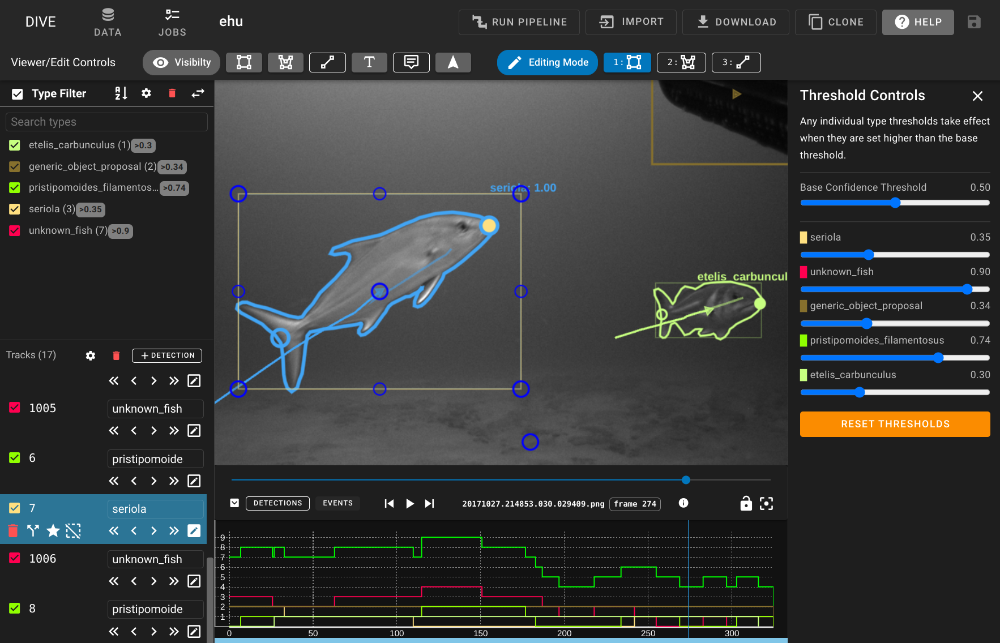
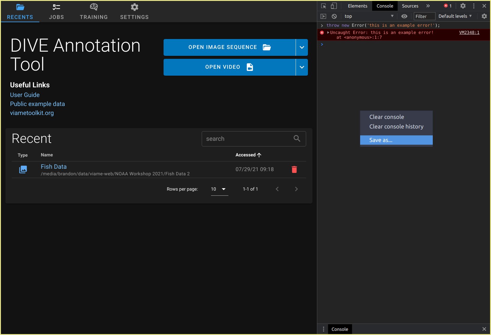

# DIVE Desktop

DIVE is available as an electron based desktop application with [VIAME](https://github.com/viame/viame) integration. It has most of the same UI and features web.  You may want to use desktop if...

* You want to make use of GPUs on your own workstation
* You need to use DIVE without network access
* You have large quantities of data on disk impractical for uploading to a server.

DIVE Desktop is fully supported on Windows and Linux. MacOS users can use it as an annotator, but without NVIDIA Driver support, the machine learning features from VIAME are unavailable.



## Installation

[:material-download: Download the latest DIVE Desktop from GitHub](https://github.com/Kitware/dive/releases/latest){ .md-button }

Choose an **asset** from the list matching your operating system:

| OS       | Extension | Description |
| -------- | --------- | ----------- |
| Windows  | .exe      | Portable executable (recommended) |
| Windows  | .msi      | Installer file |
| MacOS    | .dmg      | MacOS DiskImage (Intel only, M1 not supported) |
| Linux    | .AppImage | Portable executable for all Linux platforms (recommended) |
| Linux    | .snap     | Ubuntu SnapCraft package |

### Full VIAME Desktop Installation

This is the installation guide for DIVE.  If you want the full VIAME toolkit, you can get it from [github.com/viame/viame](https://github.com/viame/viame#installations).  The full toolkit installation includes DIVE.

## Supported Dataset Types

DIVE Desktop supports single- and multi-camera datasets.

* **Single Camera Dataset** is the most common option.  Single camera datasets are supported by the majority of VIAME pipeline and training configurations.
* **Stereo Datasets** are for datasets collected from a camera rig with a left and right camera.  These datasets can be used with certain specialty VIAME pipelines. Their physical relationship may be described by a camera transform `.npz` file (numpy transformation matrix).
* **Multi-Cam Datasets** are for more generic multi-camera rig setups.  They may have overlapping fields of view.

Shared viewer behavior (camera selection, linked tracks, MultiCamera Tools, and pipelines) is documented in [Multicamera and Stereo Data](Multicamera-data.md). The [web version](Web-Version.md#uploading-multicamera-and-stereo-data) supports the same import types with a few desktop-only advanced options.

### Interactive annotation (Desktop only)

DIVE Desktop can run VIAME-backed **interactive segmentation** and **interactive stereo** tools while you annotate. These require a local VIAME install with interactive service support and are not available in the web annotator.

* **Interactive segmentation** — click foreground/background points to generate polygon masks (++s++ or the Segment button). See [Interactive Annotation](Interactive-Annotation.md).
* **Interactive stereo** — on stereo datasets, auto-warp annotations between cameras and recompute head/tail length measurements. Configure from the **Stereo Settings** section in the track list creation settings menu.

Both features share one lazy-loaded Python interactive service subprocess. GPU is recommended for model initialization.

### Importing Datasets

Click either ==Open Image Sequence :material-folder-open:== or ==Open Video :material-file-video:== to begin a single camera default import.  Click the ==:material-chevron-down:== dropdown button to show additional import options.

* ==:material-file-video: From File== is the default option for videos. It will open a file picker and allow you to choose a single video file.
* ==:material-folder: Directory== is the default option for image sequences. It will prompt you to choose an **entire folder** of images to import as a dataset.
    * You can use globbing patterns to filter the contents of an image directory during import. Click ==:material-chevron-down: Show advanced options== to reveal the glob input.
* ==:material-view-list-outline: Image List== will prompt you to choose a `.txt` file that contains an image name or full path on each line.
* ==:material-binoculars: Stereo== will prompt you to choose 2 videos or 2 image sequences and a calibration file.
* ==:material-camera-burst: Multi-Cam== will prompt you to describe the multi-cam configuration by naming several cameras and picking the source media for each.
* ==:material-folder-multiple-image: MultiCam Batch== will prompt you to choose a root folder of **collect** subfolders and import one multicam image-sequence dataset per collect. See [Batch multicam import](Multicamera-data.md#batch-multicam-import) for the expected folder layout.

The import routine will look for `.csv` and `.json` files in the same directory as the source media, and you will be prompted to manually select an annotation file and a **Configuration File** (DIVE JSON, sometimes named `*.meta.json` or `*.config.json`). Neither is required.

Advanced options also include an optional **Metadata File** (`.json`, `.txt`, or `.csv`) — a pipeline sidecar such as a flight log. This is **not** the same as the Configuration File. Pipelines that declare `# Metadata File:` receive it at run time; DIVE also shows matching CSV/TXT rows as [Frame Metadata](Frame-Metadata.md) on image-sequence and video datasets. Metadata can be attached on single-camera, stereo, and multicam imports. See [Metadata File vs Configuration File](Pipeline-Import-Export.md#metadata-file-vs-configuration-file).

### Launching from the command line

DIVE Desktop can open a dataset directly from the command line, skipping the import wizard. This is useful for reviewing detector output, scripting open-and-review workflows, or jumping straight into annotation.

Pass the flags to the DIVE Desktop executable (for example `DIVE-Desktop.exe` on Windows, or `./DIVE-Desktop-<version>.AppImage` on Linux). Relative paths are resolved against the current working directory.

#### Single-camera datasets

``` bash
DIVE-Desktop --import <media> [--annotations <file>] [--metadata <file>] [--name <name>]
```

| Flag | Short | Description |
| ---- | ----- | ----------- |
| `--import` | `-i` | Media to open: an image-sequence directory, an image-list `.txt` file (one image path per line), or a video. Same inputs as the import wizard. |
| `--annotations` | `-a` | Optional annotation file to load (VIAME CSV or DIVE JSON). |
| `--metadata` | | Optional metadata attachment (`.json`, `.txt`, or `.csv`), e.g. a flight log. Same as the import wizard's Metadata File picker; passed to pipelines that declare `# Metadata File:` and, for matching CSV/TXT rows, also shown as [Frame Metadata](Frame-Metadata.md). |
| `--name` | `-n` | Optional display name; defaults to the media basename. |

Example — review a detector CSV over an image list:

``` bash
DIVE-Desktop --import input_list.txt --annotations detections.csv --name "Sea Lions"
```

#### Multi-camera and stereo datasets

Name each camera with a repeated `--camera` instead of `--import`:

``` bash
DIVE-Desktop --camera left=/data/left --camera right=/data/right \
             --annotations left=/data/left.csv --annotations right=/data/right.csv \
             --calibration /data/calibration_matrices.npz \
             --metadata /data/flight_log.csv
```

| Flag | Short | Description |
| ---- | ----- | ----------- |
| `--camera` | `-c` | `<name>=<media>`, repeated once per camera (at least two). Media paths accept the same kinds as `--import`. Only the first `=` separates name from path, so Windows paths like `left=C:\data\left` work. Flag order is the display order. |
| `--annotations` | `-a` | In multi-camera mode, `<camera>=<file>`. Give once per camera that has annotations; cameras without annotations may be omitted. |
| `--calibration` | | Optional stereo calibration (`.npz` or `.json`). Multi-camera only. |
| `--metadata` | | Optional pipeline metadata sidecar (`.json`, `.txt`, or `.csv`). Available for single-camera and multi-camera imports alike. |
| `--default-display` | | Camera shown on open. Defaults to `left` when that camera exists, otherwise the first `--camera`. |
| `--name` | `-n` | Optional display name. |

!!! note

    There is no separate stereo flag. As elsewhere in DIVE, cameras named exactly `left` and `right` create a **stereo** dataset; any other set of names creates a **multicam** dataset. Pass `--calibration` when you need stereo measurement. See [Multicamera and Stereo Data](Multicamera-data.md).

Every camera must use the same kind of media (all videos or all image sequences). `--import` and `--camera` are mutually exclusive.

#### Behavior notes

* The result is a normal Desktop dataset: it appears in the library / recents list and can be reopened later, the same as if imported through the UI.
* Media that requires [transcoding](#video-transcoding) is converted first; the viewer opens when conversion finishes. When that happens, DIVE shows a notice (and logs to the console) so a cold start or an open while another dataset is already in the viewer is not mistaken for a hang.
* If DIVE Desktop is already running, a second launch with these flags opens the dataset in the existing window instead of starting another instance.
* Glob / keyword multi-camera folder layouts from the UI are not available on the command line; pass one `--camera` per source instead.

This is separate from the [server `dive` command-line tools](Command-Line-Tools.md) used for format conversion.

### Video Transcoding

DIVE Desktop is an [Electron](https://www.electronjs.org/) application built on web technologies.  Certain video codecs require automatic transcoding to be usable.  Video will be transcoded unless _all_ the following conditions are met.

* `codec` = `h264`
* `sample_aspect_ratio (SAR)` = `1:1`

Transcoding is done with [ffmpeg](https://ffmpeg.org/), which comes bundled with the DIVE Desktop executable.

## Running Training

1. Click on ==:material-brain: Training== to open the training tab.
1. Add one or more datasets to the staging area by clicking ==:material-plus:==.
1. Choose an appropriate training config file and any training parameters.  These are documented on the [training configuration page](Pipeline-Documentation.md).
1. Click ==Train on (N) Datasets==.  Note that depending on what configuration and datasets you chose, training could take hours or days.

## Add-Ons

The **Add-Ons** tab, before **Settings** in the main desktop menu, manages model packs in the configured VIAME installation. While annotating, it is available under **Other**.

Use **Download and Install** to download a pack or replace an installed pack, or **Import Local ZIP** to use a previously downloaded archive. Public Google Drive packs, including SAM3, also support **Download and Install** with an updated VIAME installation (gdown 6.1 or later). ZIP import remains available for files downloaded in a browser. Installing a model pack does not install its prerequisite VIAME components.

The manager reads `<VIAME Install Path>/bin/download_viame_addons.csv`. It checks each row's final-column file relative to `configs/pipelines`, so packs installed outside DIVE are recognized too. Status refreshes when you return to the window, press **Refresh**, or finish an installation. A catalog entry without a check file displays **unknown**, not “not installed.”

Status and Actions are centered, with separate aligned columns for **Download and Install** and **Import Local ZIP**. A progress pop-up opens automatically with separate download and installation progress bars; archive checksum verification shows an indeterminate bar. Percentage progress requires the updated VIAME add-on installer; older installers and downloads without a known size show indeterminate progress. The pop-up displays completion, cancellation, and download, checksum, or filesystem errors. **Cancel installation** requests a safe stop and restores any files already replaced; it waits for the current operation to finish. Cancellation requires the updated VIAME installer and also works when Windows has elevated the installer.

On Windows, DIVE requests administrator permission through the Windows UAC prompt when it cannot write to the VIAME installation. Only the installer runs elevated. Canceling the prompt is reported as an error; on other platforms, permission errors explain that write access must be granted or a writable installation selected.

Installation uses VIAME's `configs/add_ons.py`, retaining its checksum checks and archive handling. If the tool is missing, the catalog and installed status remain available, and DIVE asks you to update VIAME before installing. The pop-up stays open during installation; close it after completion or cancellation. Returning to Add-Ons reopens progress for any running installation. Installation is disabled in read-only mode. Like the VIAME add-ons tool, this page installs and reinstalls packs; it does not remove shared model or pipeline files.

## Desktop Settings

DIVE Desktop requires a local installation of the VIAME toolkit to run ML pipelines and training.

* **VIAME Install Path** is set automatically if you use the `launch_dive_interface.[bat|sh]` script from a VIAME install.  Otherwise, you may need to change this yourself.
    * Use ==Choose :material-folder:== to choose the base installation path, then click ==:material-content-save: Save==.
* **Project Data Storage Path** defaults to a subfolder in your user workspace and should generally not be changed.
* **Read only mode** disables the ability to save when using the annotator.
* **Synchronize Library** - The ==:material-sync: Synchronize Library with Project Data== button is useful if data in the Project Data Storage Path gets out of sync with what appears in the ==:material-folder-open: Library== list.

### Data Storage Path

The data storage path is not at all related to "project folders" in VIAME.  It's just a place for DIVE Desktop to keep and structure all the data it needs to run.

A typical data storage directory has 3 subfolders plus an optional shared-styles file at the root:

* `DIVE_Jobs` - Each job run has a working directory, kept here.
* `DIVE_Projects` - Each dataset you import into desktop has metadata and annotation data (with revision history) kept here.
* `DIVE_Pipelines` - Training runs produce models that get copied into here.
* `global_style_settings.json` - Cross-dataset type and group color/style overrides used when [Type color scope](UI-Type-List.md#type-color-scope-and-saved-styles) is **Shared across all data**. Created when shared styles are first saved; absent on a fresh install.

Here's an example of structure you might find in the storage path.

``` text
VIAME_DATA
├── DIVE_Jobs
│  ├── Scallop_1_scallop and flatfish_06-01-2021_11-02-11.585
│  │  ├── detector_output.csv
│  │  ├── dive_job_manifest.json
│  │  ├── image-manifest.txt
│  │  └── runlog.txt
│  └── Scallop_2_scallop netharn_06-01-2021_11-02-19.432
│     ├── detector_output.csv
│     ├── dive_job_manifest.json
│     ├── image-manifest.txt
│     └── runlog.txt
├── DIVE_Pipelines
│  ├── My Fish SVM Demo
│  │  ├── detector.pipe
│  │  └── fish.svm
│  └── Quadcam_Fish_Detector_SVM
│     ├── detector.pipe
│     └── fish.svm
├── DIVE_Projects
│  ├── fish_training_data_c_jp7hq88vfv
│  │  ├── auxiliary
│  │  │  └── result_06-01-2021_10-55-38.627.json
│  │  ├── dataset.json
│  │  └── result_06-01-2021_04-53-38.050.json
│  └── scallop_2_jrgdq760gu
│     ├── auxiliary
│     │  └── result_06-01-2021_10-54-56.034.json
│     ├── dataset.json
│     └── result_06-01-2021_11-02-35.857.json
└── global_style_settings.json
```

Each project folder stores a `dataset.json` with desktop-specific dataset state (media paths, ids, transcodes, multicam layout, …). This is separate from the portable **Configuration File** (`config.json`) used on import/export for attributes, styles, FPS, and related settings. Shared type/group colors in `global_style_settings.json` are also separate from that portable configuration file.

Existing datasets that still have `meta.json` in the project folder are read normally; the next save migrates them to `dataset.json` and removes the legacy file.
### Configuration with env

DIVE Desktop looks for the these environment variables on launch.

| Name | Default | Description |
| ---- | ------- | ----------- |
| DIVE_VIAME_INSTALL_PATH | /opt/noaa/viame (Linux/macOS) C:\Program Files\VIAME (Windows) | Overrides the location of the VIAME installation.  Users may not change this value in the settings pane if provided. |
| DIVE_READONLY_MODE | None | Overrides read only mode to true or false.  Users may still change this value in the settings pane if provided. |

## Import/Export of Models

Trained models are kept in `${Project Data Storage Path}/DIVE_Pipelines` as described above.  Each model file consists of exactly 1 pipe file and some number of other model files.

* The pipe file can be one of `detector.pipe`, `tracker.pipe`, or `generate.pipe`.
* Other files can be `.zip`, `.svm`, `.lbl`, or `.cfg`.

You can use externally trained models in DIVE by creating a folder containing these files.  The name of the configuration or pipeline in dive will be the folder name you create.

## Troubleshooting

> I imported some data, but I don't see my annotations

See [Importing images and video above](#importing-datasets).  You most likely need to specify your annotation file in the import dialog.

> Some VIAME canned pipelines are missing, or there are no training configuration files.

You may need to install VIAME Toolkit, or correct your **VIAME Install Base Path** setting.

If you don't see some pipelines you expect, you may not have installed the addons (also called Optional Patches) yet.  Open the **Add-Ons** tab to check and install them, or follow the [VIAME installation docs](https://github.com/viame/VIAME#installations).

> Advanced troubleshooting

If you experience problems or have questions about DIVE Desktop, [contact us](Support.md) and include the content from the settings page such as `Build Version` as well as your currently installed VIAME version.

It's also helpful to look in the debug console.  Press ++ctrl+shift+i++ to launch the Dev Tools and look under the console tab.  Errors and warnings will appear in red and yellow.  You can right-click in the console area and click "Save As" to save the log file and [open a support ticket](Support.md)

> Interactive segmentation or stereo fails to load

See [Interactive Annotation troubleshooting](Interactive-Annotation.md#troubleshooting). Verify the VIAME install path, confirm VIAME includes interactive service support, and check the debug console for subprocess errors (message: "Unable to load the interactive service").




When started through the VIAME launch scripts (`DIVE_VIAME_INSTALL_PATH` is set),
the native window title is **VIAME - DIVE Interface**. Standalone launches use
**DIVE Desktop**.

## Desktop navigation

While annotating a sequence, the top menu contains **Library**, **Jobs**,
**Review**, and **Other** with downward arrows. **Other** opens Settings,
Pipelines, Training, Scoring, and Query when available. Add-Ons is available
from the full desktop menu. Navigation still follows the normal
unsaved-annotation checks.

The full desktop menu shows every available destination when there is room.
As the window narrows, secondary destinations move into **Other** while Library
and Jobs remain visible. Settings moves into Other. Widening the window restores the tabs.
