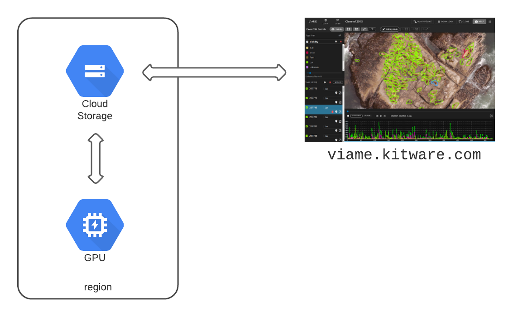

# Google Cloud

This guide is intended for VIAME Web users who would like to use Google Cloud resources to store and process data.  Your data will live in GCS Buckets and can be analyzed on either Kitware's servers or your own cloud service workers.



## Concepts

* Kitware maintains [viame.kitware.com](https://viame.kitware.com) web server deployment.
* You own and manage your data in cloud storage buckets.
* (optional) You run worker nodes that process your own personal job queue.

There are several benefits to this configuration:

* Our team can provide support and troubleshooting directly on your data and error logs.
* Our team manages deployments, updates, and maintenance.
* Our team can provide recommendatations for annotation and analysis based on your specific data and needs.

## Support

[Contact us](https://kitware.github.io/dive/#get-help) for support with any of these topics.

## Google Cloud Storage Mirroring

DIVE Web can mirror your data from google cloud storage buckets such that your team fully controls upload and data organization, but is able to view, annotation, and run analysis on that data in the DIVE platform.

### Creating access credentials

1. Create a new [service account](https://cloud.google.com/iam/docs/creating-managing-service-accounts) with read-only access to the bucket(s) and prefixes that you want to map.
1. In [storage settings](https://console.cloud.google.com/storage/settings), in the interoperability tab, create an access key (Service account HMAC) for your read-only service account.

### Setting up CORS

You'll also need to [configure CORS headers](https://cloud.google.com/storage/docs/configuring-cors) for any buckets where media will be served.

Save the following snippet as `bucket-cors-config.json` .

``` json
[
  {
    "origin": ["https://viame.kitware.com"],
    "method": ["GET"],
    "responseHeader": ["Content-Type"],
    "maxAgeSeconds": 3600
  }
]
```

Then use `gsutils` to configure each bucket.

``` bash
gsutil cors set bucket-cors-config.json gs://BUCKET_NAME
```

### Pub/Sub notifications

To keep the mount up-to-date with new data added to your bucket, please create a Pub/Sub subscription on the bucket.

1. [Create a bucket notification configuration](https://cloud.google.com/storage/docs/reporting-changes#enabling)
1. [Create a topic subscription](https://cloud.google.com/pubsub/docs/admin#pubsub_create_pull_subscription-console)
1. [Set a push delivery method for the subsciption](https://cloud.google.com/pubsub/docs/admin#pubsub_create_pull_subscription-console)
    1. The URL for delivery should be `https://viame.kitware.com/api/v1/bucket_notifications/gcs`

Our server will process events from this subscription to keep your data current.

### Choose a mount point

Choose a folder as a mount-point inside DIVE Web.  This folder should ideally be dedicated to mapping from your GCS buckets.

We recommend creating a `Google Cloud Storage` folder with subfolders named for each bucket in your user's workspace.  You can do this using the `New Folder` button in DIVE Web's File Browser.  You can get the folder ID from the browser's URL bar.

### Send us the details

Send an email with the following details from above to `viame-web@kitware.com` .

``` text
subject: Add a google cloud storage bucket mount

Bucket name:
Service provider: Google cloud
Access Key: 
Secret Key:
Mount point folder:
Prefix (if applicable):
```

## Running VIAME GPU Workloads

This section will guide you through deploying VIAME to Google Cloud for several use cases.

* Run VIAME pipelines in Google Cloud from the command line.
* Run a GPU worker in Google Cloud (or anywhere you have GPU resources) to process your queue from viame.kitware.com.

### How it works

* You must [toggle your private queue](https://viame.kitware.com/#jobs)
* When you trigger jobs (like transcoding, pipelines, or training), they go into a special queue just for your user account.
* You are responsible for running a worker.  Your worker is a Celery process that will connect to our public RabbitMQ server.
* Jobs submitted through the interface at viame.kitware.com will run on your compute resources.  This involves automatically downloading the video or images and annotation files, running a kwiver pipeline, and uploading the results.

> **NOTE**: To run the worker on existing compute resources using docker, [see the docker standalone worker docs](https://github.com/Kitware/dive/blob/main/docker/README.md).

### Preparation

To run the provisioning tools below, you need the following installed on your workstation.

!!! warning

    Google Cloud worker provisioning can **only be done** from an Ubuntu Linux 18.04+ host.  Ansible and terraform should work on Windows Subsystem for Linux (WSL) if you only have a windows host.  You could also use a cheap CPU-only cloud instance to run these tools.

!!! warning

    Google Cloud imposes GPU Quotas.  You may need to [request a quota increase](https://cloud.google.com/compute/quotas).  Anecdotally, request increases of 1 unit are approved automatically, but more are rejected.

* [Install Google Cloud SDK](https://cloud.google.com/sdk/docs/install)
* [Install Terraform](https://learn.hashicorp.com/tutorials/terraform/install-cli)
* [Install Ansible](https://docs.ansible.com/ansible/latest/installation_guide/intro_installation.html)
* find your google cloud project id.  It looks like `project-name-123456`.

``` bash
# Clone the dive repo
git clone https://github.com/Kitware/dive.git
cd dive/devops

# Install ansible
pip3 install ansible

# Generate an ssh key
ssh-keygen -t ed25519 -f ~/.ssh/gcloud_key
```

### Run Terraform

!!! warning

    GPU resources cost money.  Make sure you are familiar with the cost of the machine and gpu you choose.  See main.tf for default values.

``` bash
# Authenticate with google cloud

gcloud auth application-default login

# Verify your GPU Quota
# https://cloud.google.com/compute/docs/gpus/create-vm-with-gpus
# REGION might change.

gcloud compute regions describe us-central1

# Run plan
# See `devops/main.tf` for a complete list of variables
# the default macine_type and gpu_type can be overridden

terraform plan -var "project_name=<GCloud-Project-Id>" -out create.plan

# Run apply
terraform apply create.plan
```

### Provision with Ansible

This step will prepare the new host to run a VIAME worker by installing nvidia drivers, docker, and downloading VIAME and all optional addons.

!!! warning

    The playbook may take 30 minutes or more to run because it must install nvidia drivers and download several GB of software packages.

#### Extra Vars

The supported extra vars to pass to ansible.

| Variable | Default | Description |
|----------|---------|-------------|
| DIVE_USERNAME | null | Required. Username to start private queue processor |
| DIVE_PASSWORD | null | Required. Password for private queue processor |
| WORKER_CONCURRENCY | `2` | Optional. max concurrnet jobs. **Change this to 1 if you run training** |
| KWIVER_DEFAULT_LOG_LEVEL | `warn` | Optional. kwiver log level |
| DIVE_API_URL  | `https://viame.kitware.com/api/v1` | Optional. Remote URL to authenticate against. |
| viame_bundle_url | latest bundle url | Optional.  Change to install a different version of VIAME.  This should be a link to the latest Ubuntu Desktop (18/20) binaries from viame.kitware.com (Mirror 1) |

``` bash
# install galaxy plugins
ansible-galaxy install -r ansible/requirements.yml

# provision using inventory file automatically created by terraform and the connection string you got from us
ansible-playbook -i inventory ansible/playbook.yml --extra-vars "DIVE_USERNAME=username DIVE_PASSWORD=changeme"
```

Once provisioning is complete, jobs should begin processing from the job queue.  You can check [viame.kitware.com/#/jobs](https://viame.kitware.com/#/jobs) to see queue progress and logs.

#### Digression: Provision local hardware with Ansible

If you want to run the VIAME Worker node on a workstation, shared server, or in another cloud environment, you can run the worker in standalone mode using the [docker docs](https://github.com/Kitware/dive/tree/main/docker#running-the-gpu-job-runner-in-standalone-mode). You may even still be able to provision the target host using this ansible playbook.

This ansible playbook is runnable from any Ubuntu 18.04+ host to any Ubuntu 18.04+ target.  To run it locally, use the `inventory.local` file instead.  If you already have nvidia or docker installed, you can comment out these lines in the playbook.

```bash
ansible-playbook --ask-become-pass -i inventory ansible/playbook.yml --extra-vars "DIVE_USERNAME=username DIVE_PASSWORD=changeme"
```

#### Checking that it worked

``` bash
# Log in with the ip address from the inventory file (or google cloud dashboard)
ssh -i ~/.ssh/gcloud_key viame@ip-address

# See if viame started
# You should see "celery@identifier ready." in the logs
sudo docker logs -f worker
```

You can [enable your private queue on the jobs page](https://viame.kitware.com/#jobs) and begin running jobs.

### Destroying the stack

When your work is complete, use terraform to destroy your resources.

``` bash
terraform destroy -var "project_name=<GCloud-Project-Id>"
```

## Troubleshooting

* Ansible provisioning is idempotent.  If it fails, run it again once or twice.
* You may need to change the global `GPUS_ALL_REGIONS` quota in [IAM -> Quotas](https://stackoverflow.com/questions/53415180/gcp-error-quota-gpus-all-regions-exceeded-limit-0-0-globally)
