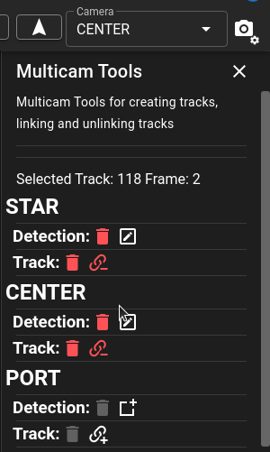

# Multicamera and Stereo Data (Dive Desktop Beta)

A beta release of the *Desktop Only* software supports both multicamera and stereo datasets for viewing and editing.

## Loading MultiCamera data

[Dive Desktop](Dive-Desktop.md) has documenation under "Supported Dataset Types" which describes how to import multiCamera or stereoscopic data.  Reminder that stereoscopic data requies a calibration file where multicamera data doesn't.

##  Data/Track Organization

Data is loaded amongst multiple folders to creae a mutlicamera dataset.  In these cases trackIds will be linked if they are the same across the cameras.  Selection of a trackId that exists across multiple cameras will be linked together in the [Track List](UI-Track-List.md).

> **Example**  If Camera 1 and Camera 2 both have annotation files with TrackId 1 they will be automatically be linked together and selecting one will select them in both cameras.> 

## Camera Selection

Editing and interacting with a camera requires that you select the camera first.  There is a dropdown in the upper right of the screen which contains the name of the currently selected camera.  Also the currently selected camera will contain a dashed light blue outline.  Left or Right clicking within a camera will cause that camera to be selected.

## Creating Tracks/Detections

Track creation for a single camera works much in the same way it does for single camera datasets.  Using the New Track button or ++n++ key to create a new track and draw.  To quickly create a track on another camera and have it link to the current cameras can be done using the "MultiCamera Tools" or by selecting the the desired base track and right clicking on the new camera to add the track.  This will put the annotation tool into creation mode for the current TrackId on a new camera.  Alternatively the MultiCamera Tools panel can simplify this be clicking on the Edit button.

## MultiCamera Tools

Next to the dropdown for the camera selection is a camera settings icon.  Clicking on that will open the context menu.  Within this menu is a dropdown for selecting MultiCamTools.  These tools provide a quick view of the selected track across all cameras.
When a track is selected it will easily show the existing detections and tracks across multiple cameras.

{ width=260px align=right }

* Editing - Clicking on the ==:material-pencil-box-outline:== or ==:material-shape-square-plus:== edit button for any camera will select that camera and edit an existing track or allow for the creation of a new track which is linked to existing tracks.
* Deleting (Detection/Track) - ==:material-delete:==  deleting the detection will leave the track for the camera (if it exists on multiple frames) or will remove only the detection for the current frame.  If it is the only detection left on that camera a prompt will ask if you want to delete the track.  If you delete the track it will remove all detections associated with that TrackId across all of the frames.
* Unlinking - ==:material-link-variant-minus:== Will split off the track for the camera into a new trackId
* Linking - ==:material-link-variant-plus:== Will select the new camera and place it into Linking Mode.  This requires selecting a track that is only that camera to link to the currently selected track.  Attempting to link a track that exists across multiple cameras will prompt to split off the track before linking.  To exit linking mode use the ++escape++ Key

## Import/Export

Importing and exporting of data works similarily to a single dataset except that it will occur on the current selected camera.  Selecting "Starboard" camera and clicking export will only export the annotations for the "Starboard" camera.  Similarily importing annotations will only occur on the selected camera as well.

## Running Pipelines

### Single Camera Pipelines

Single camera pipelines can be used by selecting the camera and then running the pipeline from the pipeline menu.

> **Note** it is suggested that single camera pipelines only be run on empty datasets that don't have annotations already.  When the pipeline finishes it will create tracks with TrackIds that may conflict with the other cameras.  So it is reccomended that all tracks be removed before running single camera pipelines.

### MultiCamera/Stereo Pipelines

There are specific pipelines that can be used on multi-camera or stereo datasets.  These pipelines are related to the type of dataset (mutlicamera vs stereo) and the number of cameras that exist.

| Pipeline | Category | Type | Cameras | Description |
| -------- | -------- | -------- | -------- | -------- |
| <pre>gmm</pre>  | measurment | stereoscopic | 2 | Stereo pipeline used to compute fish length measurement |
| <pre>X-cam</pre>  | X-cam | multicamera | 2 or 3| Multiple pipelines that can act on either 2 or 3 camera datasets.
