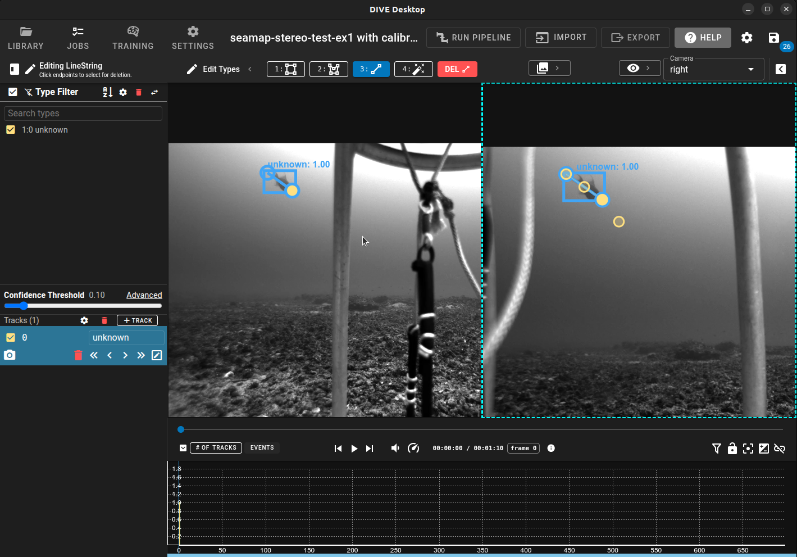
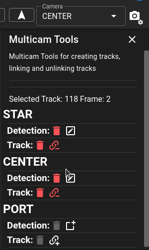
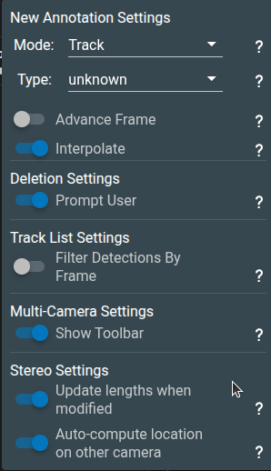

# Multicamera and Stereo Data

DIVE supports **multicamera** and **stereo** datasets on both the [web version](Web-Version.md) and [DIVE Desktop](Dive-Desktop.md). A multicam dataset groups two or three synchronized camera views under one parent dataset. Stereo datasets are a special two-camera case that also require a calibration file (`.npz`).

| Capability | Web | Desktop |
|------------|-----|---------|
| Import stereo (2 cameras + calibration) | ✔️ | ✔️ |
| Import multicam (2 or 3 cameras) | ✔️ | ✔️ |
| Batch multicam import (collect folders) | ✔️ | ✔️ |
| Timestamp-aligned multicam playback | ✔️ | ✔️ |
| View and annotate across cameras | ✔️ | ✔️ |
| MultiCamera Tools (link/unlink tracks) | ✔️ | ✔️ |
| Run stereo / multicam VIAME pipelines | ✔️ | ✔️ |
| Run single-camera pipelines on one view | ✔️ | ✔️ |
| Glob / keyword pattern import | ❌ | ✔️ |
| Export full multicam dataset as one `.zip` | ✔️ | ✔️ |
| Interactive stereo (auto-warp, length recompute) | ❌ | ✔️ |
| Interactive point-click segmentation | ❌ | ✔️ |

See [Loading MultiCamera data](#loading-multicamera-data) below for platform-specific import steps. The rest of this page describes behavior that is shared between web and desktop.

## Loading MultiCamera data

### Web version

Multicam import is available from the standard upload dialog on [viame.kitware.com](https://viame.kitware.com) or any self-hosted DIVE web deployment.

1. Open the DIVE Homepage and navigate to the ==:material-database: Data== tab.
2. Open your ==:material-folder: Public== or ==:material-folder-lock: Private== folder (or create a new folder).
3. Click ==:material-file-upload: Upload== in the toolbar.
4. Click the ==:material-chevron-down:== dropdown on either ==Add Image Sequence== or ==Add Video==.
5. Choose one of:
    * ==:material-binoculars: Stereoscopic== — exactly 2 cameras and a calibration `.npz` file.
    * ==:material-camera-burst: MultiCam== — 2 or 3 cameras; no calibration file required.
    * ==:material-folder-multiple-image: MultiCam Batch== — import many multicam datasets at once from a folder of **collect** subfolders (image sequences only). See [Batch multicam import](#batch-multicam-import).
6. In the import dialog, assign a source folder or video file to each camera. All cameras must use the same media type (all image sequences or all videos). By default, every camera must have the same number of frames (or matching video duration). For **image-sequence** imports with capture timestamps in filenames, enable **Infer frame index from filename** to allow unequal per-camera counts — see [Infer frame index from filename](#infer-frame-index-from-filename).
7. Optionally attach a per-camera annotation file during import.
8. Enter a dataset name, choose the default display camera, and click ==Begin Import==.
9. When upload finishes, DIVE opens the new multicam dataset in the annotator.

!!! note

    **Web limitations:** glob/keyword pattern import (desktop's advanced folder layout options) is not supported on web yet. You can export the full multicam dataset from the dataset browser download menu, or export annotations for the currently selected camera from the viewer (see [Import/Export](#importexport) below).

For general web upload concepts (permissions, transcoding, zip import), see [Uploading data](Web-Version.md#uploading-data).

### DIVE Desktop

[DIVE Desktop](Dive-Desktop.md) documents supported dataset types under **Supported Dataset Types**. From the home screen, click ==Open Image Sequence :material-folder-open:== or ==Open Video :material-file-video:==, then use the ==:material-chevron-down:== dropdown:

* ==:material-binoculars: Stereo== — choose 2 videos or 2 image sequences and a calibration file.
* ==:material-camera-burst: Multi-Cam== — name each camera and pick its source media.
* ==:material-folder-multiple-image: MultiCam Batch== — import many multicam datasets from a folder of collect subfolders (image sequences only). See [Batch multicam import](#batch-multicam-import).

Desktop additionally supports ==:material-view-list-outline: Image List== and glob-based folder filtering for single-camera imports, and glob/keyword layout options for multicam import.

You can also open stereo and multicam datasets from the command line with repeated `--camera` flags (and optional per-camera `--annotations` and `--calibration`). See [Launching from the command line](Dive-Desktop.md#launching-from-the-command-line).

!!! info

    Stereoscopic data **requires** a calibration file. Generic multicamera data does **not**.

### Batch multicam import

Use **MultiCam Batch** when you have many synchronized multicam **collects** on disk that share the same camera layout — for example repeated survey passes where each pass is one collect folder with the same camera subfolders (`EO/`, `IR/`, `UV/`, and so on).

**Folder layout:**

```
survey/                 ← choose this root folder
  collect_001/          ← one multicam dataset
    EO/
      frame001.jpg
      frame002.jpg
    IR/
      frame001.jpg
      frame002.jpg
  collect_002/
    EO/
    IR/
```

Each immediate child of the root is a **collect** folder. Inside every collect, the same **2 or 3 camera subfolders** must appear, each holding that camera's image frames for that collect.

**Requirements:**

* **Image sequences only** — not video or stereo.
* **2 or 3 cameras** shared across all collects (same subfolder names in every collect).
* **Camera folder names** must use letters, numbers, and underscores only (no spaces).
* **Frame counts** should match across cameras within a collect; mismatches are flagged as warnings in the review table.
* Supported image formats match standard DIVE image-sequence import (PNG, JPEG, TIFF, and others).

**Workflow (Web and Desktop):**

1. Open ==Add Image Sequence== and choose ==MultiCam Batch== from the ==:material-chevron-down:== dropdown.
2. Select the **root folder** whose subfolders are collects.
3. Review the scan summary: detected cameras, per-collect frame counts, and any blocking issues.
4. Edit the **dataset name** for each collect you plan to import (defaults to the collect folder name).
5. Select which valid collects to import, then start the batch. DIVE creates **one multicam parent dataset per collect**.
6. If one collect fails, the batch **continues** with the remaining selected collects.

On **Web**, the folder picker uploads all files under the chosen root; scanning uses browser paths to group images by collect and camera. On **Desktop**, scanning reads the folder tree locally before import begins.

For a single multicam dataset from one parent folder (one collect, camera subfolders only), use ==MultiCam== with the **parent-folder** import mode instead of MultiCam Batch.

### Flat multi-modality view folders

Both multicam import modes automatically recognize **flat view folders**: a single folder holding the images for up to three modalities side by side, distinguished by a filename suffix (`_rgb`, `_ir`, `_uv`), plus optional sidecar metadata files. Aerial survey systems commonly write each view (swathe) this way, using folder names like `left_view/`, `center_view/`, `right_view/` or `PORT/`, `CENT/`, `STBD/`:

```
fl09/                    ← choose this root folder for MultiCam Batch
  center_view/           ← or choose one view folder for parent-folder import
    fl09_..._20240612_204107.625730_rgb.jpg
    fl09_..._20240612_204107.625730_ir.tif
    fl09_..._20240612_204107.625730_uv.jpg
    metadata.json
  left_view/
  right_view/
```

A folder is treated as a flat view folder when it has no camera subfolders and every image carries a modality suffix (`_rgb`, `_ir`, `_uv`) plus a filename timestamp. DIVE then creates **one dataset per view folder** with **one camera per modality present** (`rgb`, `ir`, `uv`), selecting each camera's images by suffix. Sidecar files such as `metadata.json` are ignored.

* In **MultiCam Batch**, select the folder containing the view folders (e.g. `fl09/`); each view folder becomes a collect. Dataset names default to `<parent>_<view>` (e.g. `fl09_center_view`). A view folder with only one modality imports as a single-camera dataset with a warning.
* In the single **MultiCam** parent-folder mode, select one view folder directly. When the folder has a recognized view name (`center_view`, `CENT`, `PORT`, …), the dataset name is prefixed with the parent folder. **Infer frame index from filename** is enabled automatically, since modalities may legitimately drop frames independently and are aligned by capture timestamp.

### Infer frame index from filename

At the bottom of the multicam import dialog (image sequences only), **Infer frame index from filename** relaxes the equal-frame-count requirement when filenames encode capture time. Enable it for datasets where cameras may have different numbers of frames — for example when one camera dropped occasional shots but each surviving frame still carries a parseable timestamp.

When enabled, DIVE skips the import-time check that every camera has the same image count. During playback, frames are aligned by those filename timestamps rather than by positional index (see [Aligned playback and timestamps](#aligned-playback-and-timestamps)).

Example filename (datestamp convention):

```
test_seattle_2020_fl09_C_20200830_020814.141365_rgb.jpg
```

This option is available on both Web and Desktop for ==MultiCam== imports. It does not apply to video or stereo imports.

### Aligned playback and timestamps

On multicam **image-sequence** datasets, DIVE can synchronize playback across cameras using capture timestamps parsed from each frame's filename. When alignment is active, scrubbing and playback use a single **global timeline** whose slots group frames that share the same capture instant across cameras.

**When alignment activates:**

* The dataset has **two or three** cameras.
* **Every** frame on **every** camera has a parseable timestamp in its filename.

If any frame on any camera lacks a timestamp, DIVE falls back to **positional alignment** — each camera advances by its own local frame index, as in earlier DIVE versions.

**Supported filename conventions** (first match wins):

| Pattern | Example |
|---------|---------|
| Datestamp `YYYYMMDD[_-]HHMMSS` with optional fractional seconds | `fl02_C_20240407_130757.206341_ir.tif` |
| Epoch milliseconds (13 digits) | `img_1719843225123.tif` |
| Epoch seconds (10 digits) | `img_1719843225.tif` |

Timestamps are parsed automatically when media loads; no import setting is required beyond having recognizable filenames (and, if counts differ, enabling **Infer frame index from filename** at import time).

**What you see in the viewer:**

* The timeline **frame counter** reflects the global aligned slot index, not an individual camera's local index.
* When the current slot has no frame for a camera, that camera's pane **blanks** and its annotation overlay clears until you scrub to a slot where that camera has data.
* Red bands on the [timeline scrubber](UI-Timeline.md#multicam-gap-indicators) mark slots where at least one camera is missing a frame.

Identical capture timestamps on every camera (common in synchronized rigs) are grouped into the same slot. If one camera has extra frames at the same timestamp, the surplus frames spill into later slots rather than overwriting the first match.

## Data/Track Organization

Data is loaded amongst multiple folders to create a multicamera dataset. In these cases trackIds will be linked if they are the same across the cameras. Selection of a trackId that exists across multiple cameras will be linked together in the [Track List](UI-Track-List.md).

> **Example:** If Camera 1 and Camera 2 both have annotation files with TrackId 1 they will be automatically linked together and selecting one will select them in both cameras.

## Camera Selection

Editing and interacting with a camera requires that you select the camera first. There is a dropdown in the upper right of the screen which contains the name of the currently selected camera. Also the currently selected camera will contain a dashed light blue outline. Left or right clicking within a camera will cause that camera to be selected.

## Creating Tracks/Detections

Track creation for a single camera works much in the same way it does for single camera datasets. Using the New Track button or ++n++ key to create a new track and draw. To quickly create a track on another camera and have it link to the current cameras can be done using the "MultiCamera Tools" or by selecting the desired base track and right clicking on the new camera to add the track. This will put the annotation tool into creation mode for the current TrackId on a new camera. Alternatively the MultiCamera Tools panel can simplify this by clicking on the Edit button.

You can also start a new linked detection from **any camera view** without first switching cameras manually — DIVE keeps the multicam track link intact as you draw.

### Cross-camera selection and editing

Selecting a track that exists on multiple cameras selects it on **all** camera views at once. A single click on a linked detection in any camera enters edit mode for that track across the dataset.



## MultiCamera Tools

Next to the dropdown for the camera selection is a camera settings icon. Clicking on that will open the context menu. Within this menu is a dropdown menu entry for MultiCam Tools. These tools provide a quick view of the selected track across all cameras.
When a track is selected it will easily show the existing detections and tracks across multiple cameras.

{ width=260px align=right }

* **Editing** — Clicking on the ==:material-pencil-box-outline:== or ==:material-shape-square-plus:== edit button for any camera will select that camera and edit an existing track or allow for the creation of a new track which is linked to existing tracks.
* **Deleting (Detection/Track)** — ==:material-delete:== deleting the detection will leave the track for the camera (if it exists on multiple frames) or will remove only the detection for the current frame. If it is the only detection left on that camera a prompt will ask if you want to delete the track. If you delete the track it will remove all detections associated with that TrackId across all of the frames.
* **Unlinking** — ==:material-link-variant-minus:== will split off the track for the camera into a new trackId.
* **Linking** — ==:material-link-variant-plus:== will select the new camera and place it into Linking Mode. This requires selecting a track that is only on that camera to link to the currently selected track. Attempting to link a track that exists across multiple cameras will prompt to split off the track before linking. To exit linking mode use the ++escape++ key.

## Import/Export

Importing and exporting of data works similarly to a single dataset except that it occurs on the currently selected camera. Selecting the "Starboard" camera and clicking export will only export the annotations for the "Starboard" camera. Similarly importing annotations will only occur on the selected camera as well.

On web, a full dataset export zip (from **Download → Everything**) can be re-imported with the standard zip upload flow; DIVE detects `multiCam.json` and restores each camera folder before finalizing the multicam parent dataset.

On web, use the data browser **Download** menu on a multicam parent dataset:

- **VIAME CSV**, **DIVE TrackJSON**, and **COCO JSON** each download a zip with that format for every camera (plus `multiCam.json` at the dataset root).
- **Everything** downloads all camera media, all camera annotations, calibration (stereo), and metadata in one zip.

Per-camera export from the viewer still exports only the active camera.

## Running Pipelines

### Single Camera Pipelines

Single camera pipelines can be used by selecting the camera and then running the pipeline from the pipeline menu.

> **Note:** it is suggested that single camera pipelines only be run on empty datasets that don't have annotations already. When the pipeline finishes it will create tracks with TrackIds that may conflict with the other cameras. So it is recommended that all tracks be removed before running single camera pipelines.

### MultiCamera/Stereo Pipelines

There are specific pipelines that can be used on multi-camera or stereo datasets. These pipelines are related to the type of dataset (multicamera vs stereo) and the number of cameras that exist. On web, run these from the ==Run Pipeline== menu in the viewer; the menu filters available pipelines based on dataset type and camera count.

| Pipeline | Category | Type | Cameras | Description |
| -------- | -------- | ---- | ------- | ----------- |
| <pre>gmm</pre> | measurement | stereoscopic | 2 | Stereo pipeline used to compute fish length measurement |
| <pre>X-cam</pre> | X-cam | multicamera | 2 or 3 | Multiple pipelines that can act on either 2 or 3 camera datasets. |

## Interactive Stereo (Desktop)

[DIVE Desktop](Dive-Desktop.md) provides **interactive stereo** tools for real-time annotation assistance on calibrated stereo datasets. These are separate from batch VIAME pipelines like `gmm` above — they run inside the annotator while you work.

Open the ==:material-cog:== creation settings menu in the [Track List](UI-Track-List.md) (or bottom panel) and scroll to **Stereo Settings**:



| Setting | What it does |
|---------|--------------|
| **Update lengths when modified** | Recomputes stereo length measurements when you edit a head/tail line on a detection linked across both cameras. |
| **Auto-compute location on other camera** | Warps a new annotation drawn on one camera to the other camera when no detection exists there yet. |

Enabling either option loads the interactive stereo service (shared with [interactive segmentation](Interactive-Annotation.md)). Warped head/tail lines become normal editable line annotations; manual edits are preserved and not overwritten by later auto-warping.

On stereo datasets, [interactive segmentation](Interactive-Annotation.md#interactive-segmentation) can also warp confirmed polygon masks to the paired camera when auto-compute is enabled.

Full details: [Interactive Annotation](Interactive-Annotation.md).
