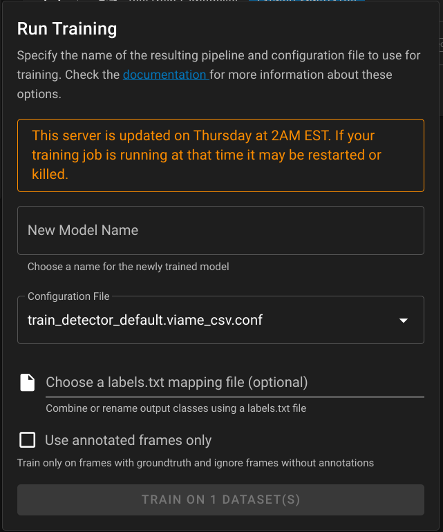

---
hide:
  - navigation
---

# Pipelines and Training

Both web and desktop versions are capable of running canned pipelines and model training on your ground truth data.  This document is to help you decide which pipeline to run.

## Help me choose

[Contact our team](Support.md) if you need help choosing the right data analysis strategy.  Please upload some sample data to viame.kitware.com to allow us to better assist you.

## Detection

Best for a series of images that have no temporal relationship, such as arial photography of multiple scenes.  Also preferred if you only care about aggregate data for the dataset, such as max occurrences of an object per scene.

| Pipeline | Use case |
| -------- | -------- |
| <pre>arctic seal eo yolo</pre> | detector for color imagery |
| <pre>arctic seal ir yolo</pre>  | detector for infrared |
| <pre>em tuna</pre>  | detector for identifying individual features of tuna |
| <pre>fish without motion</pre>  | simple single-class fish detector |
| <pre>generic proposals</pre>  | generic object detector |
| <pre>motion</pre>  | detect regions of motion in video or time-series images |
| <pre>pengcam kw</pre>  | Penguin cam full-frame classifier |
| <pre>pengcam swfsc</pre>  | Penguin cam full-frame classifier |
| <pre>scallop and flatfish</pre>  | detector for benthic images |
| <pre>scallop and flatfish left</pre>  | detector for benthic images, process left half of each frame only |
| <pre>scallop netharn</pre>  | deep learning detector for benthic images |
| <pre>scallop netharn left</pre>  | deep learning detector for benthic images, process left half of each frame only |
| <pre>sea lion multi class</pre>  | detects bulls, cows, pups, etc |
| <pre>sea lion single class</pre>  | detector |
| <pre>sefsc bw group</pre>  | black-and-white fish detector (18 class, lower granularity) (oldest, v1) |
| <pre>sefsc bw species v2</pre>  | black-and-white fish species detector (updated, v2) |

## Tracking

Run full tracking pipelines on your data.  Appropriate for videos and image sequences that derive from a video.  Tracking involves first running a detection pipeline then performing detection linking to form connected object tracks.

> **Note** some trackers can perform differently on time-series data depending on the annotation framerate selected when you upload or import your dataset. Higher framerates take longer to process, but may produce better results.

| Pipeline | Use case |
| -------- | -------- |
| <pre>em tuna</pre>  | tracker |
| <pre>fish</pre>  | simple fish tracker |
| <pre>fish.sfd</pre>  | tracker |
| <pre>generic</pre>  | generic object tracker puts generic boxes around arbitrary objects |
| <pre>motion</pre>  | identifies moving object tracks |
| <pre>mouss</pre>  | tracker, trained with data from MOUSS (Modular Optical Underwater Survey System) |
| <pre>sefsc bw *</pre>  | same as above, but with tracking |

## Utility

An assortment of other types of utility pipelines.  Utility pipelines are named `utility_<name>.pipe` and are unique in that they _may_ take detections as inputs (but are not required to).  

| Pipeline | Use case |
| -------- | -------- |
| <pre>add segmentations watershed</pre>  | Transform existing bounding boxes into polygons |
| <pre>empty frame lbls {N}fr</pre> | Add an empty bounding box covering the whole media element for the purpose of adding full-frame classifier attributes. Unique tracks are created every N frames. |
| <pre>track user selections</pre> | Create tracks from user-initialized detection bounding boxes.  Draw a box on the first frame of a track, and the pipeline will continue tracking the selected object(s) |

## Training

Run model training on ground truth annotations.  Currently, training configurations are available to do object detection, object classification, and full-frame classification.  Tracker training will be added in a future update.

* Full-frame classifiers can be trained on arbitrary multi-class labels.  It's helpful to start with `empty frame lbls` utility pipe and add type annotations to each generated frame.
* Object classifiers and detectors are trained on bounding boxes with arbitrary multi-class labels.

### Overview

* SVM ([Support Vector Machine](https://en.wikipedia.org/wiki/Support-vector_machine)) configurations are usable with the smallest amount of ground-truth and train relatively quickly.
* [NetHarn](https://gitlab.kitware.com/computer-vision/netharn) is a pytorch deep learning framework that requires more input data: on the order of thousands of target examples.  There are two architectures used.  Netharn models can take up to several days to train.
    * Cascade Faster R-CNN (cfrnn) for training box detectors
    * Mask R-CNN for training pixel classification and box detection
    * ResNet (Residual Network) for training full frame or secondary object classifiers

### Options



#### New Model Name

A recognizable name for the pipeline that results from the training run.

#### Configuration File

One of the configuration options in the table below.

#### Labels.txt file

This **optional** file controls the output classes that a newly trained model will generate.

* Use if you annotated using higher granularity labels (such as species names) and want to train a classifier using more
* Or you want to restrict your training session to only train on certain kinds of ground-truth data.

The following example `labels.txt` shows how to train a `FISH` classifier by combining `redfish` and `bluefish`, preserve the `ROCK` label, and omit every other label.

``` text
FISH redfish bluefish
ROCK
```

By default, all classes from all input datasets are preserved in the output model.

#### Use annotation frames only

By default, training runs include all frames from the chosen input datasets, and frames without annotations are considered negative examples.  If you choose to use annotated frames only, frames or images with zero annotations will be discarded.  This option is useful for trying to train on datasets that are only partially annotated.

### Configurations

| Configuration | Availability | Use Case |
| ------------- | ------------ | -------- |
| detector_default | both | alias: train detector netharn cfrnn |
| [detector_netharn_cfrnn](https://github.com/VIAME/VIAME/blob/master/configs/pipelines/train_detector_netharn_cfrnn.viame_csv.conf) | both | |
| [detector_netharn_mask_rcnn](https://github.com/VIAME/VIAME/blob/master/configs/pipelines/train_detector_netharn_mask_rcnn.viame_csv.conf) | both | |
| [detector_svm_over_generic_detections](https://github.com/VIAME/VIAME/blob/master/configs/pipelines/train_detector_svm_over_generic_detections.viame_csv.conf) | both | general purpose svm |
| [detector_svm_over_fish_detections](https://github.com/VIAME/VIAME/blob/master/configs/pipelines/train_detector_svm_over_fish_detections.viame_csv.conf) | both | fish svm |
| frame_classifier_default | both | alias: frame classifier netharn resnet |
| [frame_classifier_netharn_resnet](https://github.com/VIAME/VIAME/blob/master/configs/pipelines/train_frame_classifier_netharn_resnet.viame_csv.conf) | both | full-frame |
| [frame_classifier_svm_overn_resnet](https://github.com/VIAME/VIAME/blob/master/configs/pipelines/train_frame_classifier_svm_over_resnet.viame_csv.conf) | both | full-frame |
| object_classifier_default | both | alias: netharn resnet object classifier |
| [object_classifier_netharn_resnet](https://github.com/VIAME/VIAME/blob/master/configs/pipelines/train_object_classifier_netharn_resnet.viame_csv.conf) | both | |
| yolo | desktop only | can train, but resulting model **is not runnable with desktop** yet |

## Pipeline Import and Export

Pipelines created outside of VIAME Web can be upload and shared with other users.  See [Pipeline Import and Export](Pipeline-Import-Export.md) for details.
