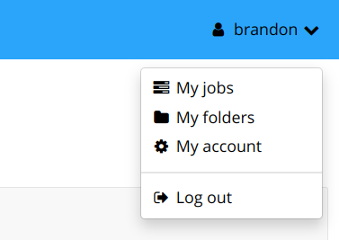
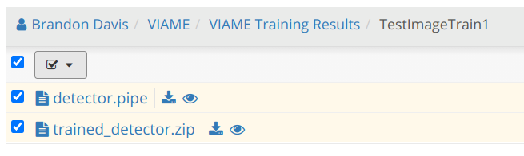
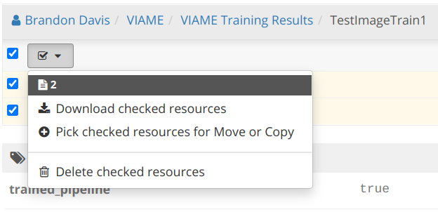
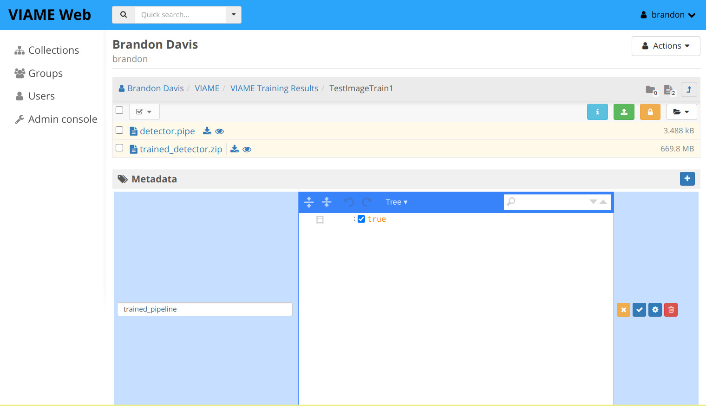

# Pipeline Import and Export

## Trained model downloads

You can download your trained models through the administrative interface.

!!! warning

    Use caution when modifying data through the admin interface

* Open the admin interface at [https://viame.kitware.com/girder](https://viame.kitware.com/girder) (or `myserver.com/girder` if you host your own instance)
* Navigate to your personal workspace by clicking ==:material-folder: My Folders== under your user dropdown in the top right corner.

    

* Navigate to the `VIAME/VIAME Training Results` folder and into the folder you wish to download
    
    

* Select all items and download using the menu

    

## Custom Pipeline Upload

It's possible to upload custom pipes to DIVE Web through the girder interface.

!!! warning

    This feature is not yet standardized, and the instructions below may change.

1. Open the girder interface at `/girder` and create a new private folder called `MyPipelines`
    1. For our demo instance, open [https://viame.kitware.com/girder](https://viame.kitware.com/girder)
1. Create a new folder in that private folder, and give it a name you'd like to associate with your new pipeline.
1. Upload one or more files inside your new pipeline subfolder:
    1. A pipeline file ending in the `.pipe` file extension
    1. Whatever other model `.zip` files are required by the pipe, named exactly as they appear in your `.pipe` file above.
1. Finally, set the **pipeline folder** metadata key `trained_pipeline` with value `true`.
1. Your new pipeline will be available under the `Run Pipeline -> Trained` menu from the DIVE web app.



### Accepting input

If your pipe must accept input, set the **pipeline folder** metadata property `requires_input` to `true` .

### Including base pipelines

User-uploaded pipelines may depend on any pipe already installed from the base image or an addon using `include <pipename>.pipe` . Depending on other user-uploaded pipes is not supported.

!!! tip

    KWIVER pipe files can be exported for use with DIVE using [kwiver pipe-config](https://kwiver.readthedocs.io/en/latest/tools/pipe-config.html?highlight=pipe-config)

## Pipe file headers

DIVE reads optional comment headers at the top of a `.pipe` file to decide how to present and run the pipeline. Headers are case-insensitive. Pipes without these headers behave as they always have.

Example:

``` text
# Description: Sea-lion registration stabilizer
# Metadata File: stabilizer:flight_log
# Image List Keys: stabilizer:image_list{cam}
# Input: image
# Output: image
# Requires Calibration: False
```

| Header | Meaning |
| ------ | ------- |
| `# Description:` | Human-readable summary shown in the Run Pipeline UI. May continue on following `#` comment lines until the next named header. |
| `# Input:` / `# Output:` | Declared media/annotation kinds for the pipe (used when discovering and categorizing static pipelines). |
| `# Requires Calibration: True` | Restricts the pipe to stereo datasets that have a calibration file attached. Values `true`, `yes`, and `1` are accepted. |
| `# Metadata File: <block>:<key>` | Opt-in: when the dataset has an attached **Metadata File**, DIVE appends a KWIVER override `-s <block>:<key>=<path>` at run time. Without this header, no metadata file is injected. |
| `# Image List Keys: <k> [k…]` | Opt-in: binds the run's per-camera input image list(s) to each listed KWIVER key. Keys may be space- or comma-separated. A key containing `{cam}` is expanded once per camera (1-based), e.g. `stabilizer:image_list{cam}` → `image_list1`, `image_list2`, …. A key without `{cam}` receives camera 1's list only. |

### Metadata File vs Configuration File

These are different files with different jobs:

| Import field | What it is | Consumed by |
| ------------ | ---------- | ----------- |
| **Configuration File** | DIVE JSON (`meta` / attributes, styles, FPS, …) | DIVE itself |
| **Metadata File** | Opaque sidecar (`.json`, `.txt`, or `.csv`), e.g. a UAV flight log | Only pipelines that declare `# Metadata File:` |

DIVE does **not** auto-discover a flight log in the media folder — the user must pick it at import (UI or CLI `--metadata`). The file format is opaque to DIVE; the KWIVER process behind the pipe owns the schema. Metadata is available on **single-camera and multicamera** imports alike; it is not stereo-gated (unlike calibration).

!!! note

    Injection is opt-in and silent when either side is missing: if a pipe declares `# Metadata File:` but the dataset has no attached file (or the reverse), the job still runs without that `-s` override. Prefer attaching the sidecar at import for registration pipes that need it.

!!! tip

    `# Image List Keys:` is intended for **image-sequence** (and multicam image) runs where DIVE builds line-separated image manifests. On video runs the bound value is the video path, which may not be what a registration-style process expects.
