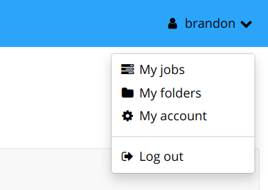
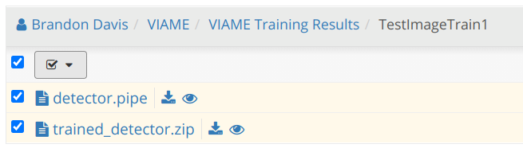
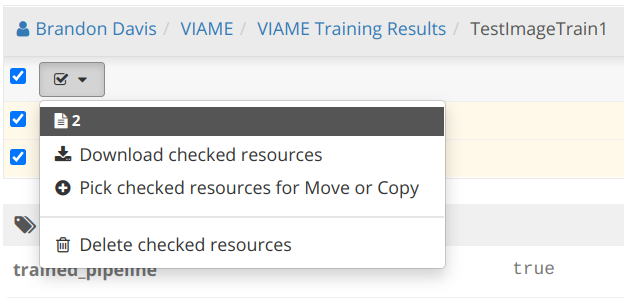
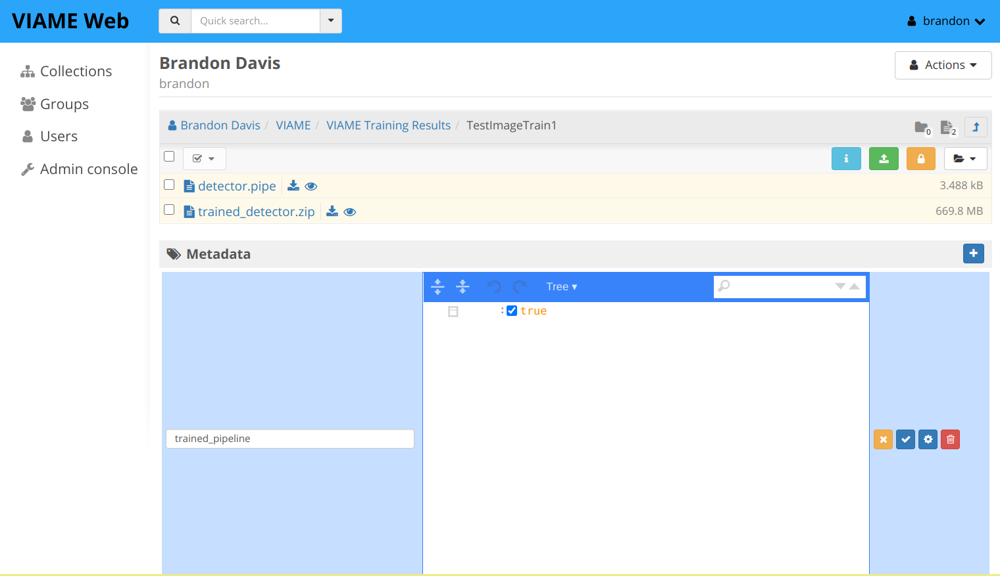

# Pipeline Import and Export

## Trained model downloads

You can download your trained models through the administrative interface.

!!! warning

    Use caution when modifying data through the admin interface

* Open the admin interface at [https://viame.kitware.com/girder](https://viame.kitware.com/girder) (or `myserver.com/girder` if you host your own instance)
* Navigate to your personal workspace by clicking ==:material-folder: My Folders== under your user dropdown in the top right corner.

    

* Navigate to the `VIAME/VIAME Training Results` folder and into the folder you wish to download
    
    

* Select all items and download using the menu

    

## Custom Pipeline Upload

It's possible to upload custom pipes to DIVE Web through the girder interface.

!!! warning

    This feature is not yet standardized, and the instructions below may change.

1. Open the girder interface at `/girder` and create a new private folder called `MyPipelines`
    1. For our demo instance, open [https://viame.kitware.com/girder](https://viame.kitware.com/girder)
1. Create a new folder in that private folder, and give it a name you'd like to associate with your new pipeline.
1. Upload one or more files inside your new pipeline subfolder:
    1. A pipeline file ending in the `.pipe` file extension
    1. Whatever other model `.zip` files are required by the pipe, named exactly as they appear in your `.pipe` file above.
1. Finally, set the **pipeline folder** metadata key `trained_pipeline` with value `true`.
1. Your new pipeline will be available under the `Run Pipeline -> Trained` menu from the DIVE web app.



### Accepting input

If your pipe must accept input, set the **pipeline folder** metadata property `requires_input` to `true` .

### Including base pipelines

User-uploaded pipelines may depend on any pipe already installed from the base image or an addon using `include <pipename>.pipe` . Depending on other user-uploaded pipes is not supported.

!!! tip

    KWIVER pipe files can be exported for use with DIVE using [kwiver pipe-config](https://kwiver.readthedocs.io/en/latest/tools/pipe-config.html?highlight=pipe-config)

## Pipe file headers

DIVE reads optional comment headers at the top of a `.pipe` file to decide how to present and run the pipeline. Headers are case-insensitive. Pipes without these headers behave as they always have.

Example:

``` text
# Description: Sea-lion registration stabilizer
# Metadata File: stabilizer:flight_log
# Image List Keys: stabilizer:image_list{cam}
# Input: image
# Output: image
# Requires Calibration: False
```

| Header | Meaning |
| ------ | ------- |
| `# Description:` | Human-readable summary shown in the Run Pipeline UI. May continue on following `#` comment lines until the next named header. |
| `# Input:` / `# Output:` | Declared media/annotation kinds for the pipe (used when discovering and categorizing static pipelines). |
| `# Requires Calibration: True` | Restricts the pipe to stereo datasets that have a calibration file attached. Values `true`, `yes`, and `1` are accepted. |
| `# Calibration Keys: <k> [k…]` | Opt-in: binds the dataset's stereo calibration file to each listed KWIVER config key at run time (one `-s <k>=<cal-path>` per key). Keys may be space- or comma-separated. Use this when the pipe's calibration consumer is not the conventional `measurer:calibration_file` / `calibration_reader:file` pair (those are used when the header is unset). Needed because `$CONFIG{global:…}` indirection cannot receive `-s` overrides (macros expand at parse time; `-s` blocks are appended last). |
| `# Metadata File: <block>:<key>` | Opt-in: when the dataset has an attached **Metadata File**, DIVE appends a KWIVER override `-s <block>:<key>=<path>` at run time. The same CSV/TXT attachment is also considered for [Frame Metadata](Frame-Metadata.md). Without this header, no metadata file is injected. |
| `# Image List Keys: <k> [k…]` | Opt-in: binds the run's per-camera input image list(s) to each listed KWIVER key. Keys may be space- or comma-separated. A key containing `{cam}` is expanded once per camera (1-based), e.g. `stabilizer:image_list{cam}` → `image_list1`, `image_list2`, …. A key without `{cam}` receives camera 1's list only. |
| `# Camera Order: <cam> [cam…]` | 2-cam/3-cam pipes only: names the camera role fed to each `inputN`, in order (e.g. `# Camera Order: EO, UV, IR` → `input1` optical, `input2` ultraviolet, `input3` thermal). Role tokens are `EO`, `IR`, `UV` (aliases: eo/rgb/optical/color/vis, ir/thermal/lwir/flir, uv/ultraviolet); any other token (`left`, `right`) matches a camera name literally. See [Multicam camera assignment](#multicam-camera-assignment) for how DIVE places a dataset's cameras onto these slots. Camera 1 is the frame the pipe's warp processes map onto: each other camera's Aligned View registration onto camera 1 is written to the job as `<camera>_to_<camera1>_registration.json` and bound to `warpN`. |

### Multicam camera assignment

Which dataset camera feeds which input of a 2-cam/3-cam pipe is decided in the open, not inferred from display order:

1. **Camera roles.** Each camera of a multicam dataset carries a sensor role (`eo`, `ir`, `uv`) in `cameraRoles`, inferred once at import from the camera (subfolder) name and, failing that, from tokens in its image file names (KAMERA style `…_rgb.jpg`, `…_ir.tif`, `…_uv.jpg`). Only a unanimous answer is recorded; ambiguous cameras get no role.
2. **Assignment step.** When you run a 2-cam/3-cam pipe, DIVE shows one row per pipeline camera (from the `# Camera Order:` header, or plain `input1..N` when the pipe has none) with the dataset camera it proposes — matched by role when both sides have one, else by name — and you confirm or change it before anything runs. Unfilled or duplicated slots block the run. Confirming a role-labelled slot saves the roles back onto the dataset (uncheck *Save these as the dataset's camera roles* to skip), so a corrected role wins over a misleading name next time and for every other pipeline.
3. **Registration check.** DIVE reads which inputs the pipe warps onto camera 1 (`process warpN :: warp_detections` / `warp_image` in the pipe body) and, in the same dialog, shows for each such row whether the chosen camera has a fitted Aligned View registration onto camera 1. A missing one blocks the run with "Register X → Y in Aligned View first" — the pipe never gets to fail at configure time on a missing `registration_cameraN_to_camera1.json`. The same check runs server-side (and on desktop) before the job is created, so CLI runs get the same message.
4. **Job.** The confirmed order is what the job runs with (`cameraOrder` in the pipeline params; visible in the desktop job manifest). Runs started without the step (CLI) fall back to matching the header by role/name, and to registration-reference-first order for pipes with no header.

### Metadata File vs Configuration File

These are different files with different jobs:

| Import field | What it is | Consumed by |
| ------------ | ---------- | ----------- |
| **Configuration File** (`config`) | DIVE JSON (`config.json`, or legacy `meta.json` / `*.meta.json` / `*.config.json`: attributes, styles, FPS, …) | DIVE itself |
| **Metadata File** (`metadata`) | One dataset attachment (`.json`, `.txt`, or `.csv`), e.g. a UAV flight log | Pipelines that declare `# Metadata File:`; CSV/TXT files with matching rows also appear as [Frame Metadata](Frame-Metadata.md) |

!!! note "Desktop project store vs Configuration File"

    On DIVE Desktop, each imported dataset also has a `dataset.json` under `DIVE_Projects/` that records media paths and other local project state. That file is not portable and is not the Configuration File described here.

Pick the file at import (UI or CLI `--metadata`), or give it one of the reserved
frame-metadata names so ingestion paths without an upload field — assetstore, zip
archive, desktop folder — find it on their own. Any other filename is used only when
it is selected explicitly. The KWIVER process behind the pipe owns the schema.

DIVE additionally reads a selected CSV/TXT attachment as [Frame Metadata](Frame-Metadata.md)
for image-sequence and video datasets; if no rows match, it shows no frame values while
pipelines still receive the file unchanged. Metadata is available on **single-camera and
multicamera** imports alike; it is not stereo-gated (unlike calibration).

!!! note

    Injection is opt-in and silent when either side is missing: if a pipe declares `# Metadata File:` but the dataset has no attached file (or the reverse), the job still runs without that `-s` override. Prefer attaching the sidecar at import for registration pipes that need it.

!!! tip

    `# Image List Keys:` is intended for **image-sequence** (and multicam image) runs where DIVE builds line-separated image manifests. On video runs the bound value is the video path, which may not be what a registration-style process expects.
