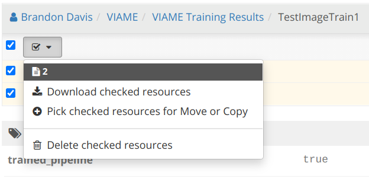
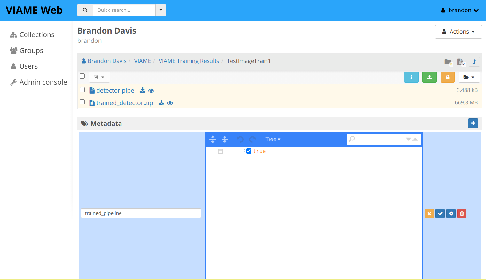

# Pipeline Import and Export

## Trained model downloads

You can download your trained models through the administrative interface.

!!! warning

    Use caution when modifying data through the admin interface

* Open the admin interface at [https://viame.kitware.com/girder](https://viame.kitware.com/girder) (or `myserver.com/girder` if you host your own instance)
* Navigate to your personal workspace by clicking ==:material-folder: My Folders== under your user dropdown in the top right corner.

    

* Navigate to the `VIAME/VIAME Training Results` folder and into the folder you wish to download
    
    

* Select all items and download using the menu

    

## Custom Pipeline Upload

It's possible to upload custom pipes to DIVE Web through the girder interface.

!!! warning

    This feature is not yet standardized, and the instructions below may change.

1. Open the girder interface at `/girder` and create a new private folder called `MyPipelines`
    1. For our demo instance, open [https://viame.kitware.com/girder](https://viame.kitware.com/girder)
1. Create a new folder in that private folder, and give it a name you'd like to associate with your new pipeline.
1. Upload one or more files inside your new pipeline subfolder:
    1. A pipeline file ending in the `.pipe` file extension
    1. Whatever other model `.zip` files are required by the pipe, named exactly as they appear in your `.pipe` file above.
1. Finally, set the **pipeline folder** metadata key `trained_pipeline` with value `true`.
1. Your new pipeline will be available under the `Run Pipeline -> Trained` menu from the DIVE web app.

### Accepting input

If your pipe must accept input, set the **pipeline folder** metadata property `requires_input` to `true` .

### Including base pipelines

User-uploaded pipelines may depend on any pipe already installed from the base image or an addon using `include <pipename>.pipe` . Depending on other user-uploaded pipes is not supported.

!!! tip

    KWIVER pipe files can be exported for use with DIVE using [kwiver pipe-config](https://kwiver.readthedocs.io/en/latest/tools/pipe-config.html?highlight=pipe-config)
