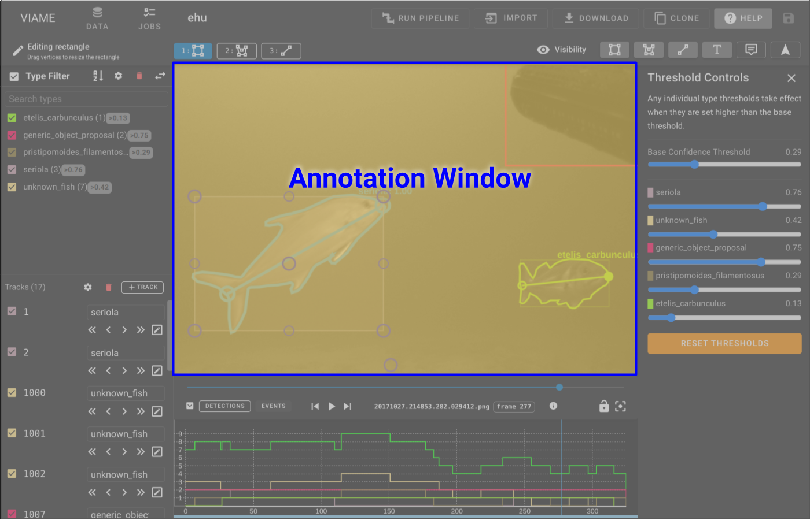

# Annotation Window

The annotation window will look different based on the current mode and what visibility toggles are enabled.

* **Left Click** an annotation to select it.
* **Right Click** an annotation to select it and enter editing mode.
* **Middle Click** and drag to pan the camera.  This is useful when drawing annotations while zoomed such that you need to work on something slightly off-screen.

## Viewer modes

* **Default Mode** - In the default mode the annotation will have bounds associated with it as well as a text name for the type and an associated confidence level.  The color and styling will match what is specified in the [Type List Style Settings](UI-Type-List.md).  There are additional modes which can be toggled on and off in the [Edit Bar](UI-Navigation-Editing-Bar.md).

* **Selected Annotation** - selected annotations are cyan in color

    

* **Editing Annotation** - Editing annotations are cyan in color and provide handles to resize the annotation as well as a central handle to move the annotation to different spot.

    

* **Creating Annotation** - Creating an annotation requires clicking and dragging the mouse.  Creating in the annotation window is indicated by a cursor crosshair and an icon that shows the type being drawn.
    
    

* **Interpolated Annotation** - If a track has an interpolated box on the current frame it will appear slightly faded.
    
    
