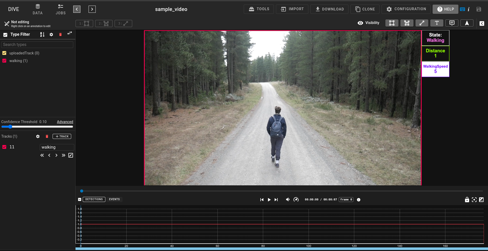
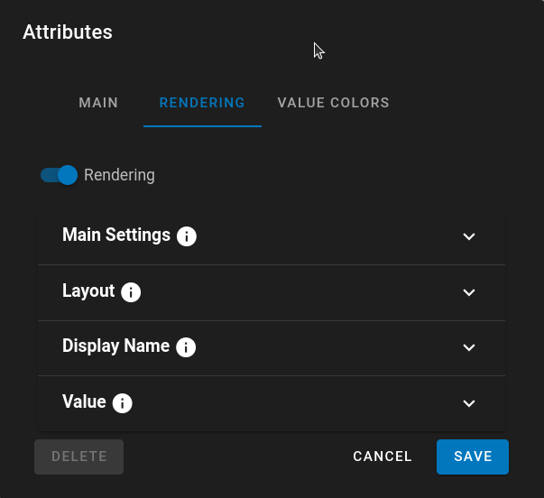
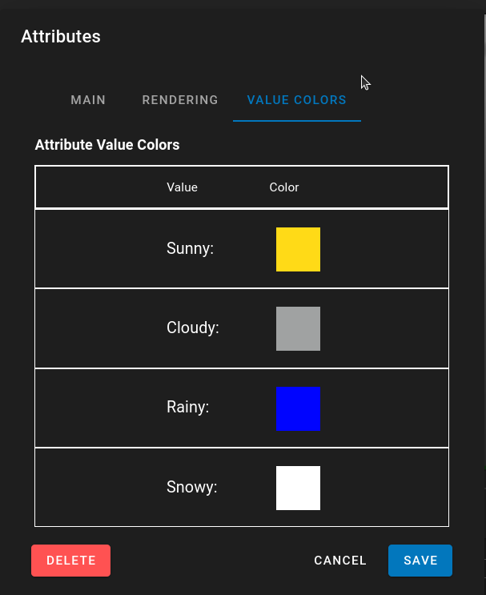
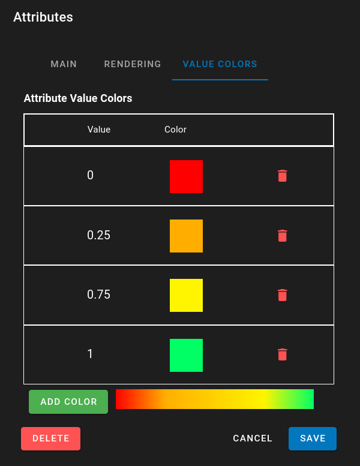

# Attribute Configuration

Attributes can be configured through their main editing window.  This provides several sections will allow for the customization of values.

## Main

The Main section is where the attribute Name, Datatype, any predefined values and the rendering color are specified

*Datatype* - Can either be Text, Number or Boolean data types.

If the track is Text type a list of predefined values can be used in dropdowns to make it eaiser to set attribute values.

*Color* - The color is used to determine the display color for the attribute within the track details and the default color utilized in any graphs or rendering of the attribute values.

## Rendering

Attributes can be displayed within the annotation area next to the tracks they are associated with.
Within the Attribute Editor there is a tab for Rendering and when turned on there are settings which can specify how the attribute is displayed and what tracks it is displayed.
By default if no settings are touched the attributes are rendered below the bottom right of the track.

{ align=center width=800px }
In the above demo the Detection attributes are rendered to the side of the track with custom text and colors for displaying each.

### Attribute Rendering Settings

{ align=center}

Under the Rendering Tab for the Attribute Editor if you turn on Render there will be numerous settings which determine how the attribute is displayed.

* **Main Settings**
    * *Selected Track* - only display attributes for the selected track.
    * *Filter Types* - Will filter and only place the attribute rendering on the filtered track types.
    * *Order* - Order is used to determine the top-to-bottom order of the attributes that are rendered.  A lower number means it has higher priority in the list.
* **Layout**
    * *Location* - determines if the attribute is rendered inside or outside of the bounding box for the track
    * *Layout* - Horizontal will render attributes as *Name:Value* left to right.  Vertical will stack them on top of each other.  Much like in the demo to the right side of track.
    * *Corner* - SE/SW/NW specifies what corner to place the attributes in
* **Display Name**
    * *Display Name* - The Name displayed at the top as a label for the attribute.  You can add a : to the display name.  It will automatically populate with the attribute name
    * *Display Text Size* - Text size in pixel for the display name.  This will remain constant when scrolling in/out of the track. -1 is a default value to auto-calculate the size much like the confidence labels.
    * *Display Color* - Text color for the display text.  If set to auto it will utilize the attribute color or the attribute value colors if they are specified.  If Auto is turned off you can set a custom display text color
* **Value**
    * *Value Text Size* - Text size in pixel for the value.  This will remain constant when scrolling in/out of the track.
    * *Value Color* - Text color for the display text.  If set to auto it will utilize the attribute color or attribute value colors if they are specified.  If Auto is turned off you can set a custom display text color.
* **Dimensions and Box Are only available under Vertical Layout**
* **Dimensions**
    * *% Type* - For width and height it will size the area for the attribute based on the track width/height.
    * *px Type* - It will size the dimension of the width/height in pixels.  This is useful if you have tracks of varying sizes and always want the attributes to fit properly.
    * *auto Type* - Only for the height this will automatically partition the height of the track into even parts based on the number of attributes that are being used.
* **Box**
    * *Draw Box* - Basic setting to draw the box, if not selected the attribute will float there.
    * *Thickness* - Line Thickness for the outside of the box.
    * *Box Color* - Line color for the box.  If set to auto it will utilize the attribute color.
    * *Box Background* - Will draw a background for the box instead of being transparent
    * *Box Background Color* - Background color for the box.  If set to auto it will utilize the attribute color.
    * *Box Background Opacity* - The Opacity of the background color for the box

## Attribute Values

Attributes can specify specific render colors based on their values.  This means that attributes with text values could be set so that specific values will have specific colors.  I.E  You may have an attribute for weather classification and it could be set so that Sunny is Yellow, Cloudy is Gray and Rainy is Blue.

### Attribute Text Values

On loading this page any existing attribute text values or predefined values will be populated and assigned a random color.  These colors can be clicked on and modified to suit needs.  If a text value doesn't exist, add it to the predefined values and it will show up when you return to this tab.

When rendering attribute Values if the color is left to Auto it will utilize the colors specified here to render the text value for the attribute.

{ align=center}

### Attribute Numerical Values

If the Attribute Datatype is 'Number' that allows for the creation of color gradients to be assigned to the numerical values.
Numbers can be added by clicking on "Add Color".  Each Number in the range can then be specified to be a specific color.  Using D3.js it then creates a gradient between the colors in the list.  To help with visualization a display of the gradient is located at the bottom of the editor next to the Add Colors button.

Like the Text Values if attribute rendering value is set to auto color it will use the gradient to determine the color of the attribute value.

{ align=center}

