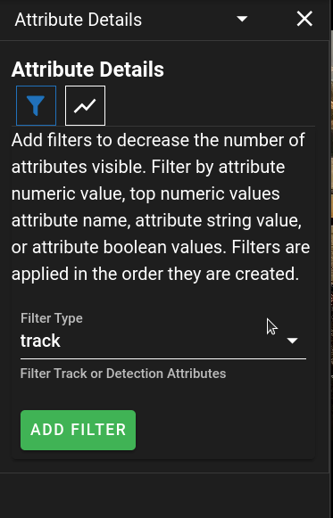
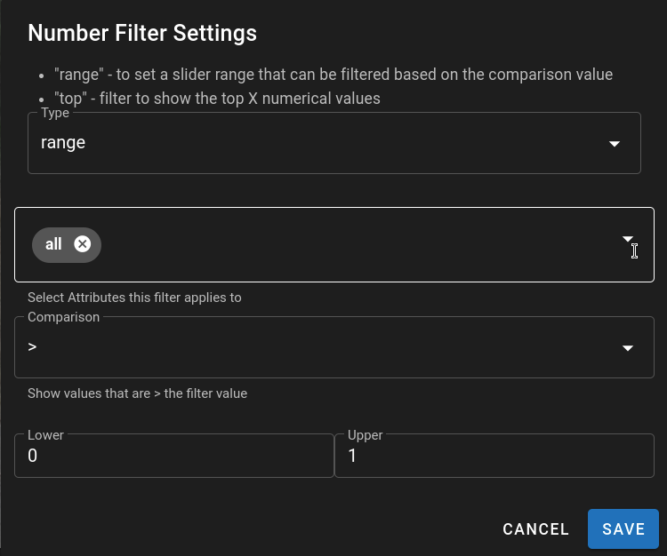
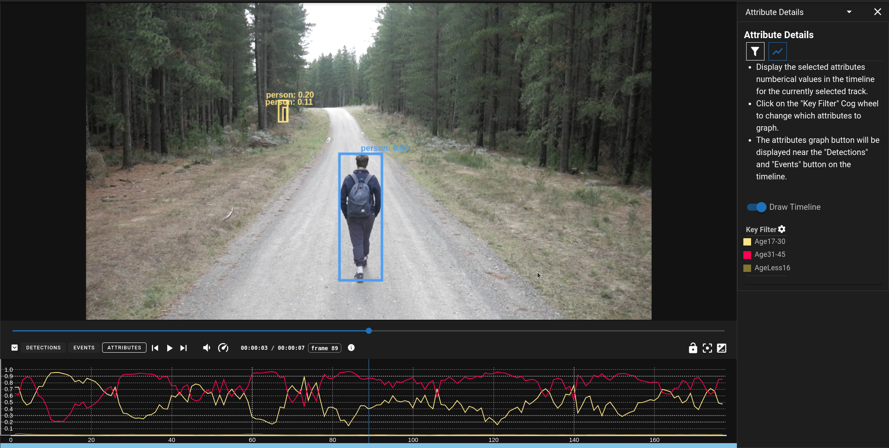

# Attribute Details Panel

The Attribute Details Panel is a side panel that provides additional tools for Filtering and Viewing Attributes.

{ align=right width=300px }

## Attribute Filtering ==:material-filter:==

Filters the values of the selected type to reduce the number of results displayed.  The filters can be applied to 
"Track" or "Detection" attributes and are applied in order.

Attribute filters have an "Applies To" list which is a list of the Attribute key names that the filter will apply to.
There is a special name called 'all' which will cause the filter to apply to all items.
The settings for individual filters can be accessed by clicking on the ==:material-cog:==

### Numeric Filters

only operates on the attributes that have numeric values.

- Range Filtering
    - Provides a slider with a custom range that can be used to filter the attribute values
    - There is a Comparison option ('>', '<', '>=', '<=') which will filter out items that don't be the currently set number value
- Top Filtering
    - Provides the Top {X} numbers when sorted by their numeric value

{ align=center width=600px }

### String Filters

only operates on the attributes that have text values

- There are 4 options for text filtering: is, not, contains, starts
    - is - simple equality comparison to confirm that the value is equal to the test value.
    - not - inverse of the equality expression.
    - contains - will pass the filter if the item contains any of the values provided.
    - starts - will pass the filter if the item starts with any of the values provided.

### Key Filters

Filter which will only show the selected Attribute names regardless of their current value.

The special name 'all' will show all of the attributes.

## Timeline Visualization ==:material-chart-line-variant:==

The timeline visualization only applies to numeric and detection attributes currently.  It will graph the selected attributes in a chart at the bottom of the screen when a Track is selected.

A Key Filter is used to determine which attributes to graph.

{ align=center width=800px }
