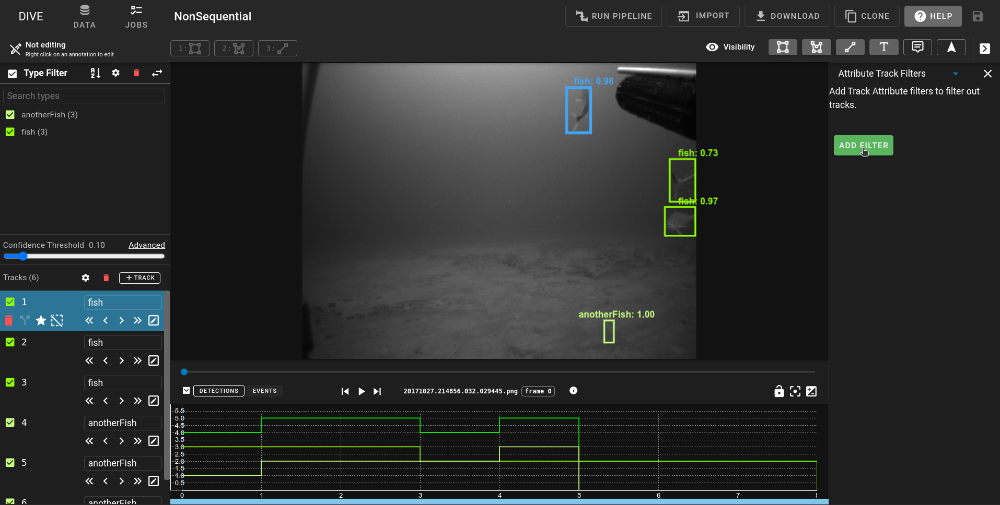
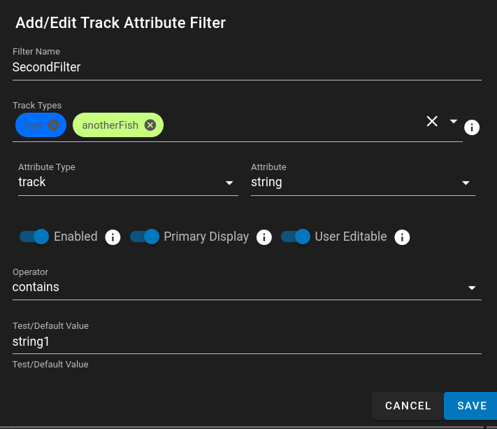
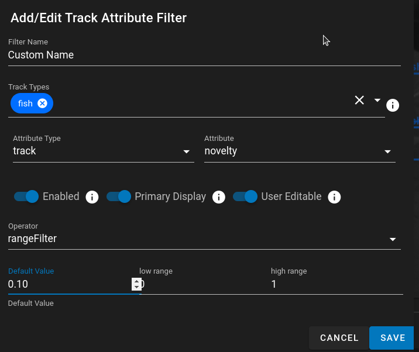
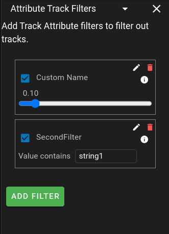
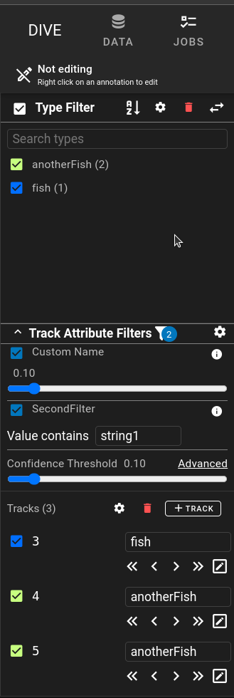
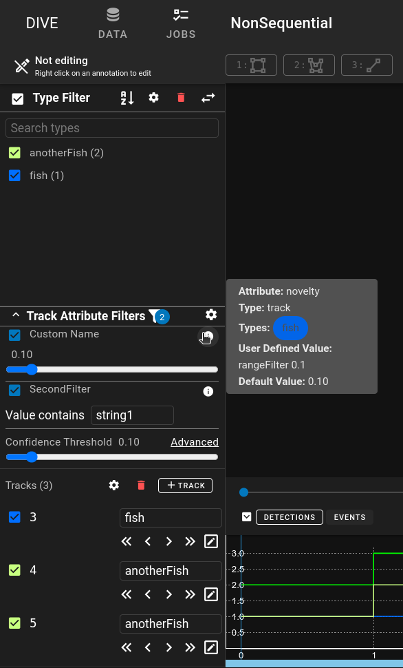

# Attribute Track Filtering

Attribute Track Filtering is used to apply a filter to the currently visible tracks based on the values defined in the **[Track or Detection Attributes](UI-Attributes.md)**

## Adding Attribute Filters

To add attribute filters open up the right side panel and go to the drop down for Attribute Track Filters

A new Atribute Track Filter can be added by clicking on the new button

### Attribute Track Filter Options

- *Filter Name* - A displayed name for the track filter
- *Track Types* - A list of tracks that the filter will apply to.  If it is empty it will apply to all track types.
- *Attribute Type* - Track or Detection Attribute type
- *Attribute* - Dropdown list of the configured Track or Detection Attributes that is determined by the *Attribute Type* selection
- *Enabled* - The Filter is enabled by default.  This means on loading the filter is active and removing tracks that meet the condition
- *Primary Display* - Displays the filter in the left hand side of the primary interface.  Where the Confidence Filter and track types are listed
- *User Editable* - Instead of utilizing a static value, users can change the filter value to customize how it is filtering.  
    - If the Operator is a range slider this would include providing a slider for the user.
    - If the Operator is a conditional (>,<,>=,<=,!=,==) or contains it will provide an input box for users to enter data
    - If the Operator is 'in' for text it will include a multi dropdown to add in custom works to check for

Atribute Track Filter with Range Settings

After adding multiple Track Attribute Filters they are listed in the side panel:

### Primary Track Atribute Filter View

All filters that have the Primary Display switched to on will be displayed in left hand side of the main viewer:

- The Track Attribute Filter is collapsable and expandable.
- The Filter Icon ==:material-filter:== with the number next to it indicates the number of currently enabled filters.  This is useful if there are enabled filters that are not in the primary display.
- The Settings Icon  ==:material-cog:== will open the Track Attribute Filter side panel directly for editing or modification of the existing filters.
- Each individual filter has a checkbox to enable/disable the filter.
- If the filter is User Editable there is an interface (range slider, input box, multi-select) to allow the user to change the filter values.
- Hovering over the info icon  ==:material-information:== will provide more information about the filter

