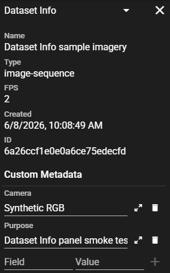

# Dataset Info

The **Dataset Info** panel shows read-only frame telemetry, properties of the
whole dataset, and custom metadata attached to it. It is one pane of the
[context sidebar](UI-Navigation-Editing-Bar.md#context-sidebar-web).

Metadata you add travels with the dataset: it is shown while annotating and written into
DIVE Configuration, [VIAME CSV](DataFormats.md#viame-csv), and
[COCO / KWCOCO](DataFormats.md#coco-and-kwcoco) exports, so downstream tooling can
re-link annotations to their source records.

## What it shows

{ width=220px align=right }

**Frame Metadata** (read-only): per-frame telemetry for the active image, such
as timestamp, latitude, longitude, depth, or altitude. The panel shows only the
source fields for the active frame, in the order they appear in the source file.

**Standard information** (read-only): Name, Type, FPS, Original FPS and Subtype (when
set), Created date, and ID (the Girder folder id).

**Custom Metadata** — a free-form list of key/value pairs stored on the dataset, for
example a station id, cruise number, or dive number.

<div style="clear: both;"/>

## Frame Metadata

Frame telemetry is not an annotation stream. DIVE reads it from a `.meta.csv` or
`.meta.txt` sidecar file next to the imagery and displays the values for the
active frame. The sidecar remains the source of truth; DIVE does not import it
into an editable store or save a derived copy.

### Source file

Name the file so it ends in `.meta.csv` or `.meta.txt` (case-insensitive) — that
naming convention is what tells DIVE the file is telemetry rather than an
annotation CSV. Use a delimited text file with:

* a header row,
* one or more columns containing image filenames,
* at least one metadata column beyond the filename column.

The delimiter can be comma, tab, or whitespace. DIVE joins rows to frames by
matching filename values, not by row order. A row that does not match an image is
ignored instead of being shifted onto another frame.

Example (`AUV_nav.meta.txt`):

```text
image_file timestamp latitude longitude water_depth
img_0001.tif 15:40:56 46.575870 -124.603094 192.80
img_0002.tif 15:41:04 46.575912 -124.603080 193.10
```

The filename extension is ignored during matching, so `img_0001.tif` matches the
image key `img_0001`. Values are displayed as raw strings in the order they
appear in the source file.

### Placement

For a single-camera image sequence, place the `.meta.csv` or `.meta.txt` file in
the dataset folder beside the images.

For a multicamera image sequence, use either placement:

* Place one shared file at the multicam parent folder. Each camera selects the
  rows or filename column that match its own images.
* Place one file inside each camera child folder. Each file is read only for that
  camera.

A shared multicam file can contain one filename column per camera, such as
`port_image` and `starboard_image`, or one filename column with separate rows for
each camera. The Dataset Info panel follows the active camera, so switching
cameras switches the displayed records.

### Display behavior

Open **Dataset Info** from the context sidebar while viewing an image-sequence
dataset. The Frame Metadata section updates as the playhead moves.

The section shows only the source fields for the active frame, in the column
order of the source file. It does not repeat the current frame number or
filename, which are already shown by the playback controls.

A **`Source:`** line names the sidecar file (or files, winner first) that supplied
the values for the active camera, so you can tell at a glance which telemetry file
DIVE read and confirm it is the one you dropped.

The section may show an empty state when:

* **the platform or dataset type does not support frame metadata** — for example
  a video or large-image dataset;
* **no matching `.meta.csv` or `.meta.txt` source is present** — the empty state
  points at the naming convention (drop a delimited text file next to the imagery
  and name it so it ends in `.meta.csv` or `.meta.txt`), because there is no
  import-time warning when a sidecar matches no frames;
* **the current frame has no matching row** — a source is present, but no row's
  filename value matches this frame.

Frame telemetry is read-only in v1. There is no edit, save, import, or export
flow for these values. The desktop app refuses to import a `.meta.csv`/`.meta.txt`
file through the annotation flow; a plain annotation CSV that fails to parse
suggests renaming it to `.meta.csv` if it is actually telemetry. Video telemetry, embedded KLV, embedded EXIF, and manual
selection of a source file from another location are future work.

See [Data Formats](DataFormats.md#per-frame-metadata-text-sidecars) for the
sidecar file contract.

## Where the data is stored

Custom metadata lives on the dataset's folder metadata under the `datasetInfo` key — the
same key the exporter reads. Because it is ordinary Girder metadata, you can populate it
three ways:

1. **By hand** in the panel — good for one-offs and corrections.
2. **At upload, from a pipeline** — stamp it when the dataset is created:
   ```python
   gc.addMetadataToFolder(folder_id, {
       "datasetInfo": {"gfishsite_id": "2024TXN012", "cruise": "2403", "year": "2024"},
   })
   ```
   (equivalently `PUT /folder/{folder_id}/metadata`). This is the intended end state for
   batch ingest: stamp identifiers once and they flow through to export. See
   `samples/scripts/uploadScript.py`.
3. **After the fact, with a script** — the same call works on existing datasets.

## How it is exported

Non-empty `datasetInfo` is included in dataset-level exports with format-specific keys:

* [DIVE Configuration JSON](DataFormats.md#dive-configuration-json): top-level `datasetInfo`.
* [VIAME CSV](DataFormats.md#viame-csv): `dataset_info` in the `# metadata` header.
* [COCO / KWCOCO](DataFormats.md#coco-and-kwcoco): `info.dive_dataset_info`.

Imports restore `datasetInfo` using the selected import mode. See
[Data Formats](DataFormats.md) for the exact wire format and merge behavior.

### Value types

The panel stores values as text. A script may write typed values (numbers, objects);
they serialize into the export as-is. Keep `datasetInfo` a flat key/value object.
