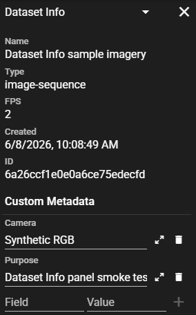

# Dataset Info

The **Dataset Info** panel shows read-only frame metadata, properties of the
whole dataset, and custom metadata attached to it. It is one pane of the
[context sidebar](UI-Navigation-Editing-Bar.md#context-sidebar-web).

Metadata you add travels with the dataset: it is shown while annotating and written into
DIVE Configuration, [VIAME CSV](DataFormats.md#viame-csv), and
[COCO / KWCOCO](DataFormats.md#coco-and-kwcoco) exports, so downstream tooling can
re-link annotations to their source records.

## What it shows

{ width=220px align=right }

The pane holds three collapsible sections:

**Frame Metadata** (read-only): per-frame metadata for the active frame, such as
timestamp, latitude, longitude, depth, or altitude. It shows only the source
fields for that frame, in the order they appear in the source file.

**Dataset Info** (read-only): Name, Type, FPS, Original FPS and Subtype (when
set), Created date, and ID (the Girder folder id).

**Custom Dataset Info** — a free-form list of key/value pairs stored on the dataset,
for example a station id, cruise number, or dive number.

<div style="clear: both;"/>

## Frame Metadata

The Frame Metadata section shows values for the active frame, updating as the
playhead moves and following the active camera on multicamera datasets. The
section header carries an information icon when an attachment supplied the
values; hover it to see which file they came from. When there are no values to
show, the section says why in place of the rows.

See [Frame Metadata Sidecars](Frame-Metadata.md) for supported filenames, file
format, placement, and limits.

## Where the data is stored

Custom metadata lives on the dataset's folder metadata under the `datasetInfo` key — the
same key the exporter reads. Because it is ordinary Girder metadata, you can populate it
three ways:

1. **By hand** in the panel — good for one-offs and corrections.
2. **At upload, from a pipeline** — stamp it when the dataset is created:
   ```python
   gc.addMetadataToFolder(folder_id, {
       "datasetInfo": {"gfishsite_id": "2024TXN012", "cruise": "2403", "year": "2024"},
   })
   ```
   (equivalently `PUT /folder/{folder_id}/metadata`). This is the intended end state for
   batch ingest: stamp identifiers once and they flow through to export. See
   `samples/scripts/uploadScript.py`.
3. **After the fact, with a script** — the same call works on existing datasets.

## How it is exported

Non-empty `datasetInfo` is included in dataset-level exports with format-specific keys:

* [DIVE Configuration JSON](DataFormats.md#dive-configuration-json): top-level `datasetInfo`.
* [VIAME CSV](DataFormats.md#viame-csv): `dataset_info` in the `# metadata` header.
* [COCO / KWCOCO](DataFormats.md#coco-and-kwcoco): `info.dive_dataset_info`.

Imports restore `datasetInfo` using the selected import mode. See
[Data Formats](DataFormats.md) for the exact wire format and merge behavior.

### Value types

The panel stores values as text. A script may write typed values (numbers, objects);
they serialize into the export as-is. Keep `datasetInfo` a flat key/value object.
