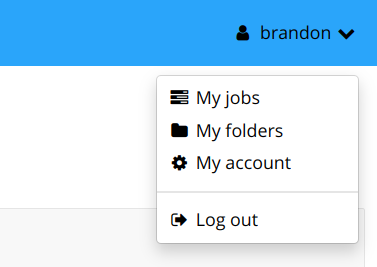

# Downloading Data

After creating/modifying annotations or running pipelines the data may be exported through two methods:

* File Browser Data Download
* Annotation Viewer Download

## Annotation Folder Structure

An annotation folder in DIVE will consist of three main components:

* **Source Data** - The image-sequence files or video used in the annotation.
* **Detections File** - The current detections/tracks for the annotation which are stored in either a CSV format or JSON
  * After the first edit to a project, the data will be stored in JSON, when downloading the current detection it will **always be downloaded in .csv format**
* **Auxiliary Folder** - Backups of the detection file each time a save is done.

## File Browser Data Download

Data can be downloaded directly from the FileBrowser by clicking the checkmark to the left of a folder.  This allows you to download the source images/video, the current detection file converted to .csv or everything including all backups of the detection files.  

**Filtered Detections** - The ability to export detections/tracks based on the currently set confidence filter.  This will only export tracks/detections that are higher than the confidence filter set for the folder.  This can be adjusted through the UI interface within the Annotation Viewer.  For more information check:

## Annotation Viewer Download

Within the annotation viewer itself there is the option to download the same data in the file browser.

These options are explained in **[Navigation Bar](UI-Navigation-Bar.md)**

## Trained model downloads

You can download your trained models through the administrative interface.  This will be added to the normal interface in a future update.

!!! warning
    Use caution when modifying data through the admin interface

* Open the admin interface at [https://viame.kitware.com/girder](https://viame.kitware.com/girder) (or `myserver.com/girder` if you host your own instance)
* Navigate to your personal workspace by clicking `My folders` under your user dropdown in the top right corner.
    * 
* Navigate to the `VIAME/VIAME Training Results` folder and into the folder you wish to download
    * 
* Select all items and download using the menu
    * 
