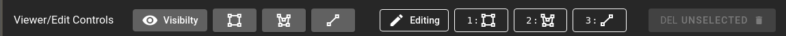
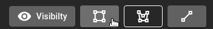
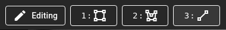
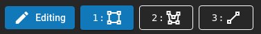
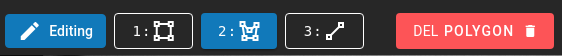
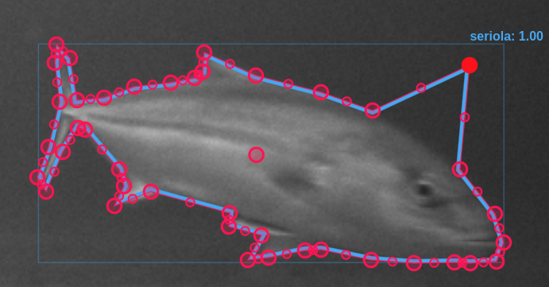

# View and Edit Controls

The View/Edit Bar is used to hide/view annotations as well as create and edit them.  Tthe visibility section where different types of geometry associated with a track/detection can be hidden or shown.  The edit section allows for the creation and editing of different geometries associated with a track.

* **Visibility** - Toggle on/off the different geometries associated with tracks or detections. This may be necessary when having multiple geometries visbile to make it easier to see a specific type.  By default all tracks/detections have an included bounding box.  If there is a polygon as well as a bounding box the box will become thinner and dimmer.  This tool allows you to disable one or the other to make groups of items more visible.
    * 
* **Edit Section** - This bar is used for both editing and creating geometries associated with a track. 
    * 
    * **Edit/Creation Mode** - When in edit or creation mode the selected geometry type will be highlighted blue.  You can swap between them at anytime by clicking on the type or using the keyboard shortcuts corresponding to the numbers.  If a geometry of that type already exists it will be placed in edit mode, if it doesn't exist you can then create it.
    * 
* **Deletion** - Allows for the deletion of geometry types or points within a geometry.
    * **Delete Geometry** - This is the deletion of the entire type from the track.  You cannot delete a bounding box.  The bounding box is necessary for the representation of the track
    * 
    * **Delete Point** - When in edit mode for a polygon or a line segment it is possible to select individual points by clicking on them.  They will turn Red and the Deletion button will indicate that you are now selecting a point for deletion.  Clicking it will remove that current point from the line segment or the polygon.
    * 
    * 
