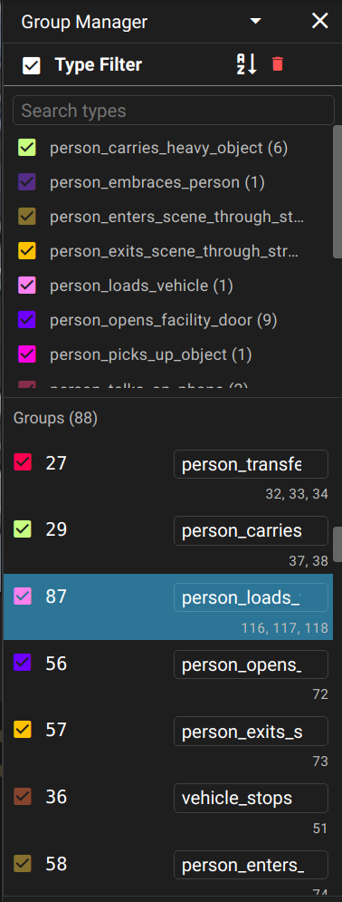
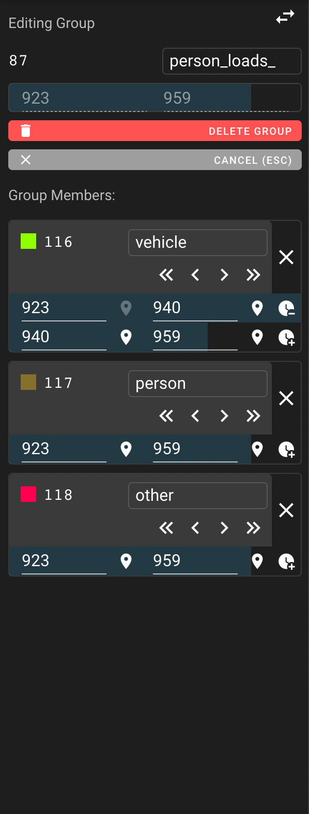

# Group Manager

The group manager is one pane of the context sidebar.

## Feature overview

DIVE supports complex group annotation.

* Groups can be interpreted as activity participation.  For example, two `Person` type tracks participate in a `Conversation` activity.
* Groups can be used to represent most types of multi-annotation collections.
* Group membership for tracks can be explicitly constrained to sub-intervals within `[track.begin, track.end]`.  A single track can belong to a group for multiple sub-ranges, typically interpreted as the tracked object leaving and re-joining a group.
* Tracks can belong to many different groups at once, and can have different participation interval(s) for each.

See the [data format documentation](DataFormats.md) for the complete capabilities of group annotations in the DIVE json schema.

## Group List Controls

{ width=260px align=right }

### Group Type List

The group type summary list allows for enabling and disabling annotations based on their group and bulk-editing group type characteristics.

* Groups do not have separate "selected" and "editing" states, so selecting a group puts it into editing mode.
* Group type styles can be edited in the same fashion as [track type styles](UI-Type-List.md#type-style-editor) in the left sidebar using ==:material-pencil:== (the edit pencil).

### Group Instance List

Each group instance includes the following.

* A checkbox to enable and disable visibility
* The group id
* The group type
* A list of member track ids that are part of the group.

## Group Editor

{ width=260px align=right }

To enter group edit mode, click a group's ID number in the group list.

* Add new tracks to a group by first entering group edit mode, then selecting tracks to add (in the annotation window, the sidebar, or any UI where track selection can happen)
* ==:material-close:== (next to a track) will remove a track from a group.
* Use the frame range input boxes to adjust the start and end frame numbers that a track participates in a group.
* ==:material-map-marker:== will set a frame input box to the current frame.
* ==:material-clock-plus:== will create a new sub-interval participation range for a track within a group.
* ==:material-clock-minus:== will remove a sub-interval participation range.
* ==:material-delete: Delete Group=={ .error } will delete a group without deleting its member tracks.

Some notes about group editing behavior.

* If you delete a track, and the track was the only track remaining in one or more groups, those groups will also be deleted.
* If you delete a group, its member tracks will not be deleted no matter how many members there are.
* The group's composite range (shown as disabled begin and end frames in the group editor) is the maximum overlapping range of all sub-intervals of all member tracks.

## Example data

The group feature was initially developed for compatibility with the The Multiview Extended Video with Activities (MEVA) dataset.  Find example data at [mevadata.org](https://mevadata.org/).
