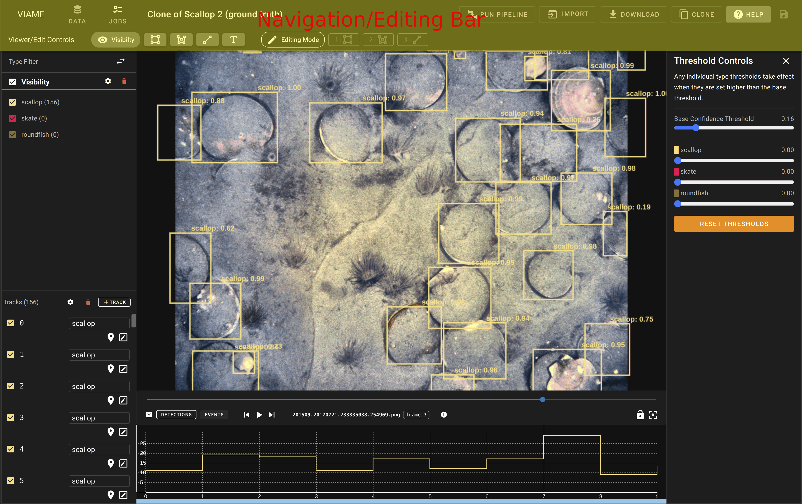
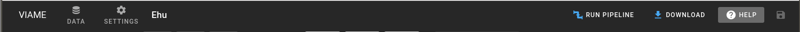
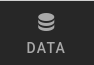
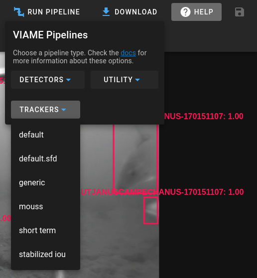
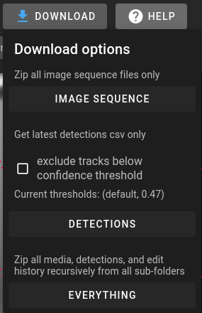

## Navigation Bar

* **Data Link** - Returns back to the folder which contains the current data.
    * 
* **Run Pipeline** - Will run a pipeline from the dropdown on the current data. 
    * NOTE: Current annotations will be backed-up and replaced by the pipeline when it is complete
    * 
* **Download** - Allows for downloading all data, the image-sequence/video, dataset configuration, or just the detections.
    * 
    * **Exclude Tracks** - this allows you to remove tracks below a specific confidence threshold when exporting the CSV.  It is how you can export only the higher detections/tracks after running a pipeline.
    * **Checked Types Only** - allows you to only export the annotations of types that are currently checked in the type list.
* **Help** - Provides a small indication of currently available mouse/keyboard shortcuts as well as a link to this documention.
* **Save** - This button is used to save the current annotations and any custom styles applied to the different types.  Changes are not immediately committed and will instead update the save icon with a number indicating the number of changes that have occured.  Clicking this button will reset the number and save the data at the same time.
    * 
