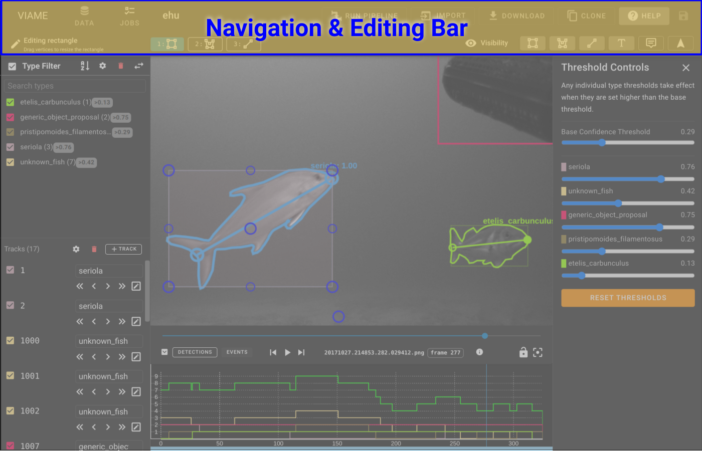

# Navigation Bar

* ==:material-database: Data== navigates to the folder that contains the current dataset.
* ==:material-pipe: Run Pipeline== will launch a pipeline dropdown menu.
    * **NOTE** Current annotations will be replaced by the pipeline output when it is complete.  You should not perform annotations while a pipeline is running.

* ==:material-download: Download== (Web) or ==:material-application-export: Export== (Desktop) allows for exporting all or part of the current dataset.
    * **Exclude Tracks** - this allows you to remove tracks below a specific confidence threshold when exporting the CSV.  It is how you can export only the higher detections/tracks after running a pipeline.
    * **Checked Types Only** - allows you to only export the annotations of types that are currently checked in the type list.
    * **Web-specific options** are documented in the [Web Section](Web-Version.md#download-or-export-data)
* ==:material-help-circle: Help== provides mouse/keyboard shortcuts as well as a link to this documention.
* ==:material-application-import: Import== allows the upload of several kinds of files
    * overwrite the current annotations with a `.json` or `.csv` annotation file.
    * overwrite the style and attribute configuration with a config `.json` file.
* ==:material-content-copy: Clone== is documented in the [Web Section](Web-Version.md#dataset-clones).
* ==:material-content-save: Save== is used to save outstanding annotation changes and any custom styles applied to the different types.  Changes are not immediately commmitted and will instead update the save icon with a number badge indicating how many changes are outstanding.  Clicking this button will commit your changes and reset the count to zero.
