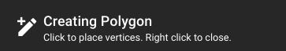

## Navigation Bar

The navigation bar is the row of controls at the very top of the window.

* ==:material-database: Data== navigates to the folder that contains the current dataset.
* ==:material-pipe: Run Pipeline== will launch a pipeline dropdown menu.
    * **NOTE** Current annotations will be replaced by the pipeline output when it is complete.  You should not perform annotations while a pipeline is running.
* ==:material-application-import: Import== allows the upload of several kinds of files
    * overwrite the current annotations with a `.json` or `.csv` annotation file.
    * overwrite the style and attribute configuration with a config `.json` file.
* ==:material-download: Download== (Web) or ==:material-application-export: Export== (Desktop) allows for exporting all or part of the current dataset.
    * **Exclude Tracks** - this allows you to remove tracks below a specific confidence threshold when exporting the CSV.  It is how you can export only the higher detections/tracks after running a pipeline.
    * **Checked Types Only** - allows you to only export the annotations of types that are currently checked in the type list.
    * **Web-specific options** are documented in the [web download section](Web-Version.md#download-or-export-data)
* ==:material-content-copy: Clone== is documented in the [web clone section](Web-Version.md#dataset-clones).
* ==:material-help-circle: Help== provides mouse/keyboard shortcuts as well as a link to this documentation.
* ==:material-content-save:== is used to save outstanding annotation changes and any custom styles applied to the different types.  Changes are not immediately committed and will instead update the save icon with a number badge indicating how many changes are outstanding.  Clicking this button will commit your changes and reset the count to zero.

## Editing Bar

The editing bar is the second row below navigation.

### Editing Status Indicator

On the far left, the editing mode status indicator shows you what mode you're in, what input is expected, and usually reminds you to press ++escape++ to cancel.

### Edit Mode Toggles

Editing mode toggles control the type of geometry being created or edited during annotation.  See the [Annotation Quickstart](Annotation-QuickStart.md) for an in-depth guide to annotation.

### Visibility Toggles

The **:material-eye: visibility** section contains toggle buttons that control the different types of annotation data can be hidden or shown.

* ==:material-vector-rectangle:== toggles **rectangle** visibility
* ==:material-vector-polygon:== toggles **polygon** visibility
* ==:material-vector-line:== toggles **head/tail line** visibility
* ==:material-format-text:== toggles annotation type & confidence **text** visibility
* ==:material-comment-text-outline:== toggles a **cursor hover tooltip**, helpful for reviewing very dense scenes with lots of overlap.
* ==:material-navigation:== toggles **track trail** visibility.  The track trail is configurable to show up to 100 frames both ahead and behind each bounding box.  The trail line is made of bounding box midpoints.
