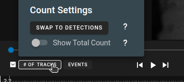
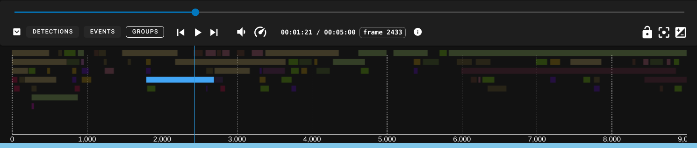

# Timeline

The timeline provides a control bar and a few different temporal visualizations.  All timeline visualizations are updated live by type confidence slider(s), type checkboxes, and track checkboxes.

## Control Bar

* ==:material-chevron-down-box:== will minimize the timeline.
* ==# of Detections== button selects the **Track/Detection Count** histogram timeline view.
* ==Events== button selects the **Event View**, which is a Gantt-style track chart.
* ==Groups== button selects the **Group View**, which is a Gantt-style group chart.
* ==:material-skip-previous:==  ==:material-play:== ==:material-skip-next:== are standard media playback controls.
* ==:material-speedometer:==  ==:material-volume-medium:== opens the video playback speed controls and volume controls, respectively.
* ==frame ##== shows the current frame number.
* ==:material-lock-open:== will enable camera lock, which causes the annotation view to auto-zoom and pan to whatever annotation is currently selected.  This is useful when reviewing the output of a pipeline.
    * Hovering over the camera lock will open additional settings for forcing transition and locking to a zoomed in multiple of the bbox size
* ==:material-image-filter-center-focus:== or the ++r++ key will reset zoom/pan in the annotation view.
* ==:material-contrast-box:== will open the image contrast adjustment panel.

## Detection/Track Count

* Line color matches the annotation type style.
* Top green line is the sum count of all annotations of all types on each frame.

This is the default visualization.  It is a stacked histogram of track/detection types over the duration of the sequence.
Hovering over the Button for # of Tracks will bring up a settings panel where a user can swap between the # of Detections vs the # of Tracks
* Tracks - This is the count of tracks at each frame which uses tracks begin/end times so tracks with gaps in the detections will still show up on the frame
* Detections - This is a count of the detections so it will show gaps in tracks

* Swap to Detections/Tracks will swap to the different styles of counting
* Show Total Count will hide/show the total count for all tracks/detections

## Event View

The event viewer shows the start/stop frames for all tracks.  It is a kind of Gantt chart, also similar to a swimlane chart but with more compact packing.

* The tracks are drawn using their corresponding type color.
* When hovering over any track the TrackID will display.
* Clicking on a track will select it and jump to the track at the selected frame.

## Group View

The group viewer is just like the event viewer, but shows the start and end times of track groups, colored by group types. Switching to the group view changes the coloring scheme of annotations in the annoation window.

## Interpreting

<figure markdown>
  
  <figcaption markdown>**Single frame detections** are presented as single frames with spaces between.</figcaption>
</figure>

<figure markdown>
  
  <figcaption markdown>A **selected track** will be cyan and will cause all other tracks to fade out.  If a selected track is solid cyan, that means every frame in the track is a keyframe.</figcaption>
</figure>

<figure markdown>
  
  <figcaption markdown>A **selected interpolated track** will show the areas of interpolation as yellow lines, the keyframes as cyan ticks, and gaps as empty regions.</figcaption>
</figure>
