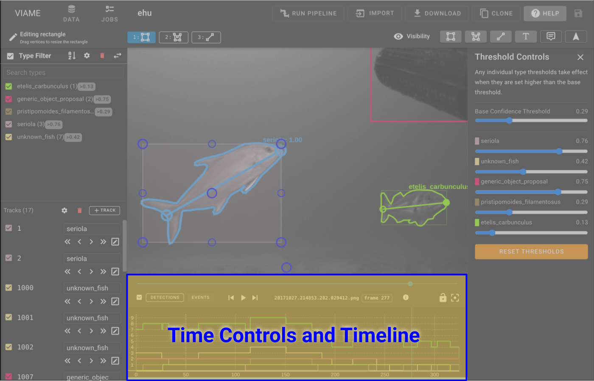
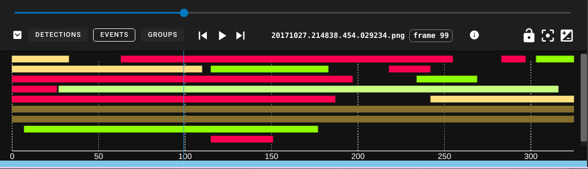
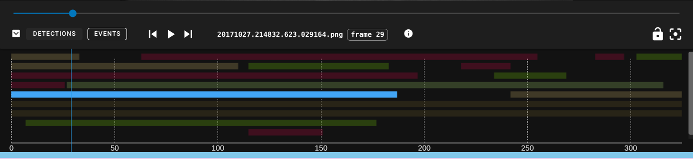

# Timeline

The timeline provides a control bar and a few different temporal visualizations.  All timeline visualizations are updated live by type confidence slider(s), type checkboxes, and track checkboxes.

## Control Bar

* ==:material-chevron-down-box:== will minimize the timeline.
* ==Detections== button selects the **Detection Count** histogram timeline view.
* ==Events== button selects the **Event View**, which is a Gantt-style track chart.
* ==:material-skip-previous:==  ==:material-play:== ==:material-skip-next:== are standard media playback controls.
* ==:material-lock-open:== will enable camera lock, which causes the annotation view to auto-zoom and pan to whatever annotation is currently selected.  This is useful when reviewing the output of a pipeline.
* ==:material-image-filter-center-focus:== or the ++r++ key will reset zoom/pan in the annotation view.
* ==:material-contrast-box:== will open the image contrast adjustment panel.
## Detection Count

This is the default visualization.  It is a stacked histogram of track/detection types over the duration of the sequence.

* Line color matches the annotation type style.
* Top green line is the sum count of all annotations of all types on each frame.

## Event View 

The event viewer shows the start/stop frames for all tracks.  It is a kind of Gantt chart, also similar to a swimlane chart but with more compact packing.

* The tracks are drawn using their corresponding type color.
* When hovering over any track the TrackID will display.
* Clicking on a track will select it and jump to the track at the selected frame.

### Interpreting

<figure markdown>
  
  <figcaption markdown>**Single frame detections** are presented as single frames with spaces between.</figcaption>
</figure>

<figure markdown>
  
  <figcaption markdown>A **selected track** will be cyan and will cause all other tracks to fade out.  If a selected track is solid cyan, that means every frame in the track is a keyframe.</figcaption>
</figure>

<figure markdown>
  
  <figcaption markdown>A **selected interpolated track** will show the areas of interpolation as yellow lines, the keyframes as cyan ticks, and gaps as empty regions.</figcaption>
</figure>
