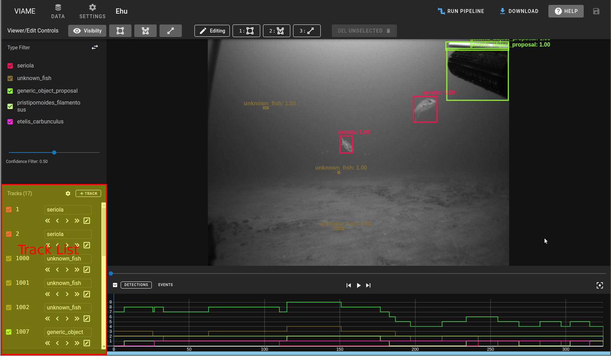
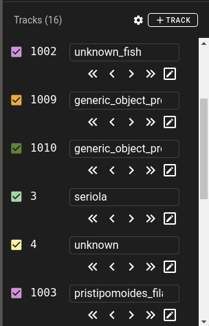
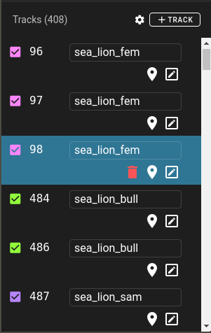
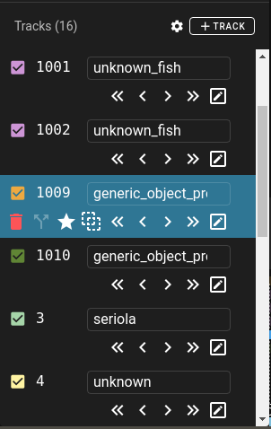

# Track List

## Track List Controls

{ width=260px align=right }

The track list allows for selecting and editing tracks.  A selected track will look different depending on whether it's a single detection or a multi-frame track.

* ==:material-cog:== opens track creation settings
* ==:material-delete:=={ .error } deletes all tracks in the track list
* ==:material-plus: Track/Detection== begins creation of a new annotation.

## Single Detection

{ width=260px align=right }

A track that spans a single frame.

* ==:material-delete:=={ .error } deletes the entire detection annotation
* ==:material-map-marker:== goes to the first frame of the detection
* ==:material-pencil-box-outline:== selects the detection and toggles edit mode.

!!! warning

    The ==:material-delete:=={ .error } button will remove the whole track if it's longer than a single detection.  To remove individual keyframes, use ==:material-star:== (the keyframe toggle button).

## Multi-frame track

{ width=260px align=right }

A track that spans multiple frames and has more options

* ==:material-delete:=={ .error } deletes the entire track
* ==:material-call-split:== splits the track into 2 smaller tracks on the current frame.
* ==:material-star:== is filled in if the current frame annotation is a keyfame.  Clicking this will either remove the keyframe if it exists or make the current interpolated annotation a keyframe.
* ==:material-vector-selection:== turns interpolation on/off for the interval between keyframes.
* ==:material-chevron-double-left:== jumps to the first frame of track
* ==:material-chevron-left:== jumps to the previous keyframe
* ==:material-chevron-right:== jumps to the next keyframe
* ==:material-chevron-double-right:== jumps to the last frame of the track
* ==:material-pencil-box-outline:== selects the detection and toggles edit mode.

