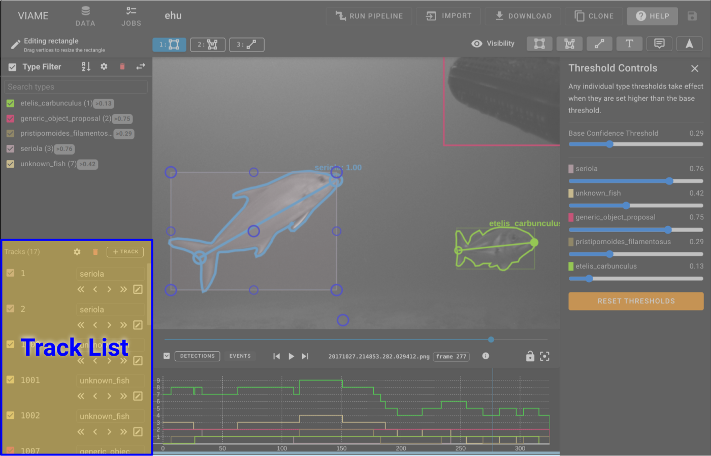

# Track List

 The tracklist allows for selecting and editing tracks that currently not filtered by the TypeList.  The tracklist will present two different options depending on the Track that is selected.

**Single Detection** - A track that spans a single frame.

* **Delete Detection** - Delete the detection
* **Go to Frame** - Goes to the first frame of the detection
* **Toggle Edit Mode** - selects the track and toggles edit mode on

**Multiple Frame Track** - A track that spans multiple frames and has more options

* **Delete Track** - Delete the entire Track
* **Split Track** - Splits the track on the current Frame
* **Toggle Keyframe** - Star is filled in if the current frame annotation is a keyfame.  Clicking this will either remove the keyframe if it exists or make the current interpolated annotation a keyframe.
* **Toggle Interpolation** - Turns interpolation on/off for a range between keyframes.
* **Navigation Options** - Navigation for first frame of track, then to jump between keyframes, finally the last frame of the track
* **Toggle Edit Mode** - selects the track and toggles edit mode on
