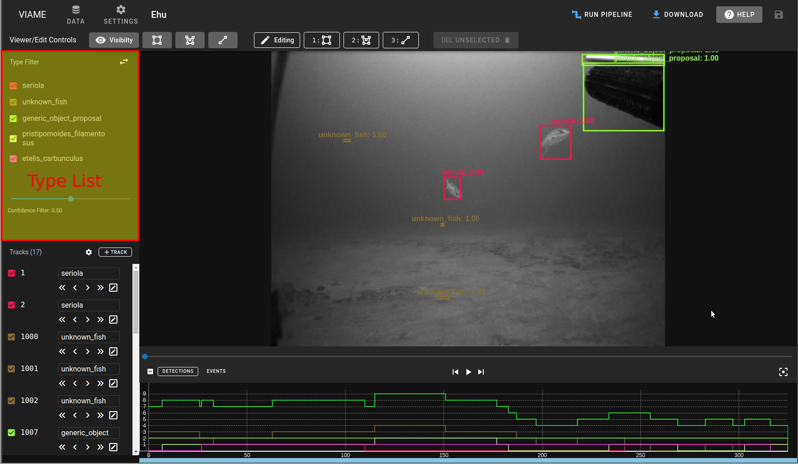
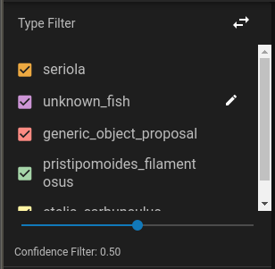
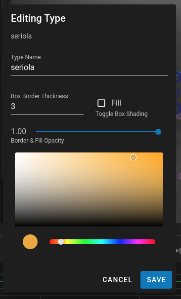
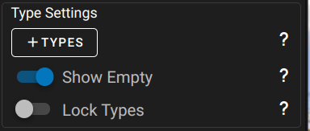
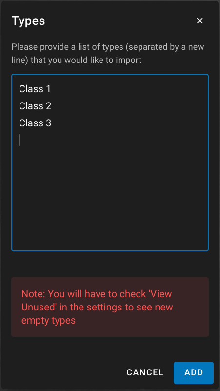

# Type List

## Type List Controls

{ align=right width=260 }

Each dataset maintains its own list of types, and types can be defined on-the-fly.

The Type List is used to control visual styles of the different types as well as filter out types that don't need to be displayed.

* The checkbox next to each type name can be used to toggle types on and off.
* ==:material-sort-alphabetical-ascending:== toggles the sort order between alphabetical and by number of annotations of each type.
* ==:material-cog:== opens the type settings menu.
* ==:material-delete:=={ .error } will remove the type from any visible track or delete the track if it is the only type.
* ==:material-swap-horizontal:== will switch the left sidebar panel to show the track attribute editor (and group editor) view.

## Hierarchical Types

When a dataset has a type hierarchy, DIVE displays the deepest checked type whose confidence meets its threshold. For example, given `fish` → `shark` → `great white shark`, if `great white shark` falls below its threshold while `shark` passes, the track displays as `shark`. Confidence values do not need to decrease or increase monotonically through the hierarchy; DIVE selects from the qualifying pairs and preserves confidence-pair order between unrelated branches.

Type-specific track and detection attribute filters match this hierarchy-resolved displayed type,
so the type picker and the filter operate on the same classification identity.

Assigning a type to a track is hierarchy-aware. A type together with its ancestors and descendants is one classification claim, so assigning over any pair in that lineage replaces the whole chain rather than leaving a relative behind for the display to select instead. Stored ancestors of the newly assigned type survive because the assignment still implies them, and pairs on unrelated branches are untouched.

**Accept as correct** is a separate command: it sets the accepted pair to `1.0`, keeps stored ancestors and descendants at their existing scores, and removes unrelated pairs. Editing a confidence value to `1.0` does not accept the type or remove any other pair.

Track notes, track attributes, and first-detection attributes edited from a track row are logical-track values. They are written to every linked camera track, using each camera track's own first feature for feature-level values. Keyframe and interpolation controls edit geometry only in the selected camera.

Linked multicamera tracks are expected to store identical confidence-pair vectors. If existing camera replicas differ, DIVE reports one warning when the dataset loads and uses the first camera in configured display order for the read-only track projection; it does not union classifications while merging display geometry. Removing classifications evaluates the complete logical vector and synchronizes the result across replicas.

The Web Library's dataset-label aggregation is intentionally different: it reports the raw
highest-confidence pair, keeping the first stored pair when scores tie, because the server does not
have each viewer's checked types and confidence thresholds. Viewer counts and filtering use the
hierarchy-resolved displayed type.

Hierarchy members render as an expandable tree rather than ordinary flat rows. Parent checkboxes control their complete subtrees, and parent counts include descendants. The Type List does not offer hierarchy editing.

While a hierarchy is active, **Prevent Cascade Types** is disabled and shows: `Not applicable to hierarchical types; DIVE selects the deepest qualifying type.` Its saved value is preserved and becomes active again when the hierarchy is removed.

Renaming a hierarchy member updates exact hierarchy references only after the complete result passes validation. A rename that would create a self-edge, conflicting parent, cycle, or duplicate type pair on one track is rejected without changing types. Deleting an unused type clears only its optional filter and style settings. The hierarchy member, edges, checked state, and any children remain unchanged, so hierarchy-only rows stay available under **Show Empty** and use default styling and thresholds.

## Type Style Editor

{ align=right loading=lazy width=260 }

The type style editor controls the visual appearance of annotations in all other areas of the application.  Launch the editor by hovering over a type row in the list and clicking ==:material-pencil:== (the edit pencil).

* **Type Name** - You can change the name for the type and it will update all subsequent tracks that are using that Type.
* **Show Label** - show the type name label in the text above each box.
* **Show Confidence** - show the confidence value in the text above each box.
* **Box Border Thickness** - the line thickness can be changed to make a type stand out more or less
* **Fill** - Fill allows the bounding box to be filled.  This is useful for annotation of background items in an image.
* **Border & Fill Opacity** - The opacity of the lines and the fill can be set here.
* **Color** - The color for the type within the annotations and the timeline views.

Where those colors are reused across datasets depends on **Type color scope** (see below).

## Type color scope and Saved Styles

Open **User Settings** with ==:material-cog:== in the [navigation bar](UI-Navigation-Editing-Bar.md#navigation-bar).

### Type color scope

* **Shared across all data** (default) — one set of type and group color/style overrides is reused across every dataset.
  * On **Desktop**, styles are stored once per data directory in `global_style_settings.json` (see [Data Storage Path](Dive-Desktop.md#data-storage-path)).
  * On **Web**, styles are stored in the current browser for the signed-in session (`localStorage`), not synced across devices.
  * When you open a dataset, shared styles overlay that dataset's own styling (shared wins on conflicts). Edits you make are mirrored back to the shared store. Colors that arrive with a dataset seed the shared store without overwriting styles you already chose.
* **Per dataset** — colors and styles are saved only with the dataset they were set on (the original behavior).

Changing the scope takes effect the next time a dataset is opened.

### Saved Styles

The **Saved Styles** panel in User Settings lists the shared type and group styles. You can filter by name or source dataset, add or edit styles, and delete one or many entries. Use this to curate the palette that Shared scope applies across sequences. Group styles follow the same rules; see [Group Manager](UI-Group-Manager.md#group-type-list).

## Type Settings Menu

Click the ==:material-cog:== button in the type list heading to open type settings.

### Ad-hoc mode

{ align=right width=260px }

In ad-hoc mode, new object classes are added as you annotate.  The type list updates automatically when new classes are added or the last member of a class is deleted.

* Set **Lock Types** to off for ad-hoc type creation.
* Set **Show Empty** to still show manually defined types with no track/detection examples in the type list.

### Locked mode

{ width=260px align=right }

In locked mode, only a specified list of classes can be used, and must be selected or autocompleted from the list for each object.

* Set **Lock Types** to on to constrain annotation types to those already defined.
* You can add new types using the ==:material-plus: Types== button under type settings.

### Suppression

Type settings also configure [suppression](UI-Suppression.md):

* **Suppression Region Type** — annotations of this type act as ignore / occlusion regions. Detections covered by at least the overlap threshold are hidden and excluded from counts. Clear the field to disable suppression. Defaults to `Suppressed`.
* **Suppression Overlap (%)** — minimum percent of a detection that must lie under suppression regions for it to be hidden (default **99**). Shown only when a suppression type is set.

The active suppression type shows an ==:material-eye-off:== icon in the type list. Detections may also be flagged with an attribute of the same name; see [Suppression](UI-Suppression.md) for region vs attribute behavior and display options.
