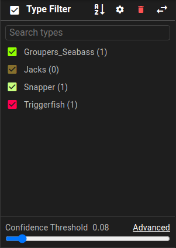

# Type List

## Type List Controls

{ align=right width=260 }

Each dataset maintains its own list of types, and types can be defined on-the-fly.

The Type List is used to control visual styles of the different types as well as filter out types that don't need to be displayed.

* The checkbox next to each type name can be used to toggle types on and off.
* ==:material-sort-alphabetical-ascending:== toggles the sort order between alphabetical and by number of annotations of each type.
* ==:material-cog:== opens the type settings menu.
* ==:material-delete:=={ .error } will remove the type from any visible track or delete the track if it is the only type.
* ==:material-swap-horizontal:== will switch the left sidebar panel to show the track attribute editor view.
* Confidence filtering is documented on the [confidence filter page](UI-Confidence-Filter.md)

## Type Style Editor

{ align=right loading=lazy width=260 }

The type style editor controls the visual appearance of annotations in all other areas of the application.  Launch the editor by hovering over a type row in the list and clicking ==:material-pencil:== (the edit pencil).

* **Type Name** - You can change the name for the type and it will update all subsequent tracks that are using that Type.
* **Show Label** - show the type name label in the text above each box.
* **Show Confidence** - show the confidence value in the text above each box.
* **Box Border Thickness** - the line thickness can be changed to make a type stand out more or less
* **Fill** - Fill allows the bounding box to be filled.  This is useful for annotation of background items in an image.
* **Border & Fill Opacity** - The opacity of the lines and the fill can be set here.
* **Color** - The color for the type within the annotations and the timeline views.

## Type Settings Menu

Click the ==:material-cog:== button in the type list heading to open type settings.

### Ad-hoc mode

{ align=right width=260px }

In ad-hoc mode, new object classes are added as you annotate.  The type list updates automatically when new classes are added or the last member of a class is deleted.

* Set **Lock Types** to off for ad-hoc type creation.
* Set **Show Empty** to still show manually defined types with no track/detection examples in the type list.

### Locked mode

{ width=260px align=right }

In locked mode, only a specified list of classes can be used, and must be selected or autocompleted from the list for each object.

* Set **Lock Types** to on to constrain annotation types to those already defined.
* You can add new types using the ==:material-plus: Types== button under type settings.
