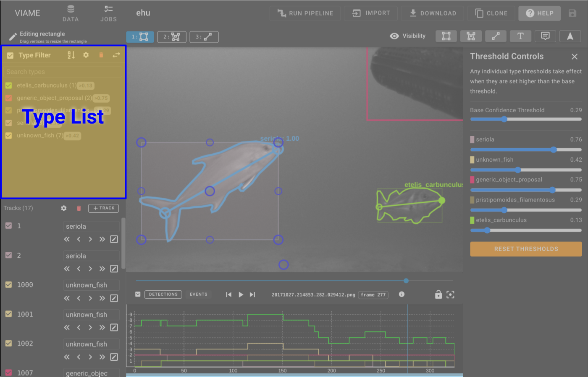

# Type List

The TypeList is used to control visual styles of the different types as well as filter out types that don't need to be displayed.  The checkbox next to each type name can be used to toggle types on and off.

**Confidence Filter**  - for pipeline results the confidence filter can be used to filter out different items based on their current confidence level.  As the confidence filter is adjusted the annotations in the AnnotationView as well as the Timeline views will update in realtime.

## Type Style Editor

When hovering over a type there is an Edit icon that is visible.  Clicking on that will bring up the TypeList Editor.

The type editor allows you to change the visual representation of the Type within the annotation view as well as the color and name.

* **Name** - You can change the name for the type and it will update all subsequent tracks that are using that Type.
* **Border Thickness** - the line thickness can be changed to make a type stand out more or less
* **Fill** - Fill allows the bounding box to be filled.  This is useful for annotation of background items in an image.
* **Opacity** - The opacity of the lines and the fill can be set here.
* **Color** - The color for the type within the annotations and the timeline views.

## Type (Class) Settings

Each dataset maintains its own list of types (classes). These are customizable under type settings.

{ width=300px }

Type settings are available by clicking the `cog` button next to `Visiblity` in the type filter list heading.

### Type Settings Options

{ width=300px }

#### Ad-hoc mode

In ad-hoc mode, new object classes are added as you annotate.  The type list updates automatically when new classes are added or the last member of a class is deleted.

* Selecting `Lock Types = false` toggles ad-hoc mode.
* Selecting `Show empty` is recommended

#### Locked mode

In locked mode, only a specified list of classes can be used, and must be selected or autocompleted from the list for each object.

* Selecting `Lock Types = true` toggles locked mode.
* You can add types using the `+ Types` button under type settings

{ width=300px }
