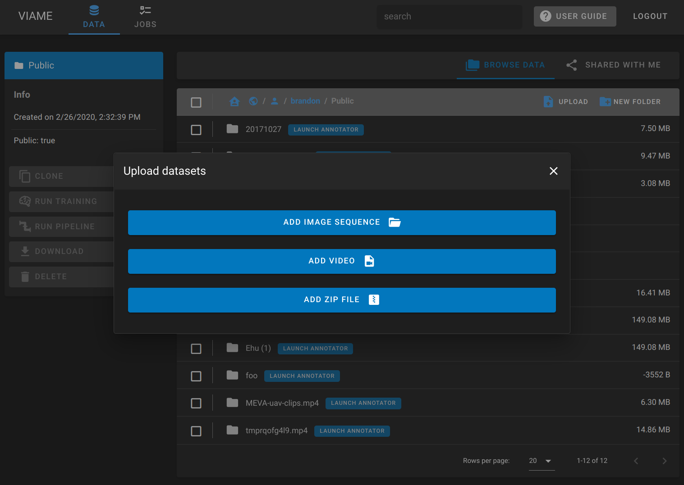
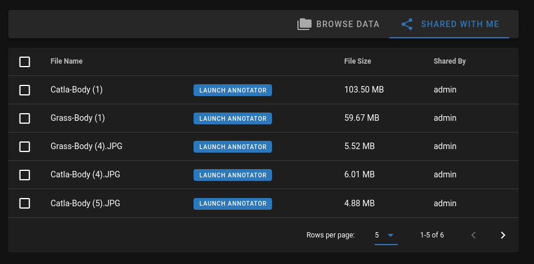

!!! warning
    **VIAME Web is automatically updated at 2AM EST/EDT every Thursday.**

    If you are running a pipeline or training workflow during update, it will be interrupted and restarted.

[Use our public server :material-open-in-new:](https://viame.kitware.com){ .md-button }
[Deploy your own](Deployment-Overview.md){ .md-button }

## Register for an account

A user account is required to store data and run pipelines on viame.kitware.com.

1. Visit [viame.kitware.com](https://viame.kitware.com)
1. Click ==Register==

## Uploading data

### Uploading individual files

* Open the DIVE Homepage, and navigate to the ==:material-database: Data== tab.
* Click the ==:material-home-account: User Home== button at the top left of the data browser.
* Click either your ==:material-folder: Public== or ==:material-folder-lock: Private== folder, or make a new folder and navigate into it.
* Click the ==:material-file-upload: Upload== button that appears in the toolbar.
* Select a video or multi-select a group of image frames.
    * Use ++ctrl++ or ++shift++ to click every file you want to upload.
    * If you already have `annotations.csv` or an annotation or configuration JSON select that too.
* Choose a name for the dataset and enter the optional playback frame rate or select other optional files.
* Press ==Start Upload==
* In the data browser, a new ==Launch Annotator== button will appear next to your data
    * If you uploaded a video, it may need to transcode first

!!! info

    All video uploaded to the web server will be transcoded as `mp4/h264`.

### Uploading zip files

A zip import can have one of the following file combinations:

* One or more images, an optional annotation file, and an optional configuration file
* One video with an optional annotation file and an optional configuration file
* One or more folders which contain the above examples (These will be converted to separate datasets)

Zip import also accepts zip archive files that were generated by the ==Download== :material-arrow-right: ==Everything== export button.

## Download or export data

{ width=260px align=right }

Data can be downloaded from the FileBrowser by clicking the checkmark to the left of a dataset name.  This allows you to download the source images/video, the current detection file converted to `.csv` or everything including all backups of the detection files.

* ==Image Sequence== or ==Video== will export the source media as a `.zip`
* ==Detections== will export a [VIAME `.csv`](DataFormats.md#viame-csv) of annotations
    * Checkbox options are explained in the [Navigation Bar Section](UI-Navigation-Editing-Bar.md#navigation-bar).
* ==Configuration== will export a [DIVE configuration](DataFormats.md#dive-configuration-json) `.json`
* ==Everything== will export all of the above.

## Sharing data with teams

This information will be relevant to teams where several people need to work on the same data.

### Concepts

By default, data uploaded to your personal user space follows these conventions.

* Data in the ==:material-folder: Public== folder is readable by all registered users, but writable only by you by default.
* Data in the ==:material-folder-lock: Private== folder is only visible to you by default.

### Working with teams

A common scenario is for a group to have a lot of shared data that several members should be able to view and annotate.

For most teams, we recommend keeping data consolidated under a single account then following the sharing instructions below to make sure all team members have appropriate access.

It's easiest to create a single parent folder to share and then put all individual datasets inside that parent.

!!! warning

    You should note that 2 people **cannot** work on the same video at the same time.  Your team should coordinate on who will work on each dataset.

## Managing Permissions

DIVE uses Girder's [Permissions Model](https://girder.readthedocs.io/en/latest/user-guide.html#permissions).

There are four levels of permission a User can have on a resource.

* No permission (cannot view, edit, or delete a resource)
* **READ** permission (can view and download resources)
* **WRITE** permission (includes READ permission, can edit the properties of a resource)
* **ADMIN** also known as own permission, (includes READ and WRITE permission, can delete the resource and also control access on it)

### Granting access to others

* Navigate to your data in the data browser.
* **Right click** a dataset or a folder of datasets and choose ==Access Control==

    

* Search for and select users you want to grant access to.
* Select the correct permissions in the drop-down next to each user.

    

* If this is a folder of datasets, enable the **Include Subfolders** switch.
* Click ==Save==.  These users should now be able to view and edit your data.

## Data Shared with you

You can view data shared with you by selecting the ==:material-share-variant: Shared With Me== tab above the data browser.

## Sharing URLs

You can copy and paste any URL from the address bar and share with collaborators.  This includes folders in the data browser as well as direct links to the annotation editor.

## Dataset Clones

A clone is a **shallow copy** of a dataset.

* It has its own annotations, and can be run through pipelines and shared with others.
* It references the media (images or video) of another dataset.

!!! warning

    Be careful when deleting data that has been cloned.  Clones "point to" their source dataset for loading media, so if the source is deleted, all of its clones will fail to load.

### Clone use cases

1. When you want to use or modify data that doesn't belong to you, such as data from the shared training collection or from other users.
1. When you want to run several different pipelines in parallel on the same input data and compare the results.

!!! warning

    Merging cloned data back to the source is **not currently supported**.  To collaborate with others on annotations, the sharing use case above is preferred.

### How to clone

* Open the dataset you wish to clone by clicking ==Launch Annotator==.
* Click the ==:material-content-copy: Clone== button in the top navigation bar on the right side.
* Choose a name and location for the clone within your own workspace.
