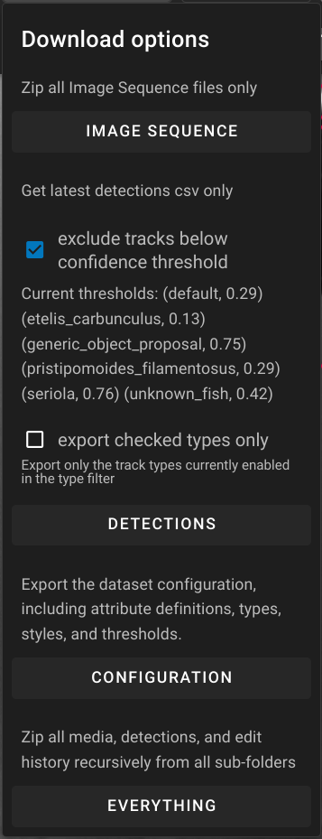

# Web Version

[Try our public server ➥](https://viame.kitware.com){ .md-button .md-button--primary }

You can also [run your own](Server-Operator.md).

!!! warning
    **VIAME Web is automatically updated at 2AM EST/EDT every Thursday.**

    If you are running a pipeline or training workflow during update, it will be interrupted and started over.
## Features

* upload and download data
* permissions and sharing support for team collaboration
* image and video annotation
* pre-trained model pipeline execution
* multi-dataset model training

## Register for an account

A user account is required to store data and run pipelines on viame.kitware.com.

1. Visit [viame.kitware.com](https://viame.kitware.com)
1. Click **Register**

## Uploading data

* Open the DIVE Homepage, and navigate to the "Data" tab.
* Click the blue "user home" button at the top left of the data browser.
* Choose your "public" or "private" folder.
* Click the blue "Upload" button that appears in the toolbar.
* Select a video or multi-select a group of image frames.
* If you already have `annotations.csv`, select that too.
* Choose a name for the data, enter the optional video playback frame rate, and press start-upload.
* In the data browser, a new blue "Launch Annotator" button will appear next to your data.

!!! info
    All video uploaded to the web server will be transcoded as `mp4/h264`.

## Downloading Data

After creating/modifying annotations or running pipelines the data may be exported through two methods:

* File Browser Data Download
* Annotation Viewer Download

### Annotation Folder Structure

An annotation folder in DIVE will consist of three main components:

* **Source Data** - The image-sequence files or video used in the annotation.
* **Detections File** - The current detections/tracks for the annotation which are stored in either a CSV format or JSON
  * After the first edit to a project, the data will be stored in JSON, when downloading the current detection it will **always be downloaded in .csv format**
* **Auxiliary Folder** - Backups of the detection file each time a save is done.

### File Browser Data Download

Data can be downloaded directly from the FileBrowser by clicking the checkmark to the left of a folder.  This allows you to download the source images/video, the current detection file converted to .csv or everything including all backups of the detection files.  

**Filtered Detections** - The ability to export detections/tracks based on the currently set confidence filter.  This will only export tracks/detections that are higher than the confidence filter set for the folder.  This can be adjusted through the UI interface within the Annotation Viewer.  For more information check:

### Annotation Viewer Download

Within the annotation viewer itself there is the option to download the same data in the file browser.

These options are explained in **[Navigation Bar](UI-Navigation-Bar.md)** UI Docs.

### Trained model downloads

You can download your trained models through the administrative interface.  This will be added to the normal interface in a future update.

!!! warning
    Use caution when modifying data through the admin interface

* Open the admin interface at [https://viame.kitware.com/girder](https://viame.kitware.com/girder) (or `myserver.com/girder` if you host your own instance)
* Navigate to your personal workspace by clicking `My folders` under your user dropdown in the top right corner.
    * 
* Navigate to the `VIAME/VIAME Training Results` folder and into the folder you wish to download
    * 
* Select all items and download using the menu
    * 

## Sharing data with teams

This information will be relevant to teams where several people need to work on the same data.

### Concepts

By default, data uploaded to your personal user space follows these conventions.

* Data in the `Public` folder is readable by all registered users, but writable only by you by default.
* Data in the `Private` folder is only visible to you by default.

!!! info
    You can share your entire public or private folder with team members.

### Working with teams

A common scenario is for a group to have a lot of shared data that several members should be able to view and annotate.

For most teams, we recommend keeping data consolidated under a single account then following the sharing instructions below to make sure all team members have appropriate access.

It's easiest to create a single parent directory to share and then put all individual datasets inside that parent.

!!! warning
    You should note that 2 people **cannot** work on the same video at the same time.  Your team should coordianate on who will work on each dataset.

## Managing Permissions

DIVE uses Girder's [Permissions Model](https://girder.readthedocs.io/en/latest/user-guide.html#permissions).

There are four levels of permission a User can have on a resource.

* No permission (cannot view, edit, or delete a resource)
* READ permission (can view and download resources)
* WRITE permission (includes READ permission, can edit the properties of a resource)
* ADMIN also known as own permission, (includes READ and WRITE permission, can delete the resource and also control access on it)

### Granting access to others

* Navigate to your data in the data browser.
* Right click a dataset folder or directory to share.

* Search for and select users you want to grant permissions for.
* Select the correct permissions in the drop-down next to each user.

* **Be sure to enable `Include subfolders` at the bottom of the dialog.**

* Click save.

These users should now be able to view and edit your data.

## Sharing URLs

You can copy and paste any URL from the address bar and share with collaborators.  This includes folders in the data browser as well as direct links to the annotation editor.

## Dataset Clones

A clone is a **shallow copy** of a dataset.

* It has its own annotations, and can be run through pipelines and shared with others.
* It references the media (images or video) of another dataset.

### Clone use cases

1. When you want to use or modify data that doesn't belong to you, such as data from the shared training collection or from other users.
1. When you want to run several different pipelines in parallel on the same input data and compare the results.

!!! warning
    Merging cloned data back to the source is **not currently supported**.  To collaborate with others on annotations, the sharing use case above is preferred.

### How to clone

* Open the dataset you wish to clone in the viewer.
* Click the `Clone` chip in the top toolbar next to the name
* Choose a name and location for the clone within your own workspace.
