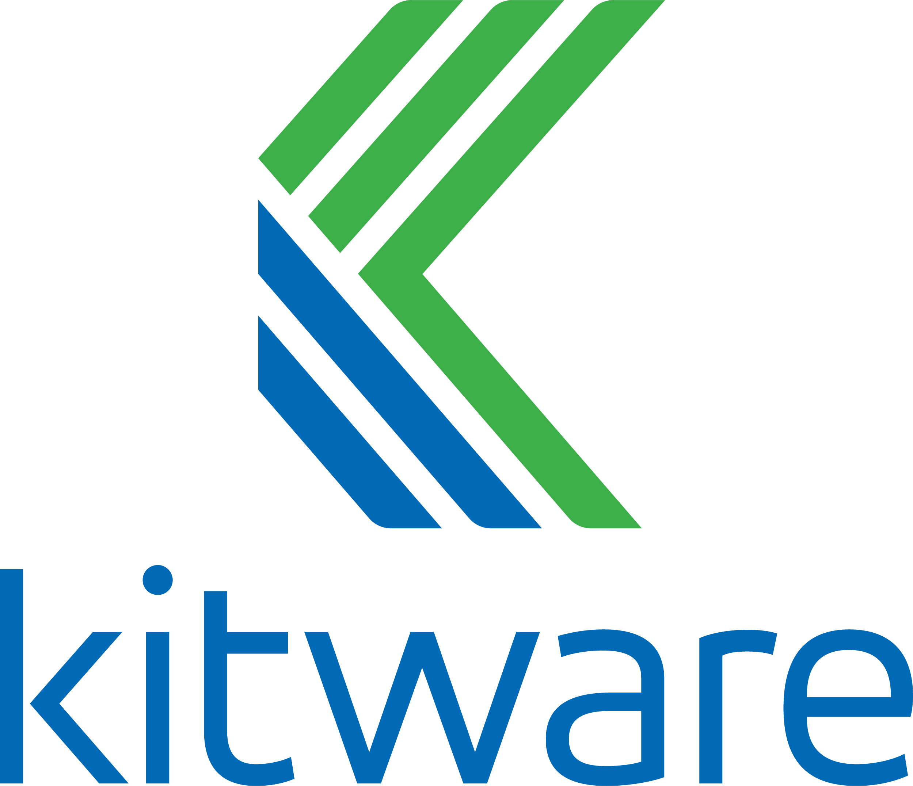
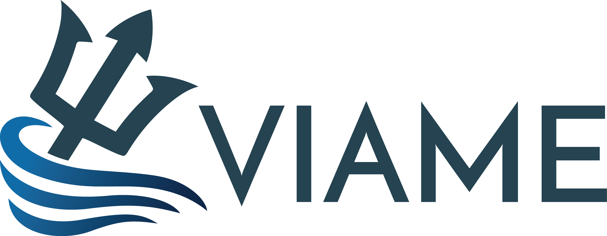

# DIVE Documentation

  
  
  

This is the user documentation for DIVE, a **free and open-source** annotation and analysis platform for web and desktop built by [Kitware](https://kitware.com). DIVE has deep integration with the [VIAME toolkit](https://www.viametoolkit.org/), but it can also be used on its own.

[:fontawesome-solid-compass: Try the web version](Web-Version.md){ .md-button } [:fontawesome-solid-desktop: Get the desktop app](Dive-Desktop.md){ .md-button }

## Support

For feedback, problems, questions, or feature requests, please [open a thread on discourse](https://discourse.kitware.com/c/viame-dive/17). Our team would be happy to hear from you!

## Feature Comparison

|         | Web | Desktop |
|---------|-----|---------|
| **Data Support** |
Load your own images and videos | ✔️ | ✔️
| &nbsp;&nbsp;&nbsp; Image and video transcoding | ✔️ | ✔️
| &nbsp;&nbsp;&nbsp; Import using image lists  | ❌ | ✔️
Load annotations from [supported formats](DataFormats) | ✔️ | ✔️
Create new object and track annoatations | ✔️ | ✔️
Annotation export | ✔️ | ✔️
Dataset export for portability between web and desktop | ✔️ | ✔️
Permissions and sharing support for team collaboration | ✔️ | ❌
| **Annotatation Support** |
Bounding boxes | ✔️ | ✔️
Polygons | ✔️ | ✔️
Head/Tail lines | ✔️ | ✔️
Linear interpolation | ✔️ | ✔️
Track split | ✔️ | ✔️
Multi-way track merge | ✔️ | ✔️
| **VIAME Integration Support** |
Run VIAME object detection and tracking | ✔️ | ✔️
Run VIAME detector and tracker **training** | ✔️ | ✔️
VIAME multi-camera pipelines  | ❌ | ✔️
Manual refinement of auto-generated annotations | ✔️ | ✔️

## Definitions

* **DIVE** is the annotator and data management software system.  It is our name for the code and capabilities, including both web and desktop, that can be deployed and configured for a variety of needs.
* **VIAME** (Video and Image Analytics for Marine Environments) is a suite of computer vision tools for object detection, tracking, rapid model generation, and many other types of analysis.  Get more info at [viametoolkit.org](https://www.viametoolkit.org/)
* **VIAME Web** is the *specific* DIVE Web deployment at [viame.kitware.com](https://viame.kitware.com). It includes a web-based annotator with the capabilities to run VIAME workflows on user-provided data.  You may deploy the web system into your own lab or cloud environment.
