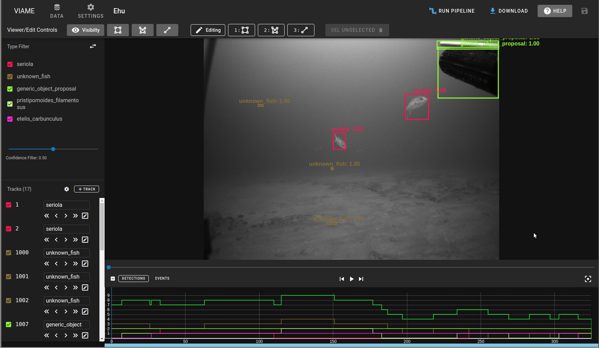

# Home

* **VIAME Web is automatically updated and down for 10 minutes on 2 am EST/EDT Sundays**
* For problems, feature requests, etc. please email `viame-web@kitware.com`
* To move data to the global collection from your personal folder, email `viame-web@kitware.com`

Current capabilities of VIAME Web include:

* User import of frame images or video.
* Playback of existing annotation data.
* Manual creation of new annotations.
* Automatic object detection and tracking of user-imported data.
* Manual user refinement of automatically generated tracks
* Export of generated annotations.
