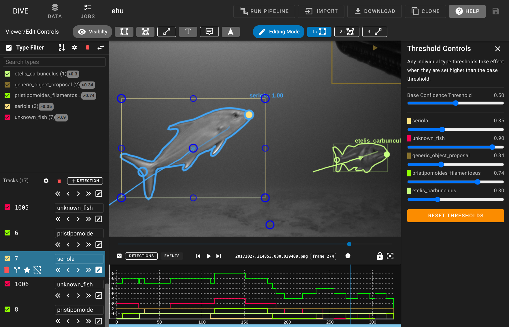

# DIVE Documentation

This is the user documentation for DIVE, an open-source annotation and analysis platform build for VIAME.  If you are looking for the VIAME Toolkit documentation, you can find it [here](https://viame.readthedocs.io/).

[:fontawesome-solid-compass: Try the web version](Web-Version.md){ .md-button } [:fontawesome-solid-desktop: Get the desktop app](Dive-Desktop.md){ .md-button }
## Get Help

For feedback, problems, questions, or feature requests, please email <a href="mailto:viame-web@kitware.com">`viame-web@kitware.com`</a>. Our team would be happy to hear from you!

## Features

Current capabilities of DIVE include:

* User import of frame images or video.
* Playback of existing annotation data.
* Manual creation of new annotations.
* Automatic object detection and tracking of user-imported data.
* Manual user refinement of automatically generated tracks
* Export of generated annotations.

## Definitions

* **DIVE** is the annotator and data management software system.  It is our name for the code and capabilities, including both web and desktop, that can be deployed and configured for a variety of needs.  It integrates tightly with VIAME, but is separate from that tool suite.
  * The desktop and girder (web) systems are known as **DIVE Desktop** and **DIVE Web**.
* **VIAME** stands for "Video and Image Analytics for Marine Environments".  It is a suite of computer vision tools for object detection, tracking, rapid model generation, and many other types of analysis.  Get more info at [viametoolkit.org](https://www.viametoolkit.org/)
* **VIAME Web** is the *specific* DIVE Web deployment at [viame.kitware.com](https://viame.kitware.com). It includes a web-based annotator with the capabilities to run VIAME workflows on user-provided data.  You may deploy the web system into your own labratory or cloud environment.
